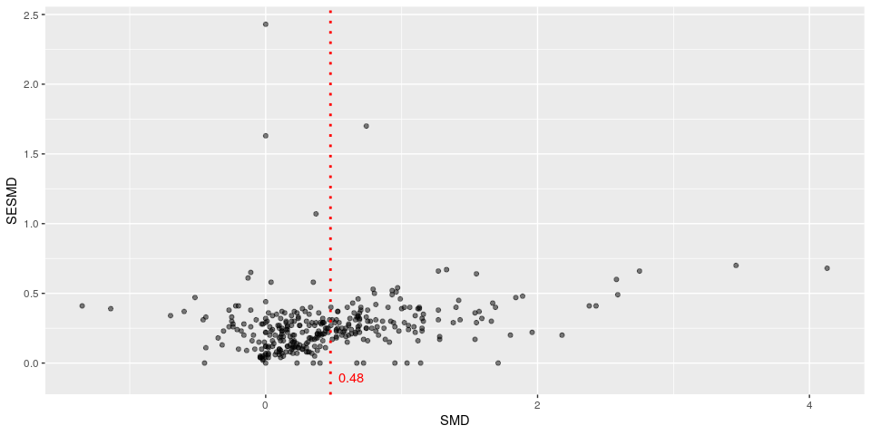
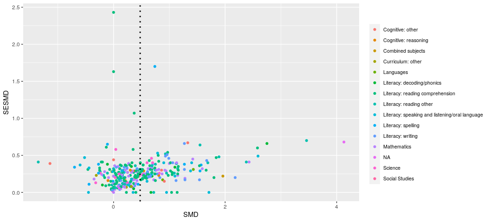
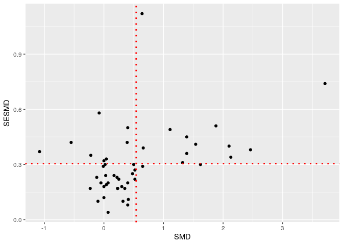
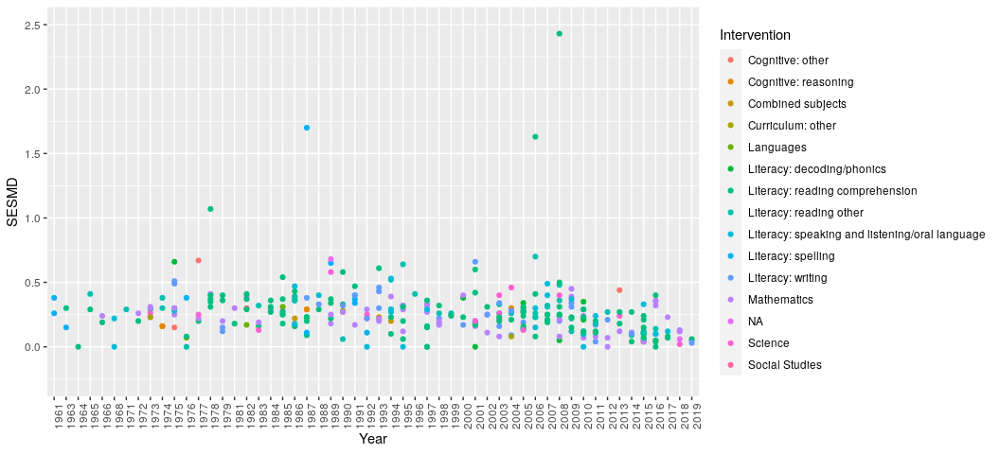
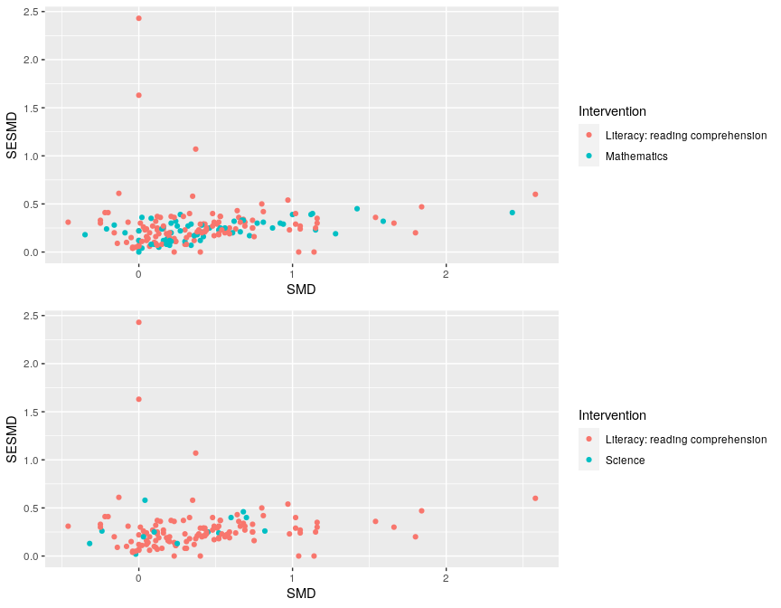

```r
knitr::opts_chunk$set(echo = T,
                      fig.path = "EffectSizeExtraction_figs/")
library(reticulate)
library(ggplot2)
library(dplyr)
library(gridExtra)
use_python("/usr/local/bin/python3")
```


```python
# import necessary packages
import json
from pprint import pprint
import pandas as pd

# control row/column display amount
pd.set_option('display.max_rows', None)
pd.set_option('display.max_columns', 10)

# open our json file
with open('/home/jon/json/Batch1.json') as f:
    data=json.load(f)

def get_study_outcomes(outcome_choice):
    '''
    A function that takes in your outcome of choice
    "primary/secondary" etc. and returns a list
    of the relevant effect size information
    '''
    global no_outcome
    outcome_studies=[]
    no_outcome=0
    for counter, item in enumerate(data["References"]):
        if "Outcomes" in data["References"][counter]:
            if data["References"][counter]["Outcomes"][0]["OutcomeText"] == outcome_choice:
                outcome_id=((data["References"][counter]["Outcomes"][0]["OutcomeId"]))
                yes_outcome=(data["References"][counter]["Outcomes"][0]["ShortTitle"])
                outcome_text=(data["References"][counter]["Outcomes"][0]["OutcomeText"])
                SMD=(data["References"][counter]["Outcomes"][0]["SMD"])
                SESMD=(data["References"][counter]["Outcomes"][0]["SESMD"])
                year=(data["References"][counter]["Year"])
                intervention=(data["References"][counter]["Outcomes"][0]["InterventionText"])
                outcome_studies.append([outcome_id, yes_outcome, outcome_text, year, intervention, SMD, SESMD])
        else:
            no_outcome+=1
    return outcome_studies

# function calls
primary = get_study_outcomes("Primary outcome")
secondary = get_study_outcomes("Secondary outcome(s)")
        
# make pandas dataframe with our lists
df_primary = pd.DataFrame(primary, columns=['OutcomeId', 'ShortTitle', 'OutcomeText', 'Year', 'Intervention', 'SMD', 'SESMD'])
df_secondary = pd.DataFrame(secondary, columns=['OutcomeId', 'ShortTitle', 'OutcomeText', 'Year', 'Intervention', 'SMD', 'SESMD'])

# round effect sizes to two decimal points
df_primary.loc[:, "SMD"] = df_primary["SMD"].astype(float).round(2)
df_primary.loc[:, "SESMD"] = df_primary["SESMD"].astype(float).round(2)

# round effect sizes to two decimal points
df_secondary.loc[:, "SMD"] = df_secondary["SMD"].astype(float).round(2)
df_secondary.loc[:, "SESMD"] = df_secondary["SESMD"].astype(float).round(2)

# sort "Year" values ascending (for plotting)
#df_primary.sort_values("Year", axis=0, ascending=True, inplace=True, kind='quicksort')
#df_secondary.sort_values("Year", axis=0, ascending=True, inplace=True, kind='quicksort')

#df.plot(x="Year", y="SMD", kind='line')
#export_csv = df.to_csv(r'/home/jon/json/outcome_measures.csv', index=False)
print("Number of Primary Outcome studies:", len(df_primary))
```

```
## Number of Primary Outcome studies: 335
```

```python
print(df_primary.head(15))
```

```
##     OutcomeId         ShortTitle      OutcomeText  Year  \
## 0       43787  Abbondanza (2013)  Primary outcome  2013   
## 1       46356       Adler (1998)  Primary outcome  1998   
## 2       43793     Allsopp (1995)  Primary outcome  1995   
## 3       45530       Ammon (1971)  Primary outcome  1971   
## 4       45614      Anders (1984)  Primary outcome  1984   
## 5       49729    Anderson (1973)  Primary outcome  1973   
## 6       46229     Andrade (2008)  Primary outcome  2008   
## 7       51144     Aram (2004) OL  Primary outcome  2004   
## 8       45528        Aram (2006)  Primary outcome  2006   
## 9       43800   Arblaster (1991)  Primary outcome  1991   
## 10      43803    Atherley (1989)  Primary outcome  1989   
## 11      47394    Aumiller (1963)  Primary outcome  1963   
## 12      43806       Baker (2005)  Primary outcome  2005   
## 13      50379       Banks (1987)  Primary outcome  1987   
## 14      43839     Bar-Eli (1982)  Primary outcome  1982   
## 
##                        Intervention   SMD  SESMD  
## 0   Literacy: reading comprehension  0.52   0.18  
## 1                 Literacy: writing  0.16   0.22  
## 2                       Mathematics  0.16   0.12  
## 3           Literacy: reading other  0.00   0.29  
## 4   Literacy: reading comprehension  1.66   0.30  
## 5                       Mathematics  1.15   0.23  
## 6                 Literacy: writing  0.83   0.20  
## 7           Literacy: reading other  0.36   0.27  
## 8   Literacy: reading comprehension  0.04   0.23  
## 9           Literacy: reading other  1.69   0.40  
## 10  Literacy: reading comprehension  0.68   0.34  
## 11               Literacy: spelling -0.01   0.15  
## 12       Literacy: decoding/phonics  1.10   0.34  
## 13          Literacy: reading other -0.18   0.23  
## 14                      Mathematics  1.00   0.39
```

```python
print("Number of Secondary Outcome studies:", len(df_secondary))
```

```
## Number of Secondary Outcome studies: 49
```

```python
print(df_secondary.head(15))

#print(df_primary["Intervention"])
```

```
##     OutcomeId          ShortTitle           OutcomeText  Year  \
## 0       46195        Arter (1994)  Secondary outcome(s)  1994   
## 1       47675      Baechie (1990)  Secondary outcome(s)  1990   
## 2       45500   Blatchford (2007)  Secondary outcome(s)  2007   
## 3       47110   Butler (1987) 1_1  Secondary outcome(s)  1987   
## 4       45671       Clarke (2017)  Secondary outcome(s)  2017   
## 5       45634     Dockrell (2015)  Secondary outcome(s)  2015   
## 6       46941  Ehlinger (1988) FB  Secondary outcome(s)  1988   
## 7       47530       Elliot (1986)  Secondary outcome(s)  1986   
## 8       49474     Fantuzzo (1992)  Secondary outcome(s)  1992   
## 9       47816       Fricke (2013)  Secondary outcome(s)  2013   
## 10      46285        Fuchs (1984)  Secondary outcome(s)  1984   
## 11      47052        Fuchs (1997)  Secondary outcome(s)  1997   
## 12      46760        Fuchs (1999)  Secondary outcome(s)  1999   
## 13      47924        Gibbs (2001)  Secondary outcome(s)  2001   
## 14      47374      Gmitter (1989)  Secondary outcome(s)  1989   
## 
##                        Intervention   SMD  SESMD  
## 0                 Literacy: writing  0.30   0.18  
## 1   Literacy: reading comprehension  0.65   0.29  
## 2   Literacy: reading comprehension  0.00   0.12  
## 3              Cognitive: reasoning  2.46   0.38  
## 4   Literacy: reading comprehension -0.23   0.17  
## 5                 Literacy: writing  0.40   0.08  
## 6   Literacy: reading comprehension -0.01   0.29  
## 7   Literacy: reading comprehension  0.02   0.30  
## 8                       Mathematics  1.54   0.41  
## 9                         Languages  0.40   0.20  
## 10          Literacy: reading other  0.35   0.17  
## 11  Literacy: reading comprehension  0.00   0.32  
## 12  Literacy: reading comprehension  0.07   0.20  
## 13       Literacy: decoding/phonics  1.62   0.30  
## 14                      Mathematics  0.22   0.23
```


```r
primary_df <- data.frame(py$df_primary)
secondary_df <- data.frame(py$df_secondary)

primary_df$Intervention <- as.character(primary_df$Intervention)
primary_df$Intervention[primary_df$Intervention==""] <- "NA"
primary_df$Intervention <- as.factor(primary_df$Intervention)

primary_mean_SMD <- mean(primary_df$SMD, na.rm=TRUE)
secondary_mean_SMD <- mean(secondary_df$SMD, na.rm=TRUE)

primary_mean_SESMD <- mean(primary_df$SESMD, na.rm=TRUE)
secondary_mean_SESMD <- mean(secondary_df$SESMD, na.rm=TRUE)

primary_mean_SMD
```

```
## [1] 0.4765672
```

```r
secondary_mean_SMD
```

```
## [1] 0.5412245
```

```r
primary_mean_SESMD
```

```
## [1] 0.266497
```

```r
secondary_mean_SESMD
```

```
## [1] 0.305102
```

```r
ggplot(data=primary_df, aes(SMD, SESMD)) + geom_point(alpha=.5, na.rm=TRUE, color="Black") +
    theme_grey() +
    geom_vline(xintercept=primary_mean_SMD, linetype="dotted", color="red", size=1) +
    theme(legend.title = element_text(color = "blue", size = 5),
          legend.text = element_text(color = "red", size = 5)) +
    annotate(geom="text", x=primary_mean_SMD+.15, y=-.1, label=round(primary_mean_SMD, 2), color="red")
```

<!-- -->


```r
ggplot(data=primary_df, aes(SMD, SESMD, color=Intervention)) + geom_point(alpha=1, na.rm=TRUE) +
    theme_grey() +
    geom_vline(xintercept=primary_mean_SMD, linetype="dotted", color="black", size=1) +
    theme(legend.title = element_text(color = "black", size = 10),
          legend.text = element_text(color = "black", size = 8)) +
    theme(legend.position="right") +
    guides(fill=guide_legend(nrow=5, byrow=TRUE)) +
    theme(legend.title=element_blank())
```

<!-- -->


```r
ggplot(data=py$df_secondary, aes(SMD, SESMD)) + geom_point() +
    theme_grey() +
    geom_vline(xintercept=secondary_mean_SMD, linetype="dotted", color="red", size=1, na.rm=TRUE) +
    geom_hline(yintercept=secondary_mean_SESMD, linetype="dotted", color="red", size=1)
```

<!-- -->


```r
ggplot(data=primary_df, aes(Year, SESMD, color=Intervention)) + geom_point(na.rm=TRUE) +
    theme_grey() +
    theme(axis.text.x = element_text(angle = 90, hjust = 1)) +
    ylim(-0.25, 2.5)
```

<!-- -->


```r
primary_df %>%
  filter(Intervention=="Mathematics" | Intervention=="Literacy: reading comprehension") %>% 
  ggplot(., aes(SMD, SESMD, color=Intervention)) + geom_point(alpha=1, na.rm=TRUE) -> p1

primary_df %>%
  filter(Intervention=="Science" | Intervention=="Literacy: reading comprehension") %>% 
  ggplot(., aes(SMD, SESMD, color=Intervention)) + geom_point(alpha=1, na.rm=TRUE) -> p2

grid.arrange(p1, p2, ncol=1)
```

<!-- -->

