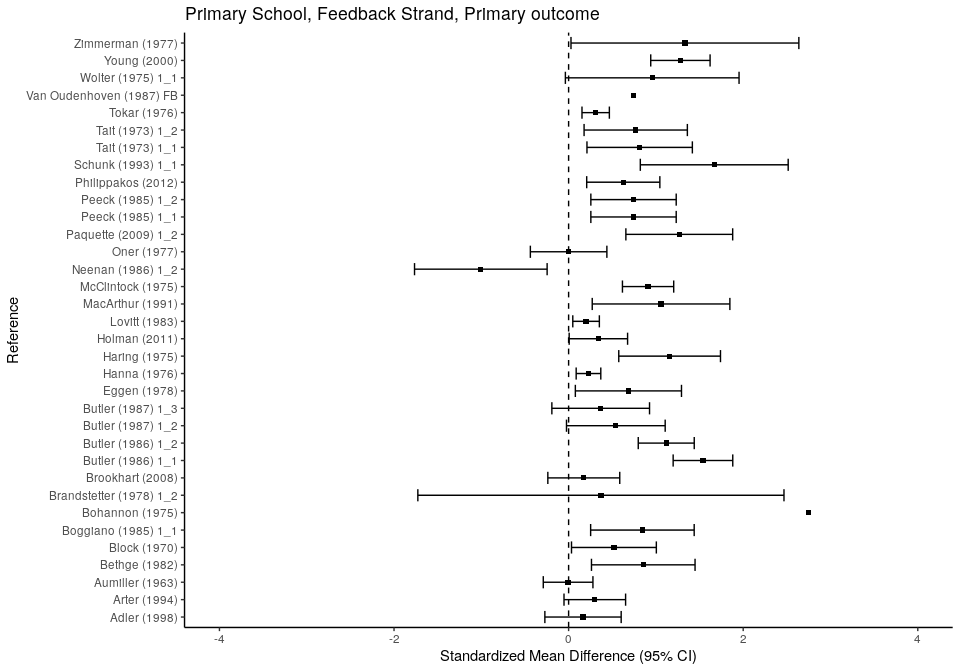
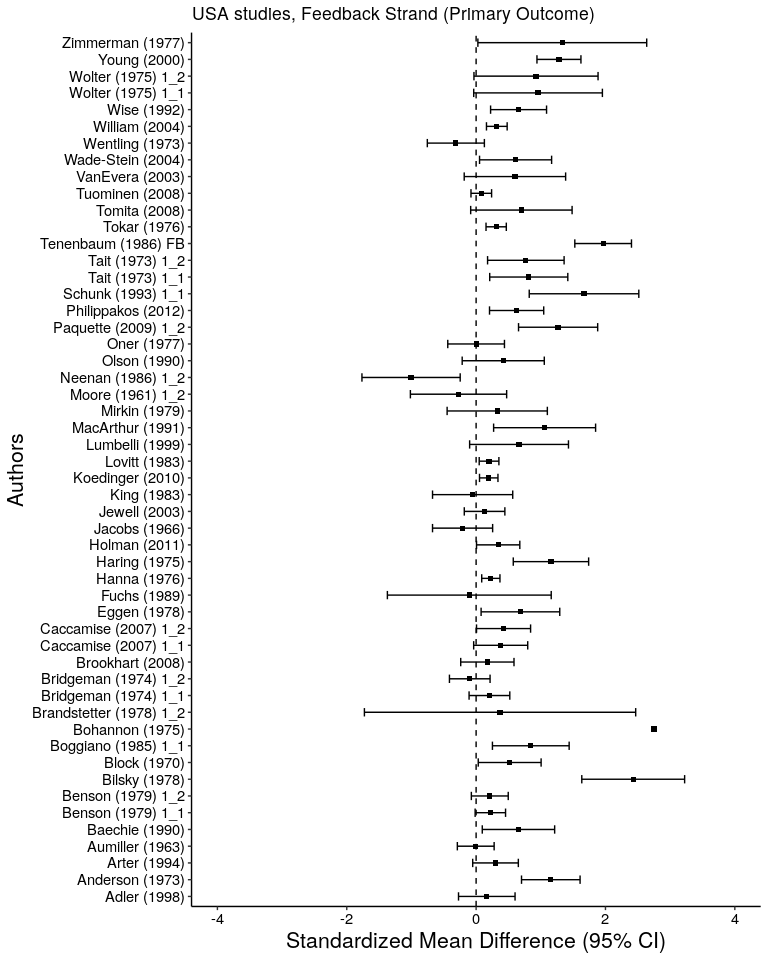
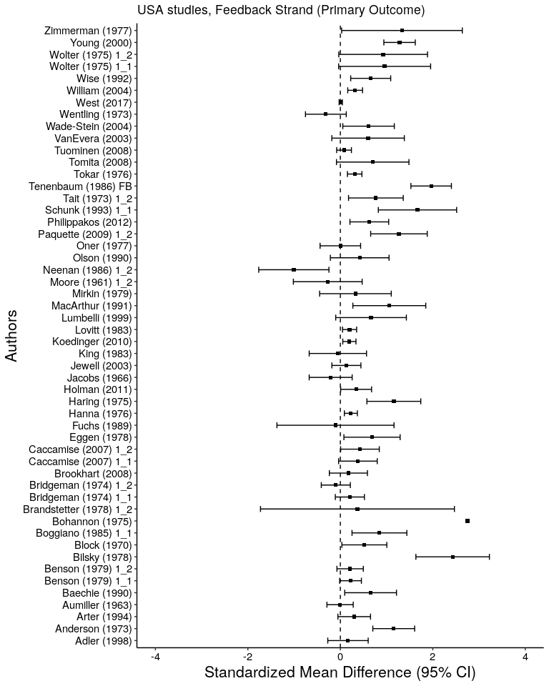
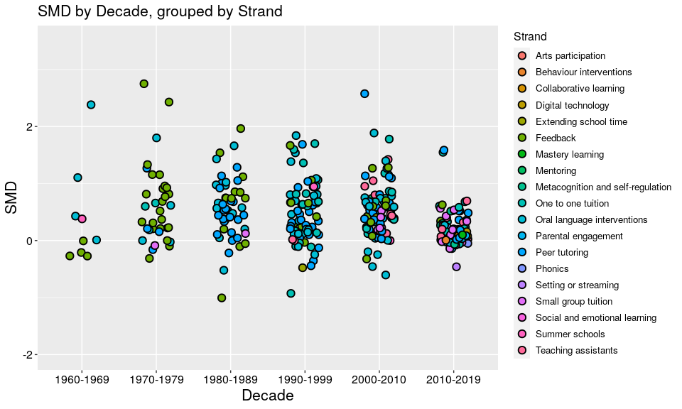

**Import R libraries, save figures to "Master_figs/"**

```r
knitr::opts_chunk$set(echo = T,
                      fig.path = "Master_figs/")
library(reticulate)
library(ggplot2)
library(dplyr)
library(reshape2)
library(purrr)
library(gridExtra)
library(kableExtra)
library(forestplot)
library(metafor)
use_python("/usr/local/bin/python3")
rm(list = ls())
```
**Import Python packages and (json) dataset**

```python
# import necessary libraries
import json
from collections import Counter
from pprint import pprint
import numpy as np
from matplotlib import pyplot as plt
import pandas as pd
plt.style.use('ggplot')

# import dataset (uncomment to select dataset of choice)
with open('/home/jon/json/ToolkitExtraction/data/batch2.json') as f:
#with open('/home/jon/json/ToolkitExtraction/data/Batch1.json') as f:
    data=json.load(f)
```
## CodeSets extraction

These functions extract attribute names and ID's (e.g. strand, educational setting) and return Python dictionaries containing attribute ID's as 'keys' and attribute names as 'values'. The 'Codesets' section at the top of the file does not contain any data, only variable information.

**Example dictionaries**  
strands&nbsp;&nbsp;&nbsp;&nbsp;&nbsp;&nbsp;&nbsp;&nbsp;&nbsp;&nbsp;= {5023544: 'Arts participation', 5023545: 'Aspiration interventions', .. }  
edu_setting&nbsp;&nbsp;&nbsp;= {5215410: 'Nursery school/pre-school', 5215411: 'Primary/elementary school', 5215412, .. }

```python
def get_strand_info():
    '''Return a dict of Strand Attribute Names & Attribute ID's'''
    strands={}
    for counter, element in enumerate(data["CodeSets"][0]["Attributes"]["AttributesList"]):
        attribute_name=(data["CodeSets"][0]["Attributes"]["AttributesList"][counter]["AttributeName"])
        attribute_id=(data["CodeSets"][0]["Attributes"]["AttributesList"][counter]["AttributeId"])
        strands.update( {attribute_id:attribute_name} )
    return strands
strands = get_strand_info()

def get_edu_info():
    '''Return a dict of Educational Setting Attribute Names & Attribute ID's'''
    edu_setting={}
    for counter, value in enumerate(data["CodeSets"][2]["Attributes"]["AttributesList"][2]["Attributes"]["AttributesList"][2]["Attributes"]["AttributesList"]):
        setting_code=data["CodeSets"][2]["Attributes"]["AttributesList"][2]["Attributes"]["AttributesList"][2]["Attributes"]["AttributesList"][counter]["AttributeId"]
        setting_name=data["CodeSets"][2]["Attributes"]["AttributesList"][2]["Attributes"]["AttributesList"][2]["Attributes"]["AttributesList"][counter]["AttributeName"]
        edu_setting.update( {setting_code:setting_name} )
    return edu_setting
edu = get_edu_info()

def get_country_codes():
  '''Return a dict of Country Attribute Names & Attribute ID's'''
  country_codes={}
  for counter, value in enumerate(data["CodeSets"][2]["Attributes"]["AttributesList"][2]["Attributes"]["AttributesList"][0]["Attributes"]["AttributesList"]):
      country_code=data["CodeSets"][2]["Attributes"]["AttributesList"][2]["Attributes"]["AttributesList"][0]["Attributes"]["AttributesList"][counter]["AttributeId"]
      country_name=data["CodeSets"][2]["Attributes"]["AttributesList"][2]["Attributes"]["AttributesList"][0]["Attributes"]["AttributesList"][counter]["AttributeName"]
      country_codes.update( {country_code:country_name} )
  return country_codes
countries = get_country_codes()

def get_publication_type():
    '''Return a dict of Publication Type Attribute Names & Attribute ID's'''
    publication_type={}
    for counter, element in enumerate(data["CodeSets"][2]["Attributes"]["AttributesList"][0]["Attributes"]["AttributesList"][0]):
        attribute_name=(data["CodeSets"][2]["Attributes"]["AttributesList"][0]["Attributes"]["AttributesList"][counter]["AttributeName"])
        attribute_id=(data["CodeSets"][2]["Attributes"]["AttributesList"][0]["Attributes"]["AttributesList"][counter]["AttributeId"])
        publication_type.update( { attribute_id:attribute_name })
    return publication_type
pub_type = get_publication_type()
```
## Main data extraction

```python
def get_all():
  finds=[]
  find=0
  strandfind=0
  countryfind=0
  exclude=np.nan
  
  extracted=0
  null=0
  
  studies=0
  # iterate over each section within each study of 'references'
  for section in range(len(data["References"])):
      find=0
      strandfind=0
      
      if "Codes" in data["References"][section]:
          extracted+=1
          for study in range(len(data["References"][section]["Codes"])):
    
              # get publication type data
              for key, value in pub_type.items():
                  if key == data["References"][section]["Codes"][study]["AttributeId"]:
                      pubfind=value
                      publabel=key
                  elif find==0:
                      pubfind=exclude
                      publabel=exclude
                  
              # get country of study data
              for key, value in countries.items():
                  if key == data["References"][section]["Codes"][study]["AttributeId"]:
                      countryfind=value
                      countrylabel=key
                  elif find==0:
                      countryfind=exclude
                      countrylabel=exclude
          
              # get educational setting data (primary/elementary etc.)
              for key,value in edu.items():
                  if key == data["References"][section]["Codes"][study]["AttributeId"]:
                      find=value
                      label=key
                  elif find==0:
                      find=exclude
                      label=exclude
                  
              # get strand data (feedback, peer tutoring etc.)
              for key,value in strands.items():
                  if key == data["References"][section]["Codes"][study]["AttributeId"]:
                      strandfind=value
                      strandlabel=key
                  elif strandfind==0:
                      strandfind=exclude
                      strandlabel=exclude
                  
              # get outcome data if an "Outcomes" section exists
              if "Outcomes" in data["References"][section]:
                  outcometext=data["References"][section]["Outcomes"][0]["OutcomeText"]
                  interventiontext=data["References"][section]["Outcomes"][0]["InterventionText"]
                  SMD=(data["References"][section]["Outcomes"][0]["SMD"])
                  SESMD=(data["References"][section]["Outcomes"][0]["SESMD"])
                  CIupperSMD=(data["References"][section]["Outcomes"][0]["CIUpperSMD"])
                  CIlowerSMD=(data["References"][section]["Outcomes"][0]["CILowerSMD"])
              else:
                  outcometext=exclude
                  interventiontext=exclude
                  SMD=exclude
                  SESMD=exclude
                  CIupperSMD=exclude
                  CIlowerSMD=exclude
              
              # get year data 
              if "Year" in data["References"][section]:
                  year=int(data["References"][section]["Year"])
              else:
                  year=exclude
              
              # get author data
              if "ShortTitle" in data["References"][section]:
                  author=data["References"][section]["ShortTitle"]
              else:
                  author=exclude
              
          # append all extracted data to our 'finds' list
          finds.append([author, find, strandfind, interventiontext, 
                        outcometext, year, countryfind, pubfind, SMD, SESMD, CIupperSMD, CIlowerSMD])
                        
      else:
          null+=1
      
      # convert data list ('finds') to Pandas dataframe
      df = pd.DataFrame(finds, columns=['Author', 'EducationalSetting', 'Strand', 
                                       'Intervention', 'Outcome', 'Year', 'Country', 'PublicationType', 'SMD', 
                                       'SESMD', 'CIupper', 'CIlower'])
                                    
      #df.fillna(0)
                                    
      # round effect sizes and confidence interbals to four decimal points
      df.loc[:, "SMD"] = df["SMD"].astype(float).round(4)
      df.loc[:, "SESMD"] = df["SESMD"].astype(float, errors='ignore').round(4)
      df.loc[:, "CIupper"] = df["CIupper"].astype(float).round(4)
      df.loc[:, "CIlower"] = df["CIlower"].astype(float).round(4)
         
  print("Number of studies extracted (they have a 'Codes' section): {}".format(extracted),
        "Number of of missing studies (no 'Codes' section found):   {}".format(null),
        sep='\n')

  return df
  
master_df = get_all()
```

```
## Number of studies extracted (they have a 'Codes' section): 598
## Number of of missing studies (no 'Codes' section found):   18
```
**Function to check "Year" range, group by decade, and insert into new 'Decade' column. Reorder columns and subset all Primary (outcome) studies**

```python
# add decade column
def decade_row(row):
  if row["Year"] >= 1960 and row["Year"] <= 1969:
    decade="1960-1969"
  elif row["Year"] >= 1970 and row["Year"] <= 1979:
    decade="1970-1979"
  elif row["Year"] >= 1980 and row["Year"] <= 1989:
    decade="1980-1989"
  elif row["Year"] >= 1990 and row["Year"] <= 1999:
    decade="1990-1999"
  elif row["Year"] >= 2000 and row["Year"] <= 2009:
    decade="2000-2010"
  elif row["Year"] >= 2010 and row["Year"] <= 2019:
    decade="2010-2019"
  elif row["Year"] >= 2019 and row["Year"] <= 2029:
    decade="2020-2029"
  return decade
  
# Use "Year" data to get 'decade' information and add to new column
master_df["Decade"] = master_df.apply(decade_row, axis=1)

# reorder columns
master_df = master_df[["Author", "Year", "Decade", "Country", "Outcome", "Strand", "PublicationType", 
                       "EducationalSetting", "Intervention", "SMD", "SESMD", "CIupper", "CIlower"]]

# subset all Primary Outcomes studies
primary = master_df[master_df["Outcome"] == "Primary outcome"]
```
**Data cleaning: replace all non-useful values with NA & convert columns to factors. Display Primary outcome dataset (25 rows here)**

```r
# Pass all Primary outcome studies to R dataframe (from Python)
primary_outcome <- data.frame(py$primary)

# Clean data (insert NA for missing values and remove 'no info' cells)
primary_outcome$Intervention <- as.character(primary_outcome$Intervention)
primary_outcome$Intervention[primary_outcome$Intervention=="NaN"] <- NA
primary_outcome$Intervention <- as.factor(primary_outcome$Intervention)

primary_outcome$EducationalSetting <- as.character(primary_outcome$EducationalSetting)
primary_outcome$EducationalSetting[primary_outcome$EducationalSetting=="NaN"] <- NA
primary_outcome$EducationalSetting[primary_outcome$EducationalSetting=="No information provided"] <- NA
primary_outcome$EducationalSetting[primary_outcome$EducationalSetting=="Other educational setting (please specify)"] <- NA
primary_outcome$EducationalSetting <- as.factor(primary_outcome$EducationalSetting)

primary_outcome$Strand <- as.character(primary_outcome$Strand)
primary_outcome$Strand[primary_outcome$Strand=="NaN"] <- NA
primary_outcome$Strand <- as.factor(primary_outcome$Strand)

primary_outcome$Country <- as.character(primary_outcome$Country)
primary_outcome$Country[primary_outcome$Country=="NaN"] <- NA
primary_outcome$Country <- as.factor(primary_outcome$Country)

primary_outcome$Outcome <- as.character(primary_outcome$Outcome)
primary_outcome$Outcome[primary_outcome$Outcome=="NaN"] <- NA
primary_outcome$Outcome <- as.factor(primary_outcome$Outcome)

primary_outcome$PublicationType <- as.character(primary_outcome$PublicationType)
primary_outcome$PublicationType[primary_outcome$PublicationType=="NaN"] <- NA
primary_outcome$PublicationType[primary_outcome$PublicationType=="Other (Please specify)"] <- NA
primary_outcome$PublicationType <- as.factor(primary_outcome$PublicationType)

# replace "UK (Select all that apply)" with "UK" for plotting without UK breakdown
primary_outcome$Country <- as.character(primary_outcome$Country)
primary_outcome$Country[primary_outcome$Country=="UK (Select all that apply)"] <- "UK"
primary_outcome$Country <- as.factor(primary_outcome$Country)

# uncomment to view all primary outcome studies (rstudio)
#View(primary_outcome)

rownames(primary_outcome) <- NULL
# display data with kable and inspect subsetted columns (highlighted)
primary_outcome[1:25,1:12] %>%
  mutate(Outcome = cell_spec(Outcome, color = "white", bold = T, background = spec_color(.9, end = .9))) %>%
  kable(escape = F, align = "l") %>%
  column_spec(5, width="30mm") %>%
  kable_styling(c("hover", "condensed", "responsive", "bordered"), full_width = T, font_size = 9)
```

<table class="table table-hover table-condensed table-responsive table-bordered" style="font-size: 9px; margin-left: auto; margin-right: auto;">
 <thead>
  <tr>
   <th style="text-align:left;"> Author </th>
   <th style="text-align:left;"> Year </th>
   <th style="text-align:left;"> Decade </th>
   <th style="text-align:left;"> Country </th>
   <th style="text-align:left;"> Outcome </th>
   <th style="text-align:left;"> Strand </th>
   <th style="text-align:left;"> PublicationType </th>
   <th style="text-align:left;"> EducationalSetting </th>
   <th style="text-align:left;"> Intervention </th>
   <th style="text-align:left;"> SMD </th>
   <th style="text-align:left;"> SESMD </th>
   <th style="text-align:left;"> CIupper </th>
  </tr>
 </thead>
<tbody>
  <tr>
   <td style="text-align:left;"> Abbondanza (2013) </td>
   <td style="text-align:left;"> 2013 </td>
   <td style="text-align:left;"> 2010-2019 </td>
   <td style="text-align:left;"> USA </td>
   <td style="text-align:left;width: 30mm; "> <span style=" font-weight: bold;    color: white !important;border-radius: 4px; padding-right: 4px; padding-left: 4px; background-color: rgba(37, 131, 142, 1) !important;">Primary outcome</span> </td>
   <td style="text-align:left;"> Peer tutoring </td>
   <td style="text-align:left;"> Dissertation or thesis </td>
   <td style="text-align:left;"> Secondary/High school </td>
   <td style="text-align:left;"> Literacy: reading comprehension </td>
   <td style="text-align:left;"> 0.5174 </td>
   <td style="text-align:left;"> 0.1767 </td>
   <td style="text-align:left;"> 0.8637 </td>
  </tr>
  <tr>
   <td style="text-align:left;"> Acalin (1995) </td>
   <td style="text-align:left;"> 1995 </td>
   <td style="text-align:left;"> 1990-1999 </td>
   <td style="text-align:left;"> USA </td>
   <td style="text-align:left;width: 30mm; "> <span style=" font-weight: bold;    color: white !important;border-radius: 4px; padding-right: 4px; padding-left: 4px; background-color: rgba(37, 131, 142, 1) !important;">Primary outcome</span> </td>
   <td style="text-align:left;"> One to one tuition </td>
   <td style="text-align:left;"> Dissertation or thesis </td>
   <td style="text-align:left;"> Primary/elementary school </td>
   <td style="text-align:left;"> Literacy: reading comprehension </td>
   <td style="text-align:left;"> -0.1119 </td>
   <td style="text-align:left;"> 0.2464 </td>
   <td style="text-align:left;"> 0.3710 </td>
  </tr>
  <tr>
   <td style="text-align:left;"> Adler (1998) </td>
   <td style="text-align:left;"> 1998 </td>
   <td style="text-align:left;"> 1990-1999 </td>
   <td style="text-align:left;"> USA </td>
   <td style="text-align:left;width: 30mm; "> <span style=" font-weight: bold;    color: white !important;border-radius: 4px; padding-right: 4px; padding-left: 4px; background-color: rgba(37, 131, 142, 1) !important;">Primary outcome</span> </td>
   <td style="text-align:left;"> Feedback </td>
   <td style="text-align:left;"> Dissertation or thesis </td>
   <td style="text-align:left;"> Primary/elementary school </td>
   <td style="text-align:left;"> Literacy: writing </td>
   <td style="text-align:left;"> 0.1650 </td>
   <td style="text-align:left;"> 0.2230 </td>
   <td style="text-align:left;"> 0.6021 </td>
  </tr>
  <tr>
   <td style="text-align:left;"> Allor (2004) </td>
   <td style="text-align:left;"> 2004 </td>
   <td style="text-align:left;"> 2000-2010 </td>
   <td style="text-align:left;"> NA </td>
   <td style="text-align:left;width: 30mm; "> <span style=" font-weight: bold;    color: white !important;border-radius: 4px; padding-right: 4px; padding-left: 4px; background-color: rgba(37, 131, 142, 1) !important;">Primary outcome</span> </td>
   <td style="text-align:left;"> One to one tuition </td>
   <td style="text-align:left;"> NA </td>
   <td style="text-align:left;"> NA </td>
   <td style="text-align:left;"> Literacy: reading comprehension </td>
   <td style="text-align:left;"> 0.5300 </td>
   <td style="text-align:left;"> 0.2400 </td>
   <td style="text-align:left;"> 1.0004 </td>
  </tr>
  <tr>
   <td style="text-align:left;"> Allsopp (1995) </td>
   <td style="text-align:left;"> 1995 </td>
   <td style="text-align:left;"> 1990-1999 </td>
   <td style="text-align:left;"> USA </td>
   <td style="text-align:left;width: 30mm; "> <span style=" font-weight: bold;    color: white !important;border-radius: 4px; padding-right: 4px; padding-left: 4px; background-color: rgba(37, 131, 142, 1) !important;">Primary outcome</span> </td>
   <td style="text-align:left;"> Peer tutoring </td>
   <td style="text-align:left;"> Dissertation or thesis </td>
   <td style="text-align:left;"> Middle school </td>
   <td style="text-align:left;"> Mathematics </td>
   <td style="text-align:left;"> 0.1596 </td>
   <td style="text-align:left;"> 0.1241 </td>
   <td style="text-align:left;"> 0.4027 </td>
  </tr>
  <tr>
   <td style="text-align:left;"> Ammon (1971) </td>
   <td style="text-align:left;"> 1971 </td>
   <td style="text-align:left;"> 1970-1979 </td>
   <td style="text-align:left;"> USA </td>
   <td style="text-align:left;width: 30mm; "> <span style=" font-weight: bold;    color: white !important;border-radius: 4px; padding-right: 4px; padding-left: 4px; background-color: rgba(37, 131, 142, 1) !important;">Primary outcome</span> </td>
   <td style="text-align:left;"> Oral language interventions </td>
   <td style="text-align:left;"> Journal article </td>
   <td style="text-align:left;"> Primary/elementary school </td>
   <td style="text-align:left;"> Literacy: reading other </td>
   <td style="text-align:left;"> 0.0000 </td>
   <td style="text-align:left;"> 0.2949 </td>
   <td style="text-align:left;"> 0.5780 </td>
  </tr>
  <tr>
   <td style="text-align:left;"> Anders (1984) </td>
   <td style="text-align:left;"> 1984 </td>
   <td style="text-align:left;"> 1980-1989 </td>
   <td style="text-align:left;"> USA </td>
   <td style="text-align:left;width: 30mm; "> <span style=" font-weight: bold;    color: white !important;border-radius: 4px; padding-right: 4px; padding-left: 4px; background-color: rgba(37, 131, 142, 1) !important;">Primary outcome</span> </td>
   <td style="text-align:left;"> Oral language interventions </td>
   <td style="text-align:left;"> Conference paper </td>
   <td style="text-align:left;"> Secondary/High school </td>
   <td style="text-align:left;"> Literacy: reading comprehension </td>
   <td style="text-align:left;"> 1.6616 </td>
   <td style="text-align:left;"> 0.2971 </td>
   <td style="text-align:left;"> 2.2439 </td>
  </tr>
  <tr>
   <td style="text-align:left;"> Anderson (1973) </td>
   <td style="text-align:left;"> 1973 </td>
   <td style="text-align:left;"> 1970-1979 </td>
   <td style="text-align:left;"> USA </td>
   <td style="text-align:left;width: 30mm; "> <span style=" font-weight: bold;    color: white !important;border-radius: 4px; padding-right: 4px; padding-left: 4px; background-color: rgba(37, 131, 142, 1) !important;">Primary outcome</span> </td>
   <td style="text-align:left;"> Feedback </td>
   <td style="text-align:left;"> Dissertation or thesis </td>
   <td style="text-align:left;"> Middle school </td>
   <td style="text-align:left;"> Mathematics </td>
   <td style="text-align:left;"> 1.1547 </td>
   <td style="text-align:left;"> 0.2310 </td>
   <td style="text-align:left;"> 1.6074 </td>
  </tr>
  <tr>
   <td style="text-align:left;"> Aram (2004) OL </td>
   <td style="text-align:left;"> 2004 </td>
   <td style="text-align:left;"> 2000-2010 </td>
   <td style="text-align:left;"> Israel </td>
   <td style="text-align:left;width: 30mm; "> <span style=" font-weight: bold;    color: white !important;border-radius: 4px; padding-right: 4px; padding-left: 4px; background-color: rgba(37, 131, 142, 1) !important;">Primary outcome</span> </td>
   <td style="text-align:left;"> Oral language interventions </td>
   <td style="text-align:left;"> Journal article </td>
   <td style="text-align:left;"> Nursery school/pre-school </td>
   <td style="text-align:left;"> Literacy: reading other </td>
   <td style="text-align:left;"> 0.3624 </td>
   <td style="text-align:left;"> 0.2673 </td>
   <td style="text-align:left;"> 0.8862 </td>
  </tr>
  <tr>
   <td style="text-align:left;"> Aram (2006) </td>
   <td style="text-align:left;"> 2006 </td>
   <td style="text-align:left;"> 2000-2010 </td>
   <td style="text-align:left;"> Israel </td>
   <td style="text-align:left;width: 30mm; "> <span style=" font-weight: bold;    color: white !important;border-radius: 4px; padding-right: 4px; padding-left: 4px; background-color: rgba(37, 131, 142, 1) !important;">Primary outcome</span> </td>
   <td style="text-align:left;"> Oral language interventions </td>
   <td style="text-align:left;"> Journal article </td>
   <td style="text-align:left;"> Nursery school/pre-school </td>
   <td style="text-align:left;"> Literacy: reading comprehension </td>
   <td style="text-align:left;"> 0.0396 </td>
   <td style="text-align:left;"> 0.2310 </td>
   <td style="text-align:left;"> 0.4923 </td>
  </tr>
  <tr>
   <td style="text-align:left;"> Arblaster (1991) </td>
   <td style="text-align:left;"> 1991 </td>
   <td style="text-align:left;"> 1990-1999 </td>
   <td style="text-align:left;"> UK </td>
   <td style="text-align:left;width: 30mm; "> <span style=" font-weight: bold;    color: white !important;border-radius: 4px; padding-right: 4px; padding-left: 4px; background-color: rgba(37, 131, 142, 1) !important;">Primary outcome</span> </td>
   <td style="text-align:left;"> Peer tutoring </td>
   <td style="text-align:left;"> Journal article </td>
   <td style="text-align:left;"> NA </td>
   <td style="text-align:left;"> Literacy: reading other </td>
   <td style="text-align:left;"> 1.6870 </td>
   <td style="text-align:left;"> 0.4016 </td>
   <td style="text-align:left;"> 2.4741 </td>
  </tr>
  <tr>
   <td style="text-align:left;"> Arter (1994) </td>
   <td style="text-align:left;"> 1994 </td>
   <td style="text-align:left;"> 1990-1999 </td>
   <td style="text-align:left;"> USA </td>
   <td style="text-align:left;width: 30mm; "> <span style=" font-weight: bold;    color: white !important;border-radius: 4px; padding-right: 4px; padding-left: 4px; background-color: rgba(37, 131, 142, 1) !important;">Primary outcome</span> </td>
   <td style="text-align:left;"> Feedback </td>
   <td style="text-align:left;"> Conference paper </td>
   <td style="text-align:left;"> Primary/elementary school </td>
   <td style="text-align:left;"> Literacy: writing </td>
   <td style="text-align:left;"> 0.3000 </td>
   <td style="text-align:left;"> 0.1800 </td>
   <td style="text-align:left;"> 0.6528 </td>
  </tr>
  <tr>
   <td style="text-align:left;"> Atherley (1989) </td>
   <td style="text-align:left;"> 1989 </td>
   <td style="text-align:left;"> 1980-1989 </td>
   <td style="text-align:left;"> UK </td>
   <td style="text-align:left;width: 30mm; "> <span style=" font-weight: bold;    color: white !important;border-radius: 4px; padding-right: 4px; padding-left: 4px; background-color: rgba(37, 131, 142, 1) !important;">Primary outcome</span> </td>
   <td style="text-align:left;"> Peer tutoring </td>
   <td style="text-align:left;"> Journal article </td>
   <td style="text-align:left;"> Primary/elementary school </td>
   <td style="text-align:left;"> Literacy: reading comprehension </td>
   <td style="text-align:left;"> 0.6814 </td>
   <td style="text-align:left;"> 0.3356 </td>
   <td style="text-align:left;"> 1.3391 </td>
  </tr>
  <tr>
   <td style="text-align:left;"> Aumiller (1963) </td>
   <td style="text-align:left;"> 1963 </td>
   <td style="text-align:left;"> 1960-1969 </td>
   <td style="text-align:left;"> USA </td>
   <td style="text-align:left;width: 30mm; "> <span style=" font-weight: bold;    color: white !important;border-radius: 4px; padding-right: 4px; padding-left: 4px; background-color: rgba(37, 131, 142, 1) !important;">Primary outcome</span> </td>
   <td style="text-align:left;"> Feedback </td>
   <td style="text-align:left;"> Dissertation or thesis </td>
   <td style="text-align:left;"> Primary/elementary school </td>
   <td style="text-align:left;"> Literacy: spelling </td>
   <td style="text-align:left;"> -0.0058 </td>
   <td style="text-align:left;"> 0.1451 </td>
   <td style="text-align:left;"> 0.2786 </td>
  </tr>
  <tr>
   <td style="text-align:left;"> Baechie (1990) </td>
   <td style="text-align:left;"> 1990 </td>
   <td style="text-align:left;"> 1990-1999 </td>
   <td style="text-align:left;"> USA </td>
   <td style="text-align:left;width: 30mm; "> <span style=" font-weight: bold;    color: white !important;border-radius: 4px; padding-right: 4px; padding-left: 4px; background-color: rgba(37, 131, 142, 1) !important;">Primary outcome</span> </td>
   <td style="text-align:left;"> Feedback </td>
   <td style="text-align:left;"> Journal article </td>
   <td style="text-align:left;"> Middle school </td>
   <td style="text-align:left;"> Literacy: reading comprehension </td>
   <td style="text-align:left;"> 0.6548 </td>
   <td style="text-align:left;"> 0.2855 </td>
   <td style="text-align:left;"> 1.2143 </td>
  </tr>
  <tr>
   <td style="text-align:left;"> Baker (2000) </td>
   <td style="text-align:left;"> 2000 </td>
   <td style="text-align:left;"> 2000-2010 </td>
   <td style="text-align:left;"> NA </td>
   <td style="text-align:left;width: 30mm; "> <span style=" font-weight: bold;    color: white !important;border-radius: 4px; padding-right: 4px; padding-left: 4px; background-color: rgba(37, 131, 142, 1) !important;">Primary outcome</span> </td>
   <td style="text-align:left;"> One to one tuition </td>
   <td style="text-align:left;"> NA </td>
   <td style="text-align:left;"> NA </td>
   <td style="text-align:left;"> Literacy: reading comprehension </td>
   <td style="text-align:left;"> 0.4043 </td>
   <td style="text-align:left;"> 0.2206 </td>
   <td style="text-align:left;"> 0.8367 </td>
  </tr>
  <tr>
   <td style="text-align:left;"> Baker (2005) </td>
   <td style="text-align:left;"> 2005 </td>
   <td style="text-align:left;"> 2000-2010 </td>
   <td style="text-align:left;"> USA </td>
   <td style="text-align:left;width: 30mm; "> <span style=" font-weight: bold;    color: white !important;border-radius: 4px; padding-right: 4px; padding-left: 4px; background-color: rgba(37, 131, 142, 1) !important;">Primary outcome</span> </td>
   <td style="text-align:left;"> Peer tutoring </td>
   <td style="text-align:left;"> Dissertation or thesis </td>
   <td style="text-align:left;"> Primary/elementary school </td>
   <td style="text-align:left;"> Literacy: decoding/phonics </td>
   <td style="text-align:left;"> 1.0958 </td>
   <td style="text-align:left;"> 0.3434 </td>
   <td style="text-align:left;"> 1.7688 </td>
  </tr>
  <tr>
   <td style="text-align:left;"> Banks (1987) </td>
   <td style="text-align:left;"> 1987 </td>
   <td style="text-align:left;"> 1980-1989 </td>
   <td style="text-align:left;"> USA </td>
   <td style="text-align:left;width: 30mm; "> <span style=" font-weight: bold;    color: white !important;border-radius: 4px; padding-right: 4px; padding-left: 4px; background-color: rgba(37, 131, 142, 1) !important;">Primary outcome</span> </td>
   <td style="text-align:left;"> Oral language interventions </td>
   <td style="text-align:left;"> Dissertation or thesis </td>
   <td style="text-align:left;"> Primary/elementary school </td>
   <td style="text-align:left;"> Literacy: reading other </td>
   <td style="text-align:left;"> 0.5767 </td>
   <td style="text-align:left;"> 0.1298 </td>
   <td style="text-align:left;"> 0.8312 </td>
  </tr>
  <tr>
   <td style="text-align:left;"> Bar-Eli (1982) </td>
   <td style="text-align:left;"> 1982 </td>
   <td style="text-align:left;"> 1980-1989 </td>
   <td style="text-align:left;"> Israel </td>
   <td style="text-align:left;width: 30mm; "> <span style=" font-weight: bold;    color: white !important;border-radius: 4px; padding-right: 4px; padding-left: 4px; background-color: rgba(37, 131, 142, 1) !important;">Primary outcome</span> </td>
   <td style="text-align:left;"> Peer tutoring </td>
   <td style="text-align:left;"> Journal article </td>
   <td style="text-align:left;"> Primary/elementary school </td>
   <td style="text-align:left;"> Mathematics </td>
   <td style="text-align:left;"> 1.0033 </td>
   <td style="text-align:left;"> 0.3874 </td>
   <td style="text-align:left;"> 1.7627 </td>
  </tr>
  <tr>
   <td style="text-align:left;"> Beck (2007) </td>
   <td style="text-align:left;"> 2007 </td>
   <td style="text-align:left;"> 2000-2010 </td>
   <td style="text-align:left;"> USA </td>
   <td style="text-align:left;width: 30mm; "> <span style=" font-weight: bold;    color: white !important;border-radius: 4px; padding-right: 4px; padding-left: 4px; background-color: rgba(37, 131, 142, 1) !important;">Primary outcome</span> </td>
   <td style="text-align:left;"> Oral language interventions </td>
   <td style="text-align:left;"> Journal article </td>
   <td style="text-align:left;"> Primary/elementary school </td>
   <td style="text-align:left;"> Literacy: reading other </td>
   <td style="text-align:left;"> 1.1537 </td>
   <td style="text-align:left;"> 0.3206 </td>
   <td style="text-align:left;"> 1.7821 </td>
  </tr>
  <tr>
   <td style="text-align:left;"> Bennett (2013) </td>
   <td style="text-align:left;"> 2013 </td>
   <td style="text-align:left;"> 2010-2019 </td>
   <td style="text-align:left;"> UK </td>
   <td style="text-align:left;width: 30mm; "> <span style=" font-weight: bold;    color: white !important;border-radius: 4px; padding-right: 4px; padding-left: 4px; background-color: rgba(37, 131, 142, 1) !important;">Primary outcome</span> </td>
   <td style="text-align:left;"> Teaching assistants </td>
   <td style="text-align:left;"> Journal article </td>
   <td style="text-align:left;"> Secondary/High school </td>
   <td style="text-align:left;"> Cognitive: other </td>
   <td style="text-align:left;"> 0.0032 </td>
   <td style="text-align:left;"> 0.4369 </td>
   <td style="text-align:left;"> 0.8596 </td>
  </tr>
  <tr>
   <td style="text-align:left;"> Benson (1979) 1_1 </td>
   <td style="text-align:left;"> 1979 </td>
   <td style="text-align:left;"> 1970-1979 </td>
   <td style="text-align:left;"> USA </td>
   <td style="text-align:left;width: 30mm; "> <span style=" font-weight: bold;    color: white !important;border-radius: 4px; padding-right: 4px; padding-left: 4px; background-color: rgba(37, 131, 142, 1) !important;">Primary outcome</span> </td>
   <td style="text-align:left;"> Feedback </td>
   <td style="text-align:left;"> Dissertation or thesis </td>
   <td style="text-align:left;"> Middle school </td>
   <td style="text-align:left;"> Literacy: writing </td>
   <td style="text-align:left;"> 0.2200 </td>
   <td style="text-align:left;"> 0.1200 </td>
   <td style="text-align:left;"> 0.4552 </td>
  </tr>
  <tr>
   <td style="text-align:left;"> Benson (1979) 1_2 </td>
   <td style="text-align:left;"> 1979 </td>
   <td style="text-align:left;"> 1970-1979 </td>
   <td style="text-align:left;"> USA </td>
   <td style="text-align:left;width: 30mm; "> <span style=" font-weight: bold;    color: white !important;border-radius: 4px; padding-right: 4px; padding-left: 4px; background-color: rgba(37, 131, 142, 1) !important;">Primary outcome</span> </td>
   <td style="text-align:left;"> Feedback </td>
   <td style="text-align:left;"> Dissertation or thesis </td>
   <td style="text-align:left;"> Middle school </td>
   <td style="text-align:left;"> Literacy: writing </td>
   <td style="text-align:left;"> 0.2115 </td>
   <td style="text-align:left;"> 0.1455 </td>
   <td style="text-align:left;"> 0.4967 </td>
  </tr>
  <tr>
   <td style="text-align:left;"> Bereiter (1985) </td>
   <td style="text-align:left;"> 1985 </td>
   <td style="text-align:left;"> 1980-1989 </td>
   <td style="text-align:left;"> USA </td>
   <td style="text-align:left;width: 30mm; "> <span style=" font-weight: bold;    color: white !important;border-radius: 4px; padding-right: 4px; padding-left: 4px; background-color: rgba(37, 131, 142, 1) !important;">Primary outcome</span> </td>
   <td style="text-align:left;"> Oral language interventions </td>
   <td style="text-align:left;"> Journal article </td>
   <td style="text-align:left;"> NA </td>
   <td style="text-align:left;"> Literacy: reading comprehension </td>
   <td style="text-align:left;"> 0.5271 </td>
   <td style="text-align:left;"> 0.3665 </td>
   <td style="text-align:left;"> 1.2454 </td>
  </tr>
  <tr>
   <td style="text-align:left;"> Bethge (1982) </td>
   <td style="text-align:left;"> 1982 </td>
   <td style="text-align:left;"> 1980-1989 </td>
   <td style="text-align:left;"> Germany </td>
   <td style="text-align:left;width: 30mm; "> <span style=" font-weight: bold;    color: white !important;border-radius: 4px; padding-right: 4px; padding-left: 4px; background-color: rgba(37, 131, 142, 1) !important;">Primary outcome</span> </td>
   <td style="text-align:left;"> Feedback </td>
   <td style="text-align:left;"> Journal article </td>
   <td style="text-align:left;"> Primary/elementary school </td>
   <td style="text-align:left;"> Cognitive: other </td>
   <td style="text-align:left;"> 0.8552 </td>
   <td style="text-align:left;"> 0.3027 </td>
   <td style="text-align:left;"> 1.4485 </td>
  </tr>
</tbody>
</table>

**Subset 'Primary/elementary school' & 'Secondary/High school' data (Primary outcomes only), then from each of those get "Feedback" strand data only**

```r
schools <- primary_outcome %>% 
  select(Author, Strand, EducationalSetting, SMD, CIupper, CIlower) %>%
  filter(EducationalSetting %in% c("Primary/elementary school", "Secondary/High school")) %>%
  filter(Strand=="Feedback")

rownames(schools) <- NULL
# display data with kable and inspect subsetted columns (highlighted)
schools[1:25,1:6] %>%
  mutate(
    Strand = cell_spec(Strand, color = "white", bold = T, background = spec_color(.9, end = .9)),
    EducationalSetting = cell_spec(EducationalSetting, color = "white", bold = T, background = spec_color(.9, end = .9))) %>%
  kable(escape = F, align = "l") %>%
  kable_styling(c("hover", "condensed", "responsive", "bordered"), full_width = F, font_size = 12)
```

<table class="table table-hover table-condensed table-responsive table-bordered" style="font-size: 12px; width: auto !important; margin-left: auto; margin-right: auto;">
 <thead>
  <tr>
   <th style="text-align:left;"> Author </th>
   <th style="text-align:left;"> Strand </th>
   <th style="text-align:left;"> EducationalSetting </th>
   <th style="text-align:left;"> SMD </th>
   <th style="text-align:left;"> CIupper </th>
   <th style="text-align:left;"> CIlower </th>
  </tr>
 </thead>
<tbody>
  <tr>
   <td style="text-align:left;"> Adler (1998) </td>
   <td style="text-align:left;"> <span style=" font-weight: bold;    color: white !important;border-radius: 4px; padding-right: 4px; padding-left: 4px; background-color: rgba(37, 131, 142, 1) !important;">Feedback</span> </td>
   <td style="text-align:left;"> <span style=" font-weight: bold;    color: white !important;border-radius: 4px; padding-right: 4px; padding-left: 4px; background-color: rgba(37, 131, 142, 1) !important;">Primary/elementary school</span> </td>
   <td style="text-align:left;"> 0.1650 </td>
   <td style="text-align:left;"> 0.6021 </td>
   <td style="text-align:left;"> -0.2721 </td>
  </tr>
  <tr>
   <td style="text-align:left;"> Arter (1994) </td>
   <td style="text-align:left;"> <span style=" font-weight: bold;    color: white !important;border-radius: 4px; padding-right: 4px; padding-left: 4px; background-color: rgba(37, 131, 142, 1) !important;">Feedback</span> </td>
   <td style="text-align:left;"> <span style=" font-weight: bold;    color: white !important;border-radius: 4px; padding-right: 4px; padding-left: 4px; background-color: rgba(37, 131, 142, 1) !important;">Primary/elementary school</span> </td>
   <td style="text-align:left;"> 0.3000 </td>
   <td style="text-align:left;"> 0.6528 </td>
   <td style="text-align:left;"> -0.0528 </td>
  </tr>
  <tr>
   <td style="text-align:left;"> Aumiller (1963) </td>
   <td style="text-align:left;"> <span style=" font-weight: bold;    color: white !important;border-radius: 4px; padding-right: 4px; padding-left: 4px; background-color: rgba(37, 131, 142, 1) !important;">Feedback</span> </td>
   <td style="text-align:left;"> <span style=" font-weight: bold;    color: white !important;border-radius: 4px; padding-right: 4px; padding-left: 4px; background-color: rgba(37, 131, 142, 1) !important;">Primary/elementary school</span> </td>
   <td style="text-align:left;"> -0.0058 </td>
   <td style="text-align:left;"> 0.2786 </td>
   <td style="text-align:left;"> -0.2903 </td>
  </tr>
  <tr>
   <td style="text-align:left;"> Bethge (1982) </td>
   <td style="text-align:left;"> <span style=" font-weight: bold;    color: white !important;border-radius: 4px; padding-right: 4px; padding-left: 4px; background-color: rgba(37, 131, 142, 1) !important;">Feedback</span> </td>
   <td style="text-align:left;"> <span style=" font-weight: bold;    color: white !important;border-radius: 4px; padding-right: 4px; padding-left: 4px; background-color: rgba(37, 131, 142, 1) !important;">Primary/elementary school</span> </td>
   <td style="text-align:left;"> 0.8552 </td>
   <td style="text-align:left;"> 1.4485 </td>
   <td style="text-align:left;"> 0.2619 </td>
  </tr>
  <tr>
   <td style="text-align:left;"> Bilsky (1978) </td>
   <td style="text-align:left;"> <span style=" font-weight: bold;    color: white !important;border-radius: 4px; padding-right: 4px; padding-left: 4px; background-color: rgba(37, 131, 142, 1) !important;">Feedback</span> </td>
   <td style="text-align:left;"> <span style=" font-weight: bold;    color: white !important;border-radius: 4px; padding-right: 4px; padding-left: 4px; background-color: rgba(37, 131, 142, 1) !important;">Secondary/High school</span> </td>
   <td style="text-align:left;"> 2.4289 </td>
   <td style="text-align:left;"> 3.2239 </td>
   <td style="text-align:left;"> 1.6338 </td>
  </tr>
  <tr>
   <td style="text-align:left;"> Block (1970) </td>
   <td style="text-align:left;"> <span style=" font-weight: bold;    color: white !important;border-radius: 4px; padding-right: 4px; padding-left: 4px; background-color: rgba(37, 131, 142, 1) !important;">Feedback</span> </td>
   <td style="text-align:left;"> <span style=" font-weight: bold;    color: white !important;border-radius: 4px; padding-right: 4px; padding-left: 4px; background-color: rgba(37, 131, 142, 1) !important;">Primary/elementary school</span> </td>
   <td style="text-align:left;"> 0.5191 </td>
   <td style="text-align:left;"> 1.0050 </td>
   <td style="text-align:left;"> 0.0331 </td>
  </tr>
  <tr>
   <td style="text-align:left;"> Boggiano (1985) 1_1 </td>
   <td style="text-align:left;"> <span style=" font-weight: bold;    color: white !important;border-radius: 4px; padding-right: 4px; padding-left: 4px; background-color: rgba(37, 131, 142, 1) !important;">Feedback</span> </td>
   <td style="text-align:left;"> <span style=" font-weight: bold;    color: white !important;border-radius: 4px; padding-right: 4px; padding-left: 4px; background-color: rgba(37, 131, 142, 1) !important;">Primary/elementary school</span> </td>
   <td style="text-align:left;"> 0.8454 </td>
   <td style="text-align:left;"> 1.4385 </td>
   <td style="text-align:left;"> 0.2523 </td>
  </tr>
  <tr>
   <td style="text-align:left;"> Bohannon (1975) </td>
   <td style="text-align:left;"> <span style=" font-weight: bold;    color: white !important;border-radius: 4px; padding-right: 4px; padding-left: 4px; background-color: rgba(37, 131, 142, 1) !important;">Feedback</span> </td>
   <td style="text-align:left;"> <span style=" font-weight: bold;    color: white !important;border-radius: 4px; padding-right: 4px; padding-left: 4px; background-color: rgba(37, 131, 142, 1) !important;">Primary/elementary school</span> </td>
   <td style="text-align:left;"> 2.7500 </td>
   <td style="text-align:left;"> 4.0436 </td>
   <td style="text-align:left;"> 1.4564 </td>
  </tr>
  <tr>
   <td style="text-align:left;"> Boulet (1990) 1_1 </td>
   <td style="text-align:left;"> <span style=" font-weight: bold;    color: white !important;border-radius: 4px; padding-right: 4px; padding-left: 4px; background-color: rgba(37, 131, 142, 1) !important;">Feedback</span> </td>
   <td style="text-align:left;"> <span style=" font-weight: bold;    color: white !important;border-radius: 4px; padding-right: 4px; padding-left: 4px; background-color: rgba(37, 131, 142, 1) !important;">Secondary/High school</span> </td>
   <td style="text-align:left;"> -0.0329 </td>
   <td style="text-align:left;"> 0.5233 </td>
   <td style="text-align:left;"> -0.5891 </td>
  </tr>
  <tr>
   <td style="text-align:left;"> Boulet (1990) 1_2 </td>
   <td style="text-align:left;"> <span style=" font-weight: bold;    color: white !important;border-radius: 4px; padding-right: 4px; padding-left: 4px; background-color: rgba(37, 131, 142, 1) !important;">Feedback</span> </td>
   <td style="text-align:left;"> <span style=" font-weight: bold;    color: white !important;border-radius: 4px; padding-right: 4px; padding-left: 4px; background-color: rgba(37, 131, 142, 1) !important;">Secondary/High school</span> </td>
   <td style="text-align:left;"> 0.2514 </td>
   <td style="text-align:left;"> 0.7735 </td>
   <td style="text-align:left;"> -0.2707 </td>
  </tr>
  <tr>
   <td style="text-align:left;"> Brandstetter (1978) 1_2 </td>
   <td style="text-align:left;"> <span style=" font-weight: bold;    color: white !important;border-radius: 4px; padding-right: 4px; padding-left: 4px; background-color: rgba(37, 131, 142, 1) !important;">Feedback</span> </td>
   <td style="text-align:left;"> <span style=" font-weight: bold;    color: white !important;border-radius: 4px; padding-right: 4px; padding-left: 4px; background-color: rgba(37, 131, 142, 1) !important;">Primary/elementary school</span> </td>
   <td style="text-align:left;"> 0.3700 </td>
   <td style="text-align:left;"> 2.4672 </td>
   <td style="text-align:left;"> -1.7272 </td>
  </tr>
  <tr>
   <td style="text-align:left;"> Bridgeman (1974) 1_2 </td>
   <td style="text-align:left;"> <span style=" font-weight: bold;    color: white !important;border-radius: 4px; padding-right: 4px; padding-left: 4px; background-color: rgba(37, 131, 142, 1) !important;">Feedback</span> </td>
   <td style="text-align:left;"> <span style=" font-weight: bold;    color: white !important;border-radius: 4px; padding-right: 4px; padding-left: 4px; background-color: rgba(37, 131, 142, 1) !important;">Secondary/High school</span> </td>
   <td style="text-align:left;"> -0.0984 </td>
   <td style="text-align:left;"> 0.2157 </td>
   <td style="text-align:left;"> -0.4124 </td>
  </tr>
  <tr>
   <td style="text-align:left;"> Brookhart (2008) </td>
   <td style="text-align:left;"> <span style=" font-weight: bold;    color: white !important;border-radius: 4px; padding-right: 4px; padding-left: 4px; background-color: rgba(37, 131, 142, 1) !important;">Feedback</span> </td>
   <td style="text-align:left;"> <span style=" font-weight: bold;    color: white !important;border-radius: 4px; padding-right: 4px; padding-left: 4px; background-color: rgba(37, 131, 142, 1) !important;">Primary/elementary school</span> </td>
   <td style="text-align:left;"> 0.1738 </td>
   <td style="text-align:left;"> 0.5857 </td>
   <td style="text-align:left;"> -0.2381 </td>
  </tr>
  <tr>
   <td style="text-align:left;"> Butler (1986) 1_1 </td>
   <td style="text-align:left;"> <span style=" font-weight: bold;    color: white !important;border-radius: 4px; padding-right: 4px; padding-left: 4px; background-color: rgba(37, 131, 142, 1) !important;">Feedback</span> </td>
   <td style="text-align:left;"> <span style=" font-weight: bold;    color: white !important;border-radius: 4px; padding-right: 4px; padding-left: 4px; background-color: rgba(37, 131, 142, 1) !important;">Primary/elementary school</span> </td>
   <td style="text-align:left;"> 1.5390 </td>
   <td style="text-align:left;"> 1.8804 </td>
   <td style="text-align:left;"> 1.1976 </td>
  </tr>
  <tr>
   <td style="text-align:left;"> Butler (1986) 1_2 </td>
   <td style="text-align:left;"> <span style=" font-weight: bold;    color: white !important;border-radius: 4px; padding-right: 4px; padding-left: 4px; background-color: rgba(37, 131, 142, 1) !important;">Feedback</span> </td>
   <td style="text-align:left;"> <span style=" font-weight: bold;    color: white !important;border-radius: 4px; padding-right: 4px; padding-left: 4px; background-color: rgba(37, 131, 142, 1) !important;">Primary/elementary school</span> </td>
   <td style="text-align:left;"> 1.1185 </td>
   <td style="text-align:left;"> 1.4392 </td>
   <td style="text-align:left;"> 0.7978 </td>
  </tr>
  <tr>
   <td style="text-align:left;"> Butler (1987) 1_2 </td>
   <td style="text-align:left;"> <span style=" font-weight: bold;    color: white !important;border-radius: 4px; padding-right: 4px; padding-left: 4px; background-color: rgba(37, 131, 142, 1) !important;">Feedback</span> </td>
   <td style="text-align:left;"> <span style=" font-weight: bold;    color: white !important;border-radius: 4px; padding-right: 4px; padding-left: 4px; background-color: rgba(37, 131, 142, 1) !important;">Primary/elementary school</span> </td>
   <td style="text-align:left;"> 0.5410 </td>
   <td style="text-align:left;"> 1.1063 </td>
   <td style="text-align:left;"> -0.0242 </td>
  </tr>
  <tr>
   <td style="text-align:left;"> Butler (1987) 1_3 </td>
   <td style="text-align:left;"> <span style=" font-weight: bold;    color: white !important;border-radius: 4px; padding-right: 4px; padding-left: 4px; background-color: rgba(37, 131, 142, 1) !important;">Feedback</span> </td>
   <td style="text-align:left;"> <span style=" font-weight: bold;    color: white !important;border-radius: 4px; padding-right: 4px; padding-left: 4px; background-color: rgba(37, 131, 142, 1) !important;">Primary/elementary school</span> </td>
   <td style="text-align:left;"> 0.3675 </td>
   <td style="text-align:left;"> 0.9270 </td>
   <td style="text-align:left;"> -0.1919 </td>
  </tr>
  <tr>
   <td style="text-align:left;"> Caccamise (2007) 1_1 </td>
   <td style="text-align:left;"> <span style=" font-weight: bold;    color: white !important;border-radius: 4px; padding-right: 4px; padding-left: 4px; background-color: rgba(37, 131, 142, 1) !important;">Feedback</span> </td>
   <td style="text-align:left;"> <span style=" font-weight: bold;    color: white !important;border-radius: 4px; padding-right: 4px; padding-left: 4px; background-color: rgba(37, 131, 142, 1) !important;">Secondary/High school</span> </td>
   <td style="text-align:left;"> 0.3800 </td>
   <td style="text-align:left;"> 0.7979 </td>
   <td style="text-align:left;"> -0.0379 </td>
  </tr>
  <tr>
   <td style="text-align:left;"> Eggen (1978) </td>
   <td style="text-align:left;"> <span style=" font-weight: bold;    color: white !important;border-radius: 4px; padding-right: 4px; padding-left: 4px; background-color: rgba(37, 131, 142, 1) !important;">Feedback</span> </td>
   <td style="text-align:left;"> <span style=" font-weight: bold;    color: white !important;border-radius: 4px; padding-right: 4px; padding-left: 4px; background-color: rgba(37, 131, 142, 1) !important;">Primary/elementary school</span> </td>
   <td style="text-align:left;"> 0.6851 </td>
   <td style="text-align:left;"> 1.2931 </td>
   <td style="text-align:left;"> 0.0771 </td>
  </tr>
  <tr>
   <td style="text-align:left;"> Hanna (1976) </td>
   <td style="text-align:left;"> <span style=" font-weight: bold;    color: white !important;border-radius: 4px; padding-right: 4px; padding-left: 4px; background-color: rgba(37, 131, 142, 1) !important;">Feedback</span> </td>
   <td style="text-align:left;"> <span style=" font-weight: bold;    color: white !important;border-radius: 4px; padding-right: 4px; padding-left: 4px; background-color: rgba(37, 131, 142, 1) !important;">Primary/elementary school</span> </td>
   <td style="text-align:left;"> 0.2276 </td>
   <td style="text-align:left;"> 0.3686 </td>
   <td style="text-align:left;"> 0.0866 </td>
  </tr>
  <tr>
   <td style="text-align:left;"> Haring (1975) </td>
   <td style="text-align:left;"> <span style=" font-weight: bold;    color: white !important;border-radius: 4px; padding-right: 4px; padding-left: 4px; background-color: rgba(37, 131, 142, 1) !important;">Feedback</span> </td>
   <td style="text-align:left;"> <span style=" font-weight: bold;    color: white !important;border-radius: 4px; padding-right: 4px; padding-left: 4px; background-color: rgba(37, 131, 142, 1) !important;">Primary/elementary school</span> </td>
   <td style="text-align:left;"> 1.1571 </td>
   <td style="text-align:left;"> 1.7398 </td>
   <td style="text-align:left;"> 0.5745 </td>
  </tr>
  <tr>
   <td style="text-align:left;"> Holman (2011) </td>
   <td style="text-align:left;"> <span style=" font-weight: bold;    color: white !important;border-radius: 4px; padding-right: 4px; padding-left: 4px; background-color: rgba(37, 131, 142, 1) !important;">Feedback</span> </td>
   <td style="text-align:left;"> <span style=" font-weight: bold;    color: white !important;border-radius: 4px; padding-right: 4px; padding-left: 4px; background-color: rgba(37, 131, 142, 1) !important;">Primary/elementary school</span> </td>
   <td style="text-align:left;"> 0.3410 </td>
   <td style="text-align:left;"> 0.6756 </td>
   <td style="text-align:left;"> 0.0064 </td>
  </tr>
  <tr>
   <td style="text-align:left;"> Jacobs (1966) </td>
   <td style="text-align:left;"> <span style=" font-weight: bold;    color: white !important;border-radius: 4px; padding-right: 4px; padding-left: 4px; background-color: rgba(37, 131, 142, 1) !important;">Feedback</span> </td>
   <td style="text-align:left;"> <span style=" font-weight: bold;    color: white !important;border-radius: 4px; padding-right: 4px; padding-left: 4px; background-color: rgba(37, 131, 142, 1) !important;">Secondary/High school</span> </td>
   <td style="text-align:left;"> -0.2093 </td>
   <td style="text-align:left;"> 0.2554 </td>
   <td style="text-align:left;"> -0.6739 </td>
  </tr>
  <tr>
   <td style="text-align:left;"> Lovitt (1983) </td>
   <td style="text-align:left;"> <span style=" font-weight: bold;    color: white !important;border-radius: 4px; padding-right: 4px; padding-left: 4px; background-color: rgba(37, 131, 142, 1) !important;">Feedback</span> </td>
   <td style="text-align:left;"> <span style=" font-weight: bold;    color: white !important;border-radius: 4px; padding-right: 4px; padding-left: 4px; background-color: rgba(37, 131, 142, 1) !important;">Primary/elementary school</span> </td>
   <td style="text-align:left;"> 0.2000 </td>
   <td style="text-align:left;"> 0.3522 </td>
   <td style="text-align:left;"> 0.0478 </td>
  </tr>
  <tr>
   <td style="text-align:left;"> MacArthur (1991) </td>
   <td style="text-align:left;"> <span style=" font-weight: bold;    color: white !important;border-radius: 4px; padding-right: 4px; padding-left: 4px; background-color: rgba(37, 131, 142, 1) !important;">Feedback</span> </td>
   <td style="text-align:left;"> <span style=" font-weight: bold;    color: white !important;border-radius: 4px; padding-right: 4px; padding-left: 4px; background-color: rgba(37, 131, 142, 1) !important;">Primary/elementary school</span> </td>
   <td style="text-align:left;"> 1.0590 </td>
   <td style="text-align:left;"> 1.8474 </td>
   <td style="text-align:left;"> 0.2706 </td>
  </tr>
</tbody>
</table>
**Make Primary/Elementary and High school forest plots and display them**

```r
Primary_plot <- ggplot(data=na.omit(subset(schools, select=c(EducationalSetting=="Primary/elementary school", Author, SMD, CIlower, CIupper))),
                    aes(y=Author, x=SMD, xmin=CIlower, xmax=CIupper))+
                    geom_point(color='black', shape=15) +
                    geom_errorbarh(height=.7, linetype=1) +
                    scale_x_continuous(limits=c(-4,4), name='Standardized Mean Difference (95% CI)') +
                    ylab('Reference') +
                    geom_vline(xintercept=0, color='black', linetype='dashed') +
                    theme_classic() +
                    ggtitle("Primary School, Feedback Strand, Primary outcome")

High_plot <- ggplot(data=na.omit(subset(schools, select=c(EducationalSetting=="Secondary/High school", Author, SMD, CIlower, CIupper))),
                    aes(y=Author, x=SMD, xmin=CIlower, xmax=CIupper))+
                    geom_point(color='black', shape=15) +
                    geom_errorbarh(height=.7, linetype=1) +
                    scale_x_continuous(limits=c(-4,4), name='Standardized Mean Difference (95% CI)') +
                    ylab('Reference') +
                    geom_vline(xintercept=0, color='black', linetype='dashed') +
                    theme_classic() +
                    ggtitle("High School, Feeback Strand, Primary Outcome")

Primary_plot
```

<!-- -->

**Subset 'USA' and 'UK' data (Primary outcomes only), then from each of those get "Feedback" strand data only**

```r
countries <- primary_outcome %>% 
  select(Author, Strand, Country, SMD, CIupper, CIlower) %>%
  filter(Country %in% c("USA", "UK")) %>%
  filter(Strand=="Feedback")

rownames(countries) <- NULL
# display data with kable and inspect subsetted columns (highlighted)
countries[1:25,1:6] %>%
  mutate(
    Strand  = cell_spec(Strand, color = "white", bold = T, background = spec_color(.9, end = .9)),
    Country = cell_spec(Country, color = "white", bold = T, background = spec_color(.9, end = .9))) %>%
  kable(escape = F, align = "l") %>%
  kable_styling(c("hover", "condensed", "responsive", "bordered"), full_width = F, font_size = 12)
```

<table class="table table-hover table-condensed table-responsive table-bordered" style="font-size: 12px; width: auto !important; margin-left: auto; margin-right: auto;">
 <thead>
  <tr>
   <th style="text-align:left;"> Author </th>
   <th style="text-align:left;"> Strand </th>
   <th style="text-align:left;"> Country </th>
   <th style="text-align:left;"> SMD </th>
   <th style="text-align:left;"> CIupper </th>
   <th style="text-align:left;"> CIlower </th>
  </tr>
 </thead>
<tbody>
  <tr>
   <td style="text-align:left;"> Adler (1998) </td>
   <td style="text-align:left;"> <span style=" font-weight: bold;    color: white !important;border-radius: 4px; padding-right: 4px; padding-left: 4px; background-color: rgba(37, 131, 142, 1) !important;">Feedback</span> </td>
   <td style="text-align:left;"> <span style=" font-weight: bold;    color: white !important;border-radius: 4px; padding-right: 4px; padding-left: 4px; background-color: rgba(37, 131, 142, 1) !important;">USA</span> </td>
   <td style="text-align:left;"> 0.1650 </td>
   <td style="text-align:left;"> 0.6021 </td>
   <td style="text-align:left;"> -0.2721 </td>
  </tr>
  <tr>
   <td style="text-align:left;"> Anderson (1973) </td>
   <td style="text-align:left;"> <span style=" font-weight: bold;    color: white !important;border-radius: 4px; padding-right: 4px; padding-left: 4px; background-color: rgba(37, 131, 142, 1) !important;">Feedback</span> </td>
   <td style="text-align:left;"> <span style=" font-weight: bold;    color: white !important;border-radius: 4px; padding-right: 4px; padding-left: 4px; background-color: rgba(37, 131, 142, 1) !important;">USA</span> </td>
   <td style="text-align:left;"> 1.1547 </td>
   <td style="text-align:left;"> 1.6074 </td>
   <td style="text-align:left;"> 0.7020 </td>
  </tr>
  <tr>
   <td style="text-align:left;"> Arter (1994) </td>
   <td style="text-align:left;"> <span style=" font-weight: bold;    color: white !important;border-radius: 4px; padding-right: 4px; padding-left: 4px; background-color: rgba(37, 131, 142, 1) !important;">Feedback</span> </td>
   <td style="text-align:left;"> <span style=" font-weight: bold;    color: white !important;border-radius: 4px; padding-right: 4px; padding-left: 4px; background-color: rgba(37, 131, 142, 1) !important;">USA</span> </td>
   <td style="text-align:left;"> 0.3000 </td>
   <td style="text-align:left;"> 0.6528 </td>
   <td style="text-align:left;"> -0.0528 </td>
  </tr>
  <tr>
   <td style="text-align:left;"> Aumiller (1963) </td>
   <td style="text-align:left;"> <span style=" font-weight: bold;    color: white !important;border-radius: 4px; padding-right: 4px; padding-left: 4px; background-color: rgba(37, 131, 142, 1) !important;">Feedback</span> </td>
   <td style="text-align:left;"> <span style=" font-weight: bold;    color: white !important;border-radius: 4px; padding-right: 4px; padding-left: 4px; background-color: rgba(37, 131, 142, 1) !important;">USA</span> </td>
   <td style="text-align:left;"> -0.0058 </td>
   <td style="text-align:left;"> 0.2786 </td>
   <td style="text-align:left;"> -0.2903 </td>
  </tr>
  <tr>
   <td style="text-align:left;"> Baechie (1990) </td>
   <td style="text-align:left;"> <span style=" font-weight: bold;    color: white !important;border-radius: 4px; padding-right: 4px; padding-left: 4px; background-color: rgba(37, 131, 142, 1) !important;">Feedback</span> </td>
   <td style="text-align:left;"> <span style=" font-weight: bold;    color: white !important;border-radius: 4px; padding-right: 4px; padding-left: 4px; background-color: rgba(37, 131, 142, 1) !important;">USA</span> </td>
   <td style="text-align:left;"> 0.6548 </td>
   <td style="text-align:left;"> 1.2143 </td>
   <td style="text-align:left;"> 0.0952 </td>
  </tr>
  <tr>
   <td style="text-align:left;"> Benson (1979) 1_1 </td>
   <td style="text-align:left;"> <span style=" font-weight: bold;    color: white !important;border-radius: 4px; padding-right: 4px; padding-left: 4px; background-color: rgba(37, 131, 142, 1) !important;">Feedback</span> </td>
   <td style="text-align:left;"> <span style=" font-weight: bold;    color: white !important;border-radius: 4px; padding-right: 4px; padding-left: 4px; background-color: rgba(37, 131, 142, 1) !important;">USA</span> </td>
   <td style="text-align:left;"> 0.2200 </td>
   <td style="text-align:left;"> 0.4552 </td>
   <td style="text-align:left;"> -0.0152 </td>
  </tr>
  <tr>
   <td style="text-align:left;"> Benson (1979) 1_2 </td>
   <td style="text-align:left;"> <span style=" font-weight: bold;    color: white !important;border-radius: 4px; padding-right: 4px; padding-left: 4px; background-color: rgba(37, 131, 142, 1) !important;">Feedback</span> </td>
   <td style="text-align:left;"> <span style=" font-weight: bold;    color: white !important;border-radius: 4px; padding-right: 4px; padding-left: 4px; background-color: rgba(37, 131, 142, 1) !important;">USA</span> </td>
   <td style="text-align:left;"> 0.2115 </td>
   <td style="text-align:left;"> 0.4967 </td>
   <td style="text-align:left;"> -0.0737 </td>
  </tr>
  <tr>
   <td style="text-align:left;"> Bilsky (1978) </td>
   <td style="text-align:left;"> <span style=" font-weight: bold;    color: white !important;border-radius: 4px; padding-right: 4px; padding-left: 4px; background-color: rgba(37, 131, 142, 1) !important;">Feedback</span> </td>
   <td style="text-align:left;"> <span style=" font-weight: bold;    color: white !important;border-radius: 4px; padding-right: 4px; padding-left: 4px; background-color: rgba(37, 131, 142, 1) !important;">USA</span> </td>
   <td style="text-align:left;"> 2.4289 </td>
   <td style="text-align:left;"> 3.2239 </td>
   <td style="text-align:left;"> 1.6338 </td>
  </tr>
  <tr>
   <td style="text-align:left;"> Block (1970) </td>
   <td style="text-align:left;"> <span style=" font-weight: bold;    color: white !important;border-radius: 4px; padding-right: 4px; padding-left: 4px; background-color: rgba(37, 131, 142, 1) !important;">Feedback</span> </td>
   <td style="text-align:left;"> <span style=" font-weight: bold;    color: white !important;border-radius: 4px; padding-right: 4px; padding-left: 4px; background-color: rgba(37, 131, 142, 1) !important;">USA</span> </td>
   <td style="text-align:left;"> 0.5191 </td>
   <td style="text-align:left;"> 1.0050 </td>
   <td style="text-align:left;"> 0.0331 </td>
  </tr>
  <tr>
   <td style="text-align:left;"> Boggiano (1985) 1_1 </td>
   <td style="text-align:left;"> <span style=" font-weight: bold;    color: white !important;border-radius: 4px; padding-right: 4px; padding-left: 4px; background-color: rgba(37, 131, 142, 1) !important;">Feedback</span> </td>
   <td style="text-align:left;"> <span style=" font-weight: bold;    color: white !important;border-radius: 4px; padding-right: 4px; padding-left: 4px; background-color: rgba(37, 131, 142, 1) !important;">USA</span> </td>
   <td style="text-align:left;"> 0.8454 </td>
   <td style="text-align:left;"> 1.4385 </td>
   <td style="text-align:left;"> 0.2523 </td>
  </tr>
  <tr>
   <td style="text-align:left;"> Bohannon (1975) </td>
   <td style="text-align:left;"> <span style=" font-weight: bold;    color: white !important;border-radius: 4px; padding-right: 4px; padding-left: 4px; background-color: rgba(37, 131, 142, 1) !important;">Feedback</span> </td>
   <td style="text-align:left;"> <span style=" font-weight: bold;    color: white !important;border-radius: 4px; padding-right: 4px; padding-left: 4px; background-color: rgba(37, 131, 142, 1) !important;">USA</span> </td>
   <td style="text-align:left;"> 2.7500 </td>
   <td style="text-align:left;"> 4.0436 </td>
   <td style="text-align:left;"> 1.4564 </td>
  </tr>
  <tr>
   <td style="text-align:left;"> Brandstetter (1978) 1_2 </td>
   <td style="text-align:left;"> <span style=" font-weight: bold;    color: white !important;border-radius: 4px; padding-right: 4px; padding-left: 4px; background-color: rgba(37, 131, 142, 1) !important;">Feedback</span> </td>
   <td style="text-align:left;"> <span style=" font-weight: bold;    color: white !important;border-radius: 4px; padding-right: 4px; padding-left: 4px; background-color: rgba(37, 131, 142, 1) !important;">USA</span> </td>
   <td style="text-align:left;"> 0.3700 </td>
   <td style="text-align:left;"> 2.4672 </td>
   <td style="text-align:left;"> -1.7272 </td>
  </tr>
  <tr>
   <td style="text-align:left;"> Bridgeman (1974) 1_1 </td>
   <td style="text-align:left;"> <span style=" font-weight: bold;    color: white !important;border-radius: 4px; padding-right: 4px; padding-left: 4px; background-color: rgba(37, 131, 142, 1) !important;">Feedback</span> </td>
   <td style="text-align:left;"> <span style=" font-weight: bold;    color: white !important;border-radius: 4px; padding-right: 4px; padding-left: 4px; background-color: rgba(37, 131, 142, 1) !important;">USA</span> </td>
   <td style="text-align:left;"> 0.2060 </td>
   <td style="text-align:left;"> 0.5207 </td>
   <td style="text-align:left;"> -0.1088 </td>
  </tr>
  <tr>
   <td style="text-align:left;"> Bridgeman (1974) 1_2 </td>
   <td style="text-align:left;"> <span style=" font-weight: bold;    color: white !important;border-radius: 4px; padding-right: 4px; padding-left: 4px; background-color: rgba(37, 131, 142, 1) !important;">Feedback</span> </td>
   <td style="text-align:left;"> <span style=" font-weight: bold;    color: white !important;border-radius: 4px; padding-right: 4px; padding-left: 4px; background-color: rgba(37, 131, 142, 1) !important;">USA</span> </td>
   <td style="text-align:left;"> -0.0984 </td>
   <td style="text-align:left;"> 0.2157 </td>
   <td style="text-align:left;"> -0.4124 </td>
  </tr>
  <tr>
   <td style="text-align:left;"> Brookhart (2008) </td>
   <td style="text-align:left;"> <span style=" font-weight: bold;    color: white !important;border-radius: 4px; padding-right: 4px; padding-left: 4px; background-color: rgba(37, 131, 142, 1) !important;">Feedback</span> </td>
   <td style="text-align:left;"> <span style=" font-weight: bold;    color: white !important;border-radius: 4px; padding-right: 4px; padding-left: 4px; background-color: rgba(37, 131, 142, 1) !important;">USA</span> </td>
   <td style="text-align:left;"> 0.1738 </td>
   <td style="text-align:left;"> 0.5857 </td>
   <td style="text-align:left;"> -0.2381 </td>
  </tr>
  <tr>
   <td style="text-align:left;"> Caccamise (2007) 1_1 </td>
   <td style="text-align:left;"> <span style=" font-weight: bold;    color: white !important;border-radius: 4px; padding-right: 4px; padding-left: 4px; background-color: rgba(37, 131, 142, 1) !important;">Feedback</span> </td>
   <td style="text-align:left;"> <span style=" font-weight: bold;    color: white !important;border-radius: 4px; padding-right: 4px; padding-left: 4px; background-color: rgba(37, 131, 142, 1) !important;">USA</span> </td>
   <td style="text-align:left;"> 0.3800 </td>
   <td style="text-align:left;"> 0.7979 </td>
   <td style="text-align:left;"> -0.0379 </td>
  </tr>
  <tr>
   <td style="text-align:left;"> Caccamise (2007) 1_2 </td>
   <td style="text-align:left;"> <span style=" font-weight: bold;    color: white !important;border-radius: 4px; padding-right: 4px; padding-left: 4px; background-color: rgba(37, 131, 142, 1) !important;">Feedback</span> </td>
   <td style="text-align:left;"> <span style=" font-weight: bold;    color: white !important;border-radius: 4px; padding-right: 4px; padding-left: 4px; background-color: rgba(37, 131, 142, 1) !important;">USA</span> </td>
   <td style="text-align:left;"> 0.4243 </td>
   <td style="text-align:left;"> 0.8422 </td>
   <td style="text-align:left;"> 0.0064 </td>
  </tr>
  <tr>
   <td style="text-align:left;"> Eggen (1978) </td>
   <td style="text-align:left;"> <span style=" font-weight: bold;    color: white !important;border-radius: 4px; padding-right: 4px; padding-left: 4px; background-color: rgba(37, 131, 142, 1) !important;">Feedback</span> </td>
   <td style="text-align:left;"> <span style=" font-weight: bold;    color: white !important;border-radius: 4px; padding-right: 4px; padding-left: 4px; background-color: rgba(37, 131, 142, 1) !important;">USA</span> </td>
   <td style="text-align:left;"> 0.6851 </td>
   <td style="text-align:left;"> 1.2931 </td>
   <td style="text-align:left;"> 0.0771 </td>
  </tr>
  <tr>
   <td style="text-align:left;"> Fuchs (1989) </td>
   <td style="text-align:left;"> <span style=" font-weight: bold;    color: white !important;border-radius: 4px; padding-right: 4px; padding-left: 4px; background-color: rgba(37, 131, 142, 1) !important;">Feedback</span> </td>
   <td style="text-align:left;"> <span style=" font-weight: bold;    color: white !important;border-radius: 4px; padding-right: 4px; padding-left: 4px; background-color: rgba(37, 131, 142, 1) !important;">USA</span> </td>
   <td style="text-align:left;"> -0.1053 </td>
   <td style="text-align:left;"> 1.1613 </td>
   <td style="text-align:left;"> -1.3719 </td>
  </tr>
  <tr>
   <td style="text-align:left;"> Hanna (1976) </td>
   <td style="text-align:left;"> <span style=" font-weight: bold;    color: white !important;border-radius: 4px; padding-right: 4px; padding-left: 4px; background-color: rgba(37, 131, 142, 1) !important;">Feedback</span> </td>
   <td style="text-align:left;"> <span style=" font-weight: bold;    color: white !important;border-radius: 4px; padding-right: 4px; padding-left: 4px; background-color: rgba(37, 131, 142, 1) !important;">USA</span> </td>
   <td style="text-align:left;"> 0.2276 </td>
   <td style="text-align:left;"> 0.3686 </td>
   <td style="text-align:left;"> 0.0866 </td>
  </tr>
  <tr>
   <td style="text-align:left;"> Haring (1975) </td>
   <td style="text-align:left;"> <span style=" font-weight: bold;    color: white !important;border-radius: 4px; padding-right: 4px; padding-left: 4px; background-color: rgba(37, 131, 142, 1) !important;">Feedback</span> </td>
   <td style="text-align:left;"> <span style=" font-weight: bold;    color: white !important;border-radius: 4px; padding-right: 4px; padding-left: 4px; background-color: rgba(37, 131, 142, 1) !important;">USA</span> </td>
   <td style="text-align:left;"> 1.1571 </td>
   <td style="text-align:left;"> 1.7398 </td>
   <td style="text-align:left;"> 0.5745 </td>
  </tr>
  <tr>
   <td style="text-align:left;"> Holman (2011) </td>
   <td style="text-align:left;"> <span style=" font-weight: bold;    color: white !important;border-radius: 4px; padding-right: 4px; padding-left: 4px; background-color: rgba(37, 131, 142, 1) !important;">Feedback</span> </td>
   <td style="text-align:left;"> <span style=" font-weight: bold;    color: white !important;border-radius: 4px; padding-right: 4px; padding-left: 4px; background-color: rgba(37, 131, 142, 1) !important;">USA</span> </td>
   <td style="text-align:left;"> 0.3410 </td>
   <td style="text-align:left;"> 0.6756 </td>
   <td style="text-align:left;"> 0.0064 </td>
  </tr>
  <tr>
   <td style="text-align:left;"> Jacobs (1966) </td>
   <td style="text-align:left;"> <span style=" font-weight: bold;    color: white !important;border-radius: 4px; padding-right: 4px; padding-left: 4px; background-color: rgba(37, 131, 142, 1) !important;">Feedback</span> </td>
   <td style="text-align:left;"> <span style=" font-weight: bold;    color: white !important;border-radius: 4px; padding-right: 4px; padding-left: 4px; background-color: rgba(37, 131, 142, 1) !important;">USA</span> </td>
   <td style="text-align:left;"> -0.2093 </td>
   <td style="text-align:left;"> 0.2554 </td>
   <td style="text-align:left;"> -0.6739 </td>
  </tr>
  <tr>
   <td style="text-align:left;"> Jewell (2003) </td>
   <td style="text-align:left;"> <span style=" font-weight: bold;    color: white !important;border-radius: 4px; padding-right: 4px; padding-left: 4px; background-color: rgba(37, 131, 142, 1) !important;">Feedback</span> </td>
   <td style="text-align:left;"> <span style=" font-weight: bold;    color: white !important;border-radius: 4px; padding-right: 4px; padding-left: 4px; background-color: rgba(37, 131, 142, 1) !important;">USA</span> </td>
   <td style="text-align:left;"> 0.1308 </td>
   <td style="text-align:left;"> 0.4445 </td>
   <td style="text-align:left;"> -0.1829 </td>
  </tr>
  <tr>
   <td style="text-align:left;"> King (1983) </td>
   <td style="text-align:left;"> <span style=" font-weight: bold;    color: white !important;border-radius: 4px; padding-right: 4px; padding-left: 4px; background-color: rgba(37, 131, 142, 1) !important;">Feedback</span> </td>
   <td style="text-align:left;"> <span style=" font-weight: bold;    color: white !important;border-radius: 4px; padding-right: 4px; padding-left: 4px; background-color: rgba(37, 131, 142, 1) !important;">USA</span> </td>
   <td style="text-align:left;"> -0.0539 </td>
   <td style="text-align:left;"> 0.5660 </td>
   <td style="text-align:left;"> -0.6738 </td>
  </tr>
</tbody>
</table>
**Make UK and USA (Primary Outcome) study forest plots and display them**

```r
Primary_UK_plot <- ggplot(data=na.omit(subset(countries, select=c(Country=="UK", Author, SMD, CIlower, CIupper))),
                    aes(y=Author, x=SMD, xmin=CIlower, xmax=CIupper))+
                    geom_point(color='black', shape=15) +
                    geom_errorbarh(height=.7, linetype=1) +
                    scale_x_continuous(limits=c(-4,4), name='Standardized Mean Difference (95% CI)') +
                    ylab('Reference') +
                    geom_vline(xintercept=0, color='black', linetype='dashed') +
                    theme_classic() +
                    ggtitle("UK studies, Primary outcome") +
                    theme(axis.text.x = element_text(colour = "black", size=11),
                          axis.text.y = element_text(colour = "black", size=11)) +
                    theme(axis.title.x = element_text(colour = "black", size=16),
                          axis.title.y = element_text(colour = "black", size=16))

Primary_USA_plot <- ggplot(data=na.omit(subset(countries, select=c(Country=="UK", Author, SMD, CIlower, CIupper))),
                    aes(y=Author, x=SMD, xmin=CIlower, xmax=CIupper))+
                    geom_point(color='black', shape=15) +
                    geom_errorbarh(height=.5, linetype=1) +
                    scale_x_continuous(limits=c(-4,4), name='Standardized Mean Difference (95% CI)') +
                    ylab('Authors') +
                    geom_vline(xintercept=0, color='black', linetype='dashed') +
                    theme_classic() +
                    ggtitle("USA studies, Primary Outcome") +
                    theme(axis.text.x = element_text(colour = "black", size=11),
                          axis.text.y = element_text(colour = "black", size=11)) +
                    theme(axis.title.x = element_text(colour = "black", size=16),
                          axis.title.y = element_text(colour = "black", size=16))

Primary_USA_plot
```

<!-- -->

**Make jittered dotplots of SMD by Decade, grouped by Strand, Intervention, Country, Educational Setting, and Publication Type**

```r
# list reusable layers to use on all plots (constants)
gglayers <- list(
  ylim(-2,3.5),
  theme(legend.justification = "top"),
  theme(axis.text.x = element_text(colour = "black", size=12),
        axis.text.y = element_text(colour = "black", size=12)),
  theme(axis.title.x = element_text(colour = "black", size=16),
        axis.title.y = element_text(colour = "black", size=16)),
  theme(legend.title = element_text(color = "black", size = 14),
        legend.text = element_text(color = "black", size = 12)),
  theme(plot.title = element_text(face="bold", colour="black", size="16"))
)

# plot of SMD by Decade grouped (color) by Strand
strand <- filter(primary_outcome, !is.na(Strand)) %>%
  ggplot(aes(y=SMD, x=Decade, fill=Strand)) +
  geom_jitter(position=position_jitter(.2), size=4, shape=21, stroke=1, na.rm=TRUE) +
  labs(fill = "Strand") +
  ggtitle("Plot of SMD by Decade, grouped by Strand") + gglayers

# plot of SMD by Decade grouped (color) by Intervention
intervention <- filter(primary_outcome, !is.na(Intervention)) %>%
  ggplot(aes(y=SMD, x=Decade, fill=Intervention)) +
  geom_jitter(position=position_jitter(.2), size=4, shape=21, stroke=1, na.rm=TRUE) +
  labs(fill = "Intervention") +
  ggtitle("Plot of SMD by Decade, grouped by Intervention") + gglayers

# plot of SMD by Decade grouped (color) by Country
country <- filter(primary_outcome, !is.na(Country)) %>%
  ggplot(aes(y=SMD, x=Decade, fill=Country)) +
  geom_jitter(position=position_jitter(.2), size=4, shape=21, stroke=1, na.rm=TRUE) +
  labs(fill = "Country") +
  ggtitle("Plot of SMD by Decade, grouped by Country") + gglayers

# plot of SMD by Decade grouped (color) by Educational Setting
edu_setting <- filter(primary_outcome, !is.na(EducationalSetting)) %>%
  ggplot(aes(y=SMD, x=Decade, fill=EducationalSetting)) +
  geom_jitter(position=position_jitter(.2), size=4, shape=21, stroke=1, na.rm=TRUE) +
  labs(fill = "Educational Setting") +
  ggtitle("Plot of SMD by Decade, grouped by Educational Setting") + gglayers

# plot of SMD by Decade grouped (color) by Publication Type
pub_type <- filter(primary_outcome, !is.na(PublicationType)) %>%
  ggplot(aes(y=SMD, x=Decade, fill=PublicationType)) +
  geom_jitter(position=position_jitter(.2), size=4, shape=21, stroke=1, na.rm=TRUE) +
  labs(fill = "Publication Type") +
  ggtitle("Plot of SMD by Decade, grouped by Publication Type") + gglayers

# display all plots on a grid
grid.arrange(strand, intervention, country, edu_setting, pub_type, ncol=2)
```

<!-- -->
**Get all study data (Primary outcome only), convert all missing data to NA. Remove "No information" cells (from educational setting column). Plot SMD/SESMD scatter plots groups by intervention, educational setting, strand, and country**

```r
# get means for SMD and SESMD
master_df_mean_SMD    <- mean(primary_outcome$SMD, na.rm=TRUE)
master_dfk_mean_SESMD <- mean(primary_outcome$SESMD, na.rm=TRUE)

# uncomment to view data in dataviewer
#View(master_df) 

gglayers <- list(
  theme_grey(),
  geom_vline(xintercept=master_df_mean_SMD, linetype="dotted", color="black", size=1),
  theme(legend.title = element_text(color = "black", size = 10),
  legend.text = element_text(color = "black", size = 11)),
  theme(legend.position="right"),
  guides(fill=guide_legend(nrow=5, byrow=TRUE)),
  annotate(geom="text", x=master_df_mean_SMD+.15, y=-.1, label=round(master_df_mean_SMD, 2), color="black"),
  ylim(-0.2, 1.75),
  xlim(-1.5, 2.5)
)
  
# Make SMD/SESMD scatter plot, (color) grouped by Intervention
smd_intervention <- ggplot(data=subset(primary_outcome, !is.na(Intervention)), aes(SMD, SESMD, color=Intervention)) + 
    geom_point(alpha=1, na.rm=TRUE, size=1.5) +
    ggtitle("SMD by SESMD grouped by Intervention") +
    labs(fill = "Intervention") + gglayers

# Make SMD/SESMD scatter plot, (color) grouped by Educational Setting
smd_edusetting <- ggplot(data=subset(primary_outcome, !is.na(EducationalSetting)), aes(SMD, SESMD, color=EducationalSetting)) + 
    geom_point(alpha=1, na.rm=TRUE, size=1.5) +
    ggtitle("SMD by SESMD grouped by Educational Setting") +
    labs(fill = "Educational Setting") + gglayers

# Make SMD/SESMD scatter plot, (color) grouped by Strand
smd_strand <- ggplot(data=subset(primary_outcome, !is.na(Strand)), aes(SMD, SESMD, color=Strand)) + 
    geom_point(alpha=1, na.rm=TRUE, size=1.5) +
    ggtitle("SMD by SESMD grouped by Strand") +
    labs(fill = "Strand") + gglayers

# Make SMD/SESMD scatter plot, (color) grouped by Country
smd_country <- ggplot(data=subset(primary_outcome, !is.na(Country)), aes(SMD, SESMD, color=Country)) + 
    geom_point(alpha=1, na.rm=TRUE, size=1.5) +
    ggtitle("SMD by SESMD grouped by Country") +
    labs(fill = "Country") + gglayers

# use GridExtra to display all 4 plots neatly
grid.arrange(smd_intervention, smd_edusetting, smd_strand, smd_country, nrow=4)
```

<!-- -->
