**Import R libraries, save figures to "Master_figs/"**

```r
knitr::opts_chunk$set(echo = T,
                      fig.path = "Master_figs/")
library(reticulate)
library(ggplot2)
library(dplyr)
library(reshape2)
library(purrr)
library(gridExtra)
library(cowplot)
library(kableExtra)
library(forestplot)
library(metafor)
use_python("/usr/local/bin/python3")
rm(list = ls())
```
**Import Python packages and (json) dataset**

```python
# import necessary libraries
import json
from collections import Counter
from pprint import pprint
import numpy as np
from matplotlib import pyplot as plt
import pandas as pd
plt.style.use('ggplot')

# import dataset (uncomment to select dataset of choice)
with open('/home/jon/json/ToolkitExtraction/data/batch2.json') as f:
#with open('/home/jon/json/ToolkitExtraction/data/Batch1.json') as f:
    data=json.load(f)
```
**Flatten dataset into lists containing all attribute names and Ids to easily get top-level (CodeSets) information**

```python
def extract_values(obj, key):
    """Pull all values of specified key from nested JSON."""
    arr = []

    def extract(obj, arr, key):
        """Recursively search for values of key in JSON tree."""
        if isinstance(obj, dict):
            for k, v in obj.items():
                if isinstance(v, (dict, list)):
                    extract(v, arr, key)
                elif k == key:
                    arr.append(v)
        elif isinstance(obj, list):
            for item in obj:
                extract(item, arr, key)
        return arr

    results = extract(obj, arr, key)
    return results

x = extract_values(data,'AttributeName')
y = extract_values(data,'AttributeId')

df=[]
for xs, ys in zip(x, y):
    df.append([xs, ys])
```
## CodeSets extraction

These functions extract attribute names and ID's (e.g. strand, educational setting) and return Python dictionaries containing attribute ID's as 'keys' and attribute names as 'values'. The 'Codesets' section at the top of the file does not contain any data, only variable information.

**Example dictionaries**  
strands&nbsp;&nbsp;&nbsp;&nbsp;&nbsp;&nbsp;&nbsp;&nbsp;&nbsp;&nbsp;= {5023544: 'Arts participation', 5023545: 'Aspiration interventions', .. }  
edu_setting&nbsp;&nbsp;&nbsp;= {5215410: 'Nursery school/pre-school', 5215411: 'Primary/elementary school', 5215412, .. }

```python
# STUDY DESIGN
def get_study_design_info():
    study_design={}
    for counter, item in enumerate(df):
        if item[0] == "What was the study design?":
            for i in range(1,10):
                study_design.update( {df[counter+i][1]:df[counter+i][0]} )
    return study_design
study_design = get_study_design_info()

# STRAND
def get_strand_info():
    strands={}
    for counter, item in enumerate(df):
        if item[0] == "Arts participation":
            for i in range(1,33):
                strands.update( {df[counter+i][1]:df[counter+i][0]} )
    return strands
strands = get_strand_info()

# PUBLICATION TYPE
def get_pub_type_info():
    pub_type={}
    for counter, item in enumerate(df):
        if item[0] == "Section 1 What is the publication type?":
            for i in range(1,6):
                pub_type.update( {df[counter+i][1]:df[counter+i][0]} )
    return pub_type
pub_type = get_pub_type_info()

# PARTICIPANT ASSIGNMENT
def get_participant_assignment_info():
    participant_assignment={}
    for counter, item in enumerate(df):
        if item[0] == "How were participants assigned?":
            for i in range(1,8):
                participant_assignment.update( {df[counter+i][1]:df[counter+i][0]} )
    return participant_assignment
participant_assignment = get_participant_assignment_info()

# LEVEL OF ASSIGNMENT
def get_level_of_assignment_info():
    level_of_assignment={}
    for counter, item in enumerate(df):
        if item[0] == "What was the level of assignment?":
            for i in range(1,7):
                level_of_assignment.update( {df[counter+i][1]:df[counter+i][0]} ) 
    return level_of_assignment
level_of_assignment = get_level_of_assignment_info()

# STUDY REALISM
def get_study_realism_info():
    study_realism={}
    for counter, item in enumerate(df):
        if item[0] == "How realistic was the study?":
            for i in range(1,4):
                study_realism.update( {df[counter+i][1]:df[counter+i][0]} ) 
    return study_realism
study_realism = get_study_realism_info()

# COUNTRIES
def get_countries_info():
    countries={}
    for counter, item in enumerate(df):
        if item[0] == "In which country/countries was the study carried out? (Select ALL that apply)":
            for i in range(1,188):
                countries.update( {df[counter+i][1]:df[counter+i][0]} ) 
    return countries
countries = get_countries_info()
            
# EDUCATIONAL SETTING
def get_edu_setting_info():
    edu_setting={}
    for counter, item in enumerate(df):
        if item[0] == "What is the educational setting (Select ALL that apply)":
            for i in range(1,12):
                edu_setting.update( {df[counter+i][1]:df[counter+i][0]} )   
    return edu_setting
edu_setting = get_edu_setting_info()
            
# STUDENT GENDER
def get_student_gender_info():
    student_gender={}
    for counter, item in enumerate(df):
        if item[0] == "What is the gender of the students?":
            for i in range(1,5):
                student_gender.update( {df[counter+i][1]:df[counter+i][0]} ) 
    return student_gender
student_gender = get_student_gender_info()
        
# STUDENT AGE
def get_student_age_info():
    student_age={}
    for counter, item in enumerate(df):
        if item[0] == "What is the age of the students? (Select ALL that apply)":
            for i in range(1,18):
                student_age.update( {df[counter+i][1]:df[counter+i][0]} ) 
    return student_age
student_age = get_student_age_info()
```

## Main data extraction

```python
def get_all():
  exclude=np.nan
  outcomes=0
  nooutcomes=0
  extracted=0
  null=0
  finds=[]
  # iterate over each section within each study of 'references'
  for section in range(len(data["References"])):
      find=0
      if "Codes" in data["References"][section]:
          extracted+=1
          studentagefind=[]
          studentagelabel=[]
          for study in range(len(data["References"][section]["Codes"])):
          
              # get student age data
              for key, value in student_age.items():
                  if key == data["References"][section]["Codes"][study]["AttributeId"]:
                      studentagefind.append(value)
                      studentagelabel.append(key)
                  elif find==0:
                      pass
                      
              # get study design data
              for key, value in study_design.items():
                  if key == data["References"][section]["Codes"][study]["AttributeId"]:
                      studydesignfind=value
                      studydesignlabel=key
                  elif find==0:
                      studydesignfind=exclude
                      studydesignlabel=exclude
          
              # get participant assignment data
              for key, value in participant_assignment.items():
                  if key == data["References"][section]["Codes"][study]["AttributeId"]:
                      participantassignmentfind=value
                      participantassignmentlabel=key
                  elif find==0:
                      participantassignmentfind=exclude
                      participantassignmentlabel=exclude
          
              # get study realism data
              for key, value in level_of_assignment.items():
                  if key == data["References"][section]["Codes"][study]["AttributeId"]:
                      levelassignmentfind=value
                      levelassignmentlabel=key
                  elif find==0:
                      levelassignmentfind=exclude
                      levelassignmentlabel=exclude
          
               # get study realism data
              for key, value in study_realism.items():
                  if key == data["References"][section]["Codes"][study]["AttributeId"]:
                      studyrealismfind=value
                      studyrealismlabel=key
                  elif find==0:
                      studyrealismfind=exclude
                      studyrealismlabel=exclude
          
              # get student gender data
              for key, value in student_gender.items():
                  if key == data["References"][section]["Codes"][study]["AttributeId"]:
                      studentgenderfind=value
                      studentgenderlabel=key
                  elif find==0:
                      studentgenderfind=exclude
                      studentgenderlabel=exclude
    
              # get publication type data
              for key, value in pub_type.items():
                  if key == data["References"][section]["Codes"][study]["AttributeId"]:
                      pubfind=value
                      publabel=key
                  elif find==0:
                      pubfind=exclude
                      publabel=exclude
                  
              # get country of study data
              for key, value in countries.items():
                  if key == data["References"][section]["Codes"][study]["AttributeId"]:
                      countryfind=value
                      countrylabel=key
                  elif find==0:
                      countryfind=exclude
                      countrylabel=exclude
          
              # get educational setting data (primary/elementary etc.)
              for key,value in edu_setting.items():
                  if key == data["References"][section]["Codes"][study]["AttributeId"]:
                      find=value
                      label=key
                  elif find==0:
                      find=exclude
                      label=exclude
                  
              # get strand data (feedback, peer tutoring etc.)
              for key,value in strands.items():
                  if key == data["References"][section]["Codes"][study]["AttributeId"]:
                      strandfind=value
                      strandlabel=key
                  elif find==0:
                      strandfind=exclude
                      strandlabel=exclude
                  
              # get outcome data if an "Outcomes" section exists
              if "Outcomes" in data["References"][section]:
                  outcomes+=1
                  outcometext=data["References"][section]["Outcomes"][0]["OutcomeText"]
                  interventiontext=data["References"][section]["Outcomes"][0]["InterventionText"]
                  SMD=(data["References"][section]["Outcomes"][0]["SMD"])
                  SESMD=(data["References"][section]["Outcomes"][0]["SESMD"])
                  CIupperSMD=(data["References"][section]["Outcomes"][0]["CIUpperSMD"])
                  CIlowerSMD=(data["References"][section]["Outcomes"][0]["CILowerSMD"])
              else:
                  nooutcomes+=1
                  outcometext=exclude
                  interventiontext=exclude
                  SMD=exclude
                  SESMD=exclude
                  CIupperSMD=exclude
                  CIlowerSMD=exclude
              
              # get year data 
              if "Year" in data["References"][section]:
                  year=int(data["References"][section]["Year"])
              else:
                  year=exclude
              
              # get author data
              if "ShortTitle" in data["References"][section]:
                  author=data["References"][section]["ShortTitle"]
              else:
                  author=exclude
          
          # append all extracted data to our 'finds' list
          finds.append([author, find, strandfind, interventiontext, outcometext, year, countryfind, 
                        pubfind, studentagefind, studentgenderfind, studydesignfind, levelassignmentfind, participantassignmentfind, 
                        studyrealismfind, SMD, SESMD, CIupperSMD, CIlowerSMD])
                        
      else:
          null+=1
      
      # convert data list ('finds') to Pandas dataframe
      df = pd.DataFrame(finds, columns=['Author', 'EducationalSetting', 'Strand', 
                                       'Intervention', 'Outcome', 'Year', 'Country', 'PublicationType', 'StudentAge', 
                                       'StudentGender', 'StudyDesign', 'LevelofAssignment', 'ParticipantAssignment','StudyRealism', 'SMD',
                                       'SESMD', 'CIupper', 'CIlower'])
                                    
      # round effect sizes and confidence interbals to four decimal points
      df.loc[:, "SMD"] = df["SMD"].astype(float).round(4)
      df.loc[:, "SESMD"] = df["SESMD"].astype(float, errors='ignore').round(4)
      df.loc[:, "CIupper"] = df["CIupper"].astype(float).round(4)
      df.loc[:, "CIlower"] = df["CIlower"].astype(float).round(4)
      
  print("Number of studies extracted (they have a 'Codes' section): {}".format(extracted),
        "Number of of missing studies (no 'Codes' section found):   {}".format(null),
        sep='\n')

  return df
  
master_df = get_all()
```

```
## Number of studies extracted (they have a 'Codes' section): 598
## Number of of missing studies (no 'Codes' section found):   18
```

**Function to check "Year" range, group by decade, and insert into new 'Decade' column. Reorder columns and subset all Primary (outcome) studies**

```python
# add decade column
def decade_row(row):
  if row["Year"] >= 1960 and row["Year"] <= 1969:
    decade="1960-1969"
  elif row["Year"] >= 1970 and row["Year"] <= 1979:
    decade="1970-1979"
  elif row["Year"] >= 1980 and row["Year"] <= 1989:
    decade="1980-1989"
  elif row["Year"] >= 1990 and row["Year"] <= 1999:
    decade="1990-1999"
  elif row["Year"] >= 2000 and row["Year"] <= 2009:
    decade="2000-2010"
  elif row["Year"] >= 2010 and row["Year"] <= 2019:
    decade="2010-2019"
  elif row["Year"] >= 2019 and row["Year"] <= 2029:
    decade="2020-2029"
  return decade
  
# Use "Year" data to get 'decade' information and add to new column
master_df["Decade"] = master_df.apply(decade_row, axis=1)

# reorder columns
master_df = master_df[["Author", "Year", "Decade", "Country", "Outcome", "Strand", "PublicationType", 
                       "EducationalSetting", "Intervention", "StudentAge", "StudentGender",
                       "StudyRealism", "StudyDesign", "LevelofAssignment", "ParticipantAssignment", "SMD", "SESMD", "CIupper", "CIlower"]]

# subset all Primary Outcomes studies
primary = master_df[master_df["Outcome"] == "Primary outcome"]
```

**Data cleaning: replace all non-useful values with NA & convert columns to factors. Display Primary outcome dataset (25 rows here)**

```r
# Pass all Primary outcome studies to R dataframe (from Python)
primary_outcome <- data.frame(py$primary)

# Clean data (insert NA for missing values and remove 'no info' cells)
primary_outcome$Intervention <- as.character(primary_outcome$Intervention)
primary_outcome$Intervention[primary_outcome$Intervention=="NaN"] <- NA
primary_outcome$Intervention <- as.factor(primary_outcome$Intervention)

primary_outcome$EducationalSetting <- as.character(primary_outcome$EducationalSetting)
primary_outcome$EducationalSetting[primary_outcome$EducationalSetting=="NaN"] <- NA
primary_outcome$EducationalSetting[primary_outcome$EducationalSetting=="No information provided"] <- NA
primary_outcome$EducationalSetting[primary_outcome$EducationalSetting=="Other educational setting (please specify)"] <- NA
primary_outcome$EducationalSetting <- as.factor(primary_outcome$EducationalSetting)

primary_outcome$Strand <- as.character(primary_outcome$Strand)
primary_outcome$Strand[primary_outcome$Strand=="NaN"] <- NA
primary_outcome$Strand <- as.factor(primary_outcome$Strand)

primary_outcome$SESMD <- as.character(primary_outcome$SESMD)
primary_outcome$SESMD[primary_outcome$SESMD=="NaN"] <- NA
primary_outcome$SESMD <- as.numeric(primary_outcome$SESMD)

primary_outcome$StudentAge <- as.character(primary_outcome$StudentAge)
primary_outcome$StudentAge[primary_outcome$StudentAge=="list()"] <- NA
primary_outcome$StudentAge[primary_outcome$StudentAge=="No information provided"] <- NA
primary_outcome$StudentAge[primary_outcome$StudentAge==""] <- NA
primary_outcome$StudentAge <- as.factor(primary_outcome$StudentAge)

primary_outcome$Country <- as.character(primary_outcome$Country)
primary_outcome$Country[primary_outcome$Country=="NaN"] <- NA
primary_outcome$Country <- as.factor(primary_outcome$Country)

primary_outcome$Outcome <- as.character(primary_outcome$Outcome)
primary_outcome$Outcome[primary_outcome$Outcome=="NaN"] <- NA
primary_outcome$Outcome <- as.factor(primary_outcome$Outcome)

primary_outcome$StudentGender <- as.character(primary_outcome$StudentGender)
primary_outcome$StudentGender[primary_outcome$StudentGender=="NaN"] <- NA
primary_outcome$StudentGender <- as.factor(primary_outcome$StudentGender)

primary_outcome$PublicationType <- as.character(primary_outcome$PublicationType)
primary_outcome$PublicationType[primary_outcome$PublicationType=="NaN"] <- NA
primary_outcome$PublicationType[primary_outcome$PublicationType=="Other (Please specify)"] <- NA
primary_outcome$PublicationType <- as.factor(primary_outcome$PublicationType)

primary_outcome$StudyRealism <- as.character(primary_outcome$StudyRealism)
primary_outcome$StudyRealism[primary_outcome$StudyRealism=="NaN"] <- NA
primary_outcome$StudyRealism <- as.factor(primary_outcome$StudyRealism)

primary_outcome$LevelofAssignment <- as.character(primary_outcome$LevelofAssignment)
primary_outcome$LevelofAssignment[primary_outcome$LevelofAssignment=="NaN"] <- NA
primary_outcome$LevelofAssignment <- as.factor(primary_outcome$LevelofAssignment)

primary_outcome$StudyDesign <- as.character(primary_outcome$StudyDesign)
primary_outcome$StudyDesign[primary_outcome$StudyDesign=="NaN"] <- NA
primary_outcome$StudyDesign <- as.factor(primary_outcome$StudyDesign)

primary_outcome$ParticipantAssignment <- as.character(primary_outcome$ParticipantAssignment)
primary_outcome$ParticipantAssignment[primary_outcome$ParticipantAssignment=="NaN"] <- NA
primary_outcome$ParticipantAssignment <- as.factor(primary_outcome$ParticipantAssignment)

# replace "UK (Select all that apply)" with "UK" for plotting without UK breakdown
primary_outcome$Country <- as.character(primary_outcome$Country)
primary_outcome$Country[primary_outcome$Country=="UK (Select all that apply)"] <- "UK"
primary_outcome$Country <- as.factor(primary_outcome$Country)

# uncomment to view all primary outcome studies (rstudio)
View(primary_outcome)

rownames(primary_outcome) <- NULL

# write df to csv
write.csv(primary_outcome, "data.csv", row.names=FALSE)

# display data with kable and inspect subsetted columns (highlighted)
primary_outcome[1:25,1:19] %>%
  mutate(Outcome = cell_spec(Outcome, color = "white", bold = T, background = spec_color(.9, end = .9))) %>%
  kable(escape = F, align = "l") %>%
  column_spec(5, width="30mm") %>%
  kable_styling(c("hover", "condensed", "responsive", "bordered"), full_width = T, font_size = 9)
```

<table class="table table-hover table-condensed table-responsive table-bordered" style="font-size: 9px; margin-left: auto; margin-right: auto;">
 <thead>
  <tr>
   <th style="text-align:left;"> Author </th>
   <th style="text-align:left;"> Year </th>
   <th style="text-align:left;"> Decade </th>
   <th style="text-align:left;"> Country </th>
   <th style="text-align:left;"> Outcome </th>
   <th style="text-align:left;"> Strand </th>
   <th style="text-align:left;"> PublicationType </th>
   <th style="text-align:left;"> EducationalSetting </th>
   <th style="text-align:left;"> Intervention </th>
   <th style="text-align:left;"> StudentAge </th>
   <th style="text-align:left;"> StudentGender </th>
   <th style="text-align:left;"> StudyRealism </th>
   <th style="text-align:left;"> StudyDesign </th>
   <th style="text-align:left;"> LevelofAssignment </th>
   <th style="text-align:left;"> ParticipantAssignment </th>
   <th style="text-align:left;"> SMD </th>
   <th style="text-align:left;"> SESMD </th>
   <th style="text-align:left;"> CIupper </th>
   <th style="text-align:left;"> CIlower </th>
  </tr>
 </thead>
<tbody>
  <tr>
   <td style="text-align:left;"> Abbondanza (2013) </td>
   <td style="text-align:left;"> 2013 </td>
   <td style="text-align:left;"> 2010-2019 </td>
   <td style="text-align:left;"> USA </td>
   <td style="text-align:left;width: 30mm; "> <span style=" font-weight: bold;    color: white !important;border-radius: 4px; padding-right: 4px; padding-left: 4px; background-color: rgba(37, 131, 142, 1) !important;">Primary outcome</span> </td>
   <td style="text-align:left;"> Peer tutoring </td>
   <td style="text-align:left;"> Dissertation or thesis </td>
   <td style="text-align:left;"> Secondary/High school </td>
   <td style="text-align:left;"> Literacy: reading comprehension </td>
   <td style="text-align:left;"> c("11", "12", "13") </td>
   <td style="text-align:left;"> Mixed gender </td>
   <td style="text-align:left;"> High ecological validity </td>
   <td style="text-align:left;"> Prospective QED </td>
   <td style="text-align:left;"> Individual </td>
   <td style="text-align:left;"> Non-random, not matched prior to treatment </td>
   <td style="text-align:left;"> 0.5174 </td>
   <td style="text-align:left;"> 0.1767 </td>
   <td style="text-align:left;"> 0.8637 </td>
   <td style="text-align:left;"> 0.1712 </td>
  </tr>
  <tr>
   <td style="text-align:left;"> Acalin (1995) </td>
   <td style="text-align:left;"> 1995 </td>
   <td style="text-align:left;"> 1990-1999 </td>
   <td style="text-align:left;"> USA </td>
   <td style="text-align:left;width: 30mm; "> <span style=" font-weight: bold;    color: white !important;border-radius: 4px; padding-right: 4px; padding-left: 4px; background-color: rgba(37, 131, 142, 1) !important;">Primary outcome</span> </td>
   <td style="text-align:left;"> One to one tuition </td>
   <td style="text-align:left;"> Dissertation or thesis </td>
   <td style="text-align:left;"> Primary/elementary school </td>
   <td style="text-align:left;"> Literacy: reading comprehension </td>
   <td style="text-align:left;"> c("5", "6", "7", "8", "9", "10") </td>
   <td style="text-align:left;"> Mixed gender </td>
   <td style="text-align:left;"> High ecological validity </td>
   <td style="text-align:left;"> Retrospective QED </td>
   <td style="text-align:left;"> Individual </td>
   <td style="text-align:left;"> Non-random, but matched </td>
   <td style="text-align:left;"> -0.1119 </td>
   <td style="text-align:left;"> 0.2464 </td>
   <td style="text-align:left;"> 0.3710 </td>
   <td style="text-align:left;"> -0.5948 </td>
  </tr>
  <tr>
   <td style="text-align:left;"> Adler (1998) </td>
   <td style="text-align:left;"> 1998 </td>
   <td style="text-align:left;"> 1990-1999 </td>
   <td style="text-align:left;"> USA </td>
   <td style="text-align:left;width: 30mm; "> <span style=" font-weight: bold;    color: white !important;border-radius: 4px; padding-right: 4px; padding-left: 4px; background-color: rgba(37, 131, 142, 1) !important;">Primary outcome</span> </td>
   <td style="text-align:left;"> Feedback </td>
   <td style="text-align:left;"> Dissertation or thesis </td>
   <td style="text-align:left;"> Primary/elementary school </td>
   <td style="text-align:left;"> Literacy: writing </td>
   <td style="text-align:left;"> c("8", "9") </td>
   <td style="text-align:left;"> Mixed gender </td>
   <td style="text-align:left;"> Low ecological validity </td>
   <td style="text-align:left;"> Prospective QED </td>
   <td style="text-align:left;"> School - cluster </td>
   <td style="text-align:left;"> Unclear </td>
   <td style="text-align:left;"> 0.1650 </td>
   <td style="text-align:left;"> 0.2230 </td>
   <td style="text-align:left;"> 0.6021 </td>
   <td style="text-align:left;"> -0.2721 </td>
  </tr>
  <tr>
   <td style="text-align:left;"> Allor (2004) </td>
   <td style="text-align:left;"> 2004 </td>
   <td style="text-align:left;"> 2000-2010 </td>
   <td style="text-align:left;"> NA </td>
   <td style="text-align:left;width: 30mm; "> <span style=" font-weight: bold;    color: white !important;border-radius: 4px; padding-right: 4px; padding-left: 4px; background-color: rgba(37, 131, 142, 1) !important;">Primary outcome</span> </td>
   <td style="text-align:left;"> One to one tuition </td>
   <td style="text-align:left;"> NA </td>
   <td style="text-align:left;"> NA </td>
   <td style="text-align:left;"> Literacy: reading comprehension </td>
   <td style="text-align:left;"> NA </td>
   <td style="text-align:left;"> NA </td>
   <td style="text-align:left;"> NA </td>
   <td style="text-align:left;"> Individual RCT </td>
   <td style="text-align:left;"> NA </td>
   <td style="text-align:left;"> NA </td>
   <td style="text-align:left;"> 0.5300 </td>
   <td style="text-align:left;"> 0.2400 </td>
   <td style="text-align:left;"> 1.0004 </td>
   <td style="text-align:left;"> 0.0596 </td>
  </tr>
  <tr>
   <td style="text-align:left;"> Allsopp (1995) </td>
   <td style="text-align:left;"> 1995 </td>
   <td style="text-align:left;"> 1990-1999 </td>
   <td style="text-align:left;"> USA </td>
   <td style="text-align:left;width: 30mm; "> <span style=" font-weight: bold;    color: white !important;border-radius: 4px; padding-right: 4px; padding-left: 4px; background-color: rgba(37, 131, 142, 1) !important;">Primary outcome</span> </td>
   <td style="text-align:left;"> Peer tutoring </td>
   <td style="text-align:left;"> Dissertation or thesis </td>
   <td style="text-align:left;"> Middle school </td>
   <td style="text-align:left;"> Mathematics </td>
   <td style="text-align:left;"> c("12", "13", "14", "15") </td>
   <td style="text-align:left;"> Mixed gender </td>
   <td style="text-align:left;"> High ecological validity </td>
   <td style="text-align:left;"> Cluster RCT </td>
   <td style="text-align:left;"> Class </td>
   <td style="text-align:left;"> Non-random, not matched prior to treatment </td>
   <td style="text-align:left;"> 0.1596 </td>
   <td style="text-align:left;"> 0.1241 </td>
   <td style="text-align:left;"> 0.4027 </td>
   <td style="text-align:left;"> -0.0835 </td>
  </tr>
  <tr>
   <td style="text-align:left;"> Ammon (1971) </td>
   <td style="text-align:left;"> 1971 </td>
   <td style="text-align:left;"> 1970-1979 </td>
   <td style="text-align:left;"> USA </td>
   <td style="text-align:left;width: 30mm; "> <span style=" font-weight: bold;    color: white !important;border-radius: 4px; padding-right: 4px; padding-left: 4px; background-color: rgba(37, 131, 142, 1) !important;">Primary outcome</span> </td>
   <td style="text-align:left;"> Oral language interventions </td>
   <td style="text-align:left;"> Journal article </td>
   <td style="text-align:left;"> Primary/elementary school </td>
   <td style="text-align:left;"> Literacy: reading other </td>
   <td style="text-align:left;"> c("4", "5") </td>
   <td style="text-align:left;"> Mixed gender </td>
   <td style="text-align:left;"> High ecological validity </td>
   <td style="text-align:left;"> Individual RCT </td>
   <td style="text-align:left;"> Individual </td>
   <td style="text-align:left;"> Random (please specify) </td>
   <td style="text-align:left;"> 0.0000 </td>
   <td style="text-align:left;"> 0.2949 </td>
   <td style="text-align:left;"> 0.5780 </td>
   <td style="text-align:left;"> -0.5780 </td>
  </tr>
  <tr>
   <td style="text-align:left;"> Anders (1984) </td>
   <td style="text-align:left;"> 1984 </td>
   <td style="text-align:left;"> 1980-1989 </td>
   <td style="text-align:left;"> USA </td>
   <td style="text-align:left;width: 30mm; "> <span style=" font-weight: bold;    color: white !important;border-radius: 4px; padding-right: 4px; padding-left: 4px; background-color: rgba(37, 131, 142, 1) !important;">Primary outcome</span> </td>
   <td style="text-align:left;"> Oral language interventions </td>
   <td style="text-align:left;"> Conference paper </td>
   <td style="text-align:left;"> Secondary/High school </td>
   <td style="text-align:left;"> Literacy: reading comprehension </td>
   <td style="text-align:left;"> c("14", "15", "16", "17", "18") </td>
   <td style="text-align:left;"> No information provided </td>
   <td style="text-align:left;"> High ecological validity </td>
   <td style="text-align:left;"> Multisite RCT </td>
   <td style="text-align:left;"> Class </td>
   <td style="text-align:left;"> Random (please specify) </td>
   <td style="text-align:left;"> 1.6616 </td>
   <td style="text-align:left;"> 0.2971 </td>
   <td style="text-align:left;"> 2.2439 </td>
   <td style="text-align:left;"> 1.0792 </td>
  </tr>
  <tr>
   <td style="text-align:left;"> Anderson (1973) </td>
   <td style="text-align:left;"> 1973 </td>
   <td style="text-align:left;"> 1970-1979 </td>
   <td style="text-align:left;"> USA </td>
   <td style="text-align:left;width: 30mm; "> <span style=" font-weight: bold;    color: white !important;border-radius: 4px; padding-right: 4px; padding-left: 4px; background-color: rgba(37, 131, 142, 1) !important;">Primary outcome</span> </td>
   <td style="text-align:left;"> Feedback </td>
   <td style="text-align:left;"> Dissertation or thesis </td>
   <td style="text-align:left;"> Middle school </td>
   <td style="text-align:left;"> Mathematics </td>
   <td style="text-align:left;"> c("13", "14") </td>
   <td style="text-align:left;"> Male only </td>
   <td style="text-align:left;"> Low ecological validity </td>
   <td style="text-align:left;"> Retrospective QED </td>
   <td style="text-align:left;"> Individual </td>
   <td style="text-align:left;"> Random (please specify) </td>
   <td style="text-align:left;"> 1.1547 </td>
   <td style="text-align:left;"> 0.2310 </td>
   <td style="text-align:left;"> 1.6074 </td>
   <td style="text-align:left;"> 0.7020 </td>
  </tr>
  <tr>
   <td style="text-align:left;"> Aram (2004) OL </td>
   <td style="text-align:left;"> 2004 </td>
   <td style="text-align:left;"> 2000-2010 </td>
   <td style="text-align:left;"> Israel </td>
   <td style="text-align:left;width: 30mm; "> <span style=" font-weight: bold;    color: white !important;border-radius: 4px; padding-right: 4px; padding-left: 4px; background-color: rgba(37, 131, 142, 1) !important;">Primary outcome</span> </td>
   <td style="text-align:left;"> Oral language interventions </td>
   <td style="text-align:left;"> Journal article </td>
   <td style="text-align:left;"> Nursery school/pre-school </td>
   <td style="text-align:left;"> Literacy: reading other </td>
   <td style="text-align:left;"> c("3", "4", "5") </td>
   <td style="text-align:left;"> Mixed gender </td>
   <td style="text-align:left;"> High ecological validity </td>
   <td style="text-align:left;"> Retrospective QED </td>
   <td style="text-align:left;"> Class </td>
   <td style="text-align:left;"> Random (please specify) </td>
   <td style="text-align:left;"> 0.3624 </td>
   <td style="text-align:left;"> 0.2673 </td>
   <td style="text-align:left;"> 0.8862 </td>
   <td style="text-align:left;"> -0.1614 </td>
  </tr>
  <tr>
   <td style="text-align:left;"> Aram (2006) </td>
   <td style="text-align:left;"> 2006 </td>
   <td style="text-align:left;"> 2000-2010 </td>
   <td style="text-align:left;"> Israel </td>
   <td style="text-align:left;width: 30mm; "> <span style=" font-weight: bold;    color: white !important;border-radius: 4px; padding-right: 4px; padding-left: 4px; background-color: rgba(37, 131, 142, 1) !important;">Primary outcome</span> </td>
   <td style="text-align:left;"> Oral language interventions </td>
   <td style="text-align:left;"> Journal article </td>
   <td style="text-align:left;"> Nursery school/pre-school </td>
   <td style="text-align:left;"> Literacy: reading comprehension </td>
   <td style="text-align:left;"> c("3", "4", "5") </td>
   <td style="text-align:left;"> Mixed gender </td>
   <td style="text-align:left;"> High ecological validity </td>
   <td style="text-align:left;"> Prospective QED </td>
   <td style="text-align:left;"> School - cluster </td>
   <td style="text-align:left;"> Random (please specify) </td>
   <td style="text-align:left;"> 0.0396 </td>
   <td style="text-align:left;"> 0.2310 </td>
   <td style="text-align:left;"> 0.4923 </td>
   <td style="text-align:left;"> -0.4131 </td>
  </tr>
  <tr>
   <td style="text-align:left;"> Arblaster (1991) </td>
   <td style="text-align:left;"> 1991 </td>
   <td style="text-align:left;"> 1990-1999 </td>
   <td style="text-align:left;"> UK </td>
   <td style="text-align:left;width: 30mm; "> <span style=" font-weight: bold;    color: white !important;border-radius: 4px; padding-right: 4px; padding-left: 4px; background-color: rgba(37, 131, 142, 1) !important;">Primary outcome</span> </td>
   <td style="text-align:left;"> Peer tutoring </td>
   <td style="text-align:left;"> Journal article </td>
   <td style="text-align:left;"> NA </td>
   <td style="text-align:left;"> Literacy: reading other </td>
   <td style="text-align:left;"> NA </td>
   <td style="text-align:left;"> NA </td>
   <td style="text-align:left;"> Low ecological validity </td>
   <td style="text-align:left;"> Prospective QED </td>
   <td style="text-align:left;"> Individual </td>
   <td style="text-align:left;"> Non-random, but matched </td>
   <td style="text-align:left;"> 1.6870 </td>
   <td style="text-align:left;"> 0.4016 </td>
   <td style="text-align:left;"> 2.4741 </td>
   <td style="text-align:left;"> 0.8999 </td>
  </tr>
  <tr>
   <td style="text-align:left;"> Arter (1994) </td>
   <td style="text-align:left;"> 1994 </td>
   <td style="text-align:left;"> 1990-1999 </td>
   <td style="text-align:left;"> USA </td>
   <td style="text-align:left;width: 30mm; "> <span style=" font-weight: bold;    color: white !important;border-radius: 4px; padding-right: 4px; padding-left: 4px; background-color: rgba(37, 131, 142, 1) !important;">Primary outcome</span> </td>
   <td style="text-align:left;"> Feedback </td>
   <td style="text-align:left;"> Conference paper </td>
   <td style="text-align:left;"> Primary/elementary school </td>
   <td style="text-align:left;"> Literacy: writing </td>
   <td style="text-align:left;"> c("10", "11") </td>
   <td style="text-align:left;"> Mixed gender </td>
   <td style="text-align:left;"> High ecological validity </td>
   <td style="text-align:left;"> Multisite RCT </td>
   <td style="text-align:left;"> Class </td>
   <td style="text-align:left;"> Random (please specify) </td>
   <td style="text-align:left;"> 0.3000 </td>
   <td style="text-align:left;"> 0.1800 </td>
   <td style="text-align:left;"> 0.6528 </td>
   <td style="text-align:left;"> -0.0528 </td>
  </tr>
  <tr>
   <td style="text-align:left;"> Atherley (1989) </td>
   <td style="text-align:left;"> 1989 </td>
   <td style="text-align:left;"> 1980-1989 </td>
   <td style="text-align:left;"> England </td>
   <td style="text-align:left;width: 30mm; "> <span style=" font-weight: bold;    color: white !important;border-radius: 4px; padding-right: 4px; padding-left: 4px; background-color: rgba(37, 131, 142, 1) !important;">Primary outcome</span> </td>
   <td style="text-align:left;"> Peer tutoring </td>
   <td style="text-align:left;"> Journal article </td>
   <td style="text-align:left;"> Primary/elementary school </td>
   <td style="text-align:left;"> Literacy: reading comprehension </td>
   <td style="text-align:left;"> 10 </td>
   <td style="text-align:left;"> Mixed gender </td>
   <td style="text-align:left;"> High ecological validity </td>
   <td style="text-align:left;"> Prospective QED </td>
   <td style="text-align:left;"> Individual </td>
   <td style="text-align:left;"> Non-random, but matched </td>
   <td style="text-align:left;"> 0.6814 </td>
   <td style="text-align:left;"> 0.3356 </td>
   <td style="text-align:left;"> 1.3391 </td>
   <td style="text-align:left;"> 0.0237 </td>
  </tr>
  <tr>
   <td style="text-align:left;"> Aumiller (1963) </td>
   <td style="text-align:left;"> 1963 </td>
   <td style="text-align:left;"> 1960-1969 </td>
   <td style="text-align:left;"> USA </td>
   <td style="text-align:left;width: 30mm; "> <span style=" font-weight: bold;    color: white !important;border-radius: 4px; padding-right: 4px; padding-left: 4px; background-color: rgba(37, 131, 142, 1) !important;">Primary outcome</span> </td>
   <td style="text-align:left;"> Feedback </td>
   <td style="text-align:left;"> Dissertation or thesis </td>
   <td style="text-align:left;"> Primary/elementary school </td>
   <td style="text-align:left;"> Literacy: spelling </td>
   <td style="text-align:left;"> c("8", "9", "10", "11") </td>
   <td style="text-align:left;"> No information provided </td>
   <td style="text-align:left;"> High ecological validity </td>
   <td style="text-align:left;"> Individual RCT </td>
   <td style="text-align:left;"> Individual </td>
   <td style="text-align:left;"> Random (please specify) </td>
   <td style="text-align:left;"> -0.0058 </td>
   <td style="text-align:left;"> 0.1451 </td>
   <td style="text-align:left;"> 0.2786 </td>
   <td style="text-align:left;"> -0.2903 </td>
  </tr>
  <tr>
   <td style="text-align:left;"> Baechie (1990) </td>
   <td style="text-align:left;"> 1990 </td>
   <td style="text-align:left;"> 1990-1999 </td>
   <td style="text-align:left;"> USA </td>
   <td style="text-align:left;width: 30mm; "> <span style=" font-weight: bold;    color: white !important;border-radius: 4px; padding-right: 4px; padding-left: 4px; background-color: rgba(37, 131, 142, 1) !important;">Primary outcome</span> </td>
   <td style="text-align:left;"> Feedback </td>
   <td style="text-align:left;"> Journal article </td>
   <td style="text-align:left;"> Middle school </td>
   <td style="text-align:left;"> Literacy: reading comprehension </td>
   <td style="text-align:left;"> c("8", "9", "10", "11", "12", "13") </td>
   <td style="text-align:left;"> Mixed gender </td>
   <td style="text-align:left;"> Low ecological validity </td>
   <td style="text-align:left;"> Prospective QED </td>
   <td style="text-align:left;"> Individual </td>
   <td style="text-align:left;"> Random (please specify) </td>
   <td style="text-align:left;"> 0.6548 </td>
   <td style="text-align:left;"> 0.2855 </td>
   <td style="text-align:left;"> 1.2143 </td>
   <td style="text-align:left;"> 0.0952 </td>
  </tr>
  <tr>
   <td style="text-align:left;"> Baker (2000) </td>
   <td style="text-align:left;"> 2000 </td>
   <td style="text-align:left;"> 2000-2010 </td>
   <td style="text-align:left;"> NA </td>
   <td style="text-align:left;width: 30mm; "> <span style=" font-weight: bold;    color: white !important;border-radius: 4px; padding-right: 4px; padding-left: 4px; background-color: rgba(37, 131, 142, 1) !important;">Primary outcome</span> </td>
   <td style="text-align:left;"> One to one tuition </td>
   <td style="text-align:left;"> NA </td>
   <td style="text-align:left;"> NA </td>
   <td style="text-align:left;"> Literacy: reading comprehension </td>
   <td style="text-align:left;"> NA </td>
   <td style="text-align:left;"> NA </td>
   <td style="text-align:left;"> NA </td>
   <td style="text-align:left;"> Individual RCT </td>
   <td style="text-align:left;"> NA </td>
   <td style="text-align:left;"> NA </td>
   <td style="text-align:left;"> 0.4043 </td>
   <td style="text-align:left;"> 0.2206 </td>
   <td style="text-align:left;"> 0.8367 </td>
   <td style="text-align:left;"> -0.0281 </td>
  </tr>
  <tr>
   <td style="text-align:left;"> Baker (2005) </td>
   <td style="text-align:left;"> 2005 </td>
   <td style="text-align:left;"> 2000-2010 </td>
   <td style="text-align:left;"> USA </td>
   <td style="text-align:left;width: 30mm; "> <span style=" font-weight: bold;    color: white !important;border-radius: 4px; padding-right: 4px; padding-left: 4px; background-color: rgba(37, 131, 142, 1) !important;">Primary outcome</span> </td>
   <td style="text-align:left;"> Peer tutoring </td>
   <td style="text-align:left;"> Dissertation or thesis </td>
   <td style="text-align:left;"> Primary/elementary school </td>
   <td style="text-align:left;"> Literacy: decoding/phonics </td>
   <td style="text-align:left;"> c("6", "7") </td>
   <td style="text-align:left;"> Mixed gender </td>
   <td style="text-align:left;"> High ecological validity </td>
   <td style="text-align:left;"> Prospective QED </td>
   <td style="text-align:left;"> Class </td>
   <td style="text-align:left;"> Non-random, not matched prior to treatment </td>
   <td style="text-align:left;"> 1.0958 </td>
   <td style="text-align:left;"> 0.3434 </td>
   <td style="text-align:left;"> 1.7688 </td>
   <td style="text-align:left;"> 0.4228 </td>
  </tr>
  <tr>
   <td style="text-align:left;"> Banks (1987) </td>
   <td style="text-align:left;"> 1987 </td>
   <td style="text-align:left;"> 1980-1989 </td>
   <td style="text-align:left;"> USA </td>
   <td style="text-align:left;width: 30mm; "> <span style=" font-weight: bold;    color: white !important;border-radius: 4px; padding-right: 4px; padding-left: 4px; background-color: rgba(37, 131, 142, 1) !important;">Primary outcome</span> </td>
   <td style="text-align:left;"> Oral language interventions </td>
   <td style="text-align:left;"> Dissertation or thesis </td>
   <td style="text-align:left;"> Primary/elementary school </td>
   <td style="text-align:left;"> Literacy: reading other </td>
   <td style="text-align:left;"> c("7", "8", "9", "10", "11") </td>
   <td style="text-align:left;"> No information provided </td>
   <td style="text-align:left;"> High ecological validity </td>
   <td style="text-align:left;"> Prospective QED </td>
   <td style="text-align:left;"> Class </td>
   <td style="text-align:left;"> Non-random, not matched prior to treatment </td>
   <td style="text-align:left;"> 0.5767 </td>
   <td style="text-align:left;"> 0.1298 </td>
   <td style="text-align:left;"> 0.8312 </td>
   <td style="text-align:left;"> 0.3222 </td>
  </tr>
  <tr>
   <td style="text-align:left;"> Bar-Eli (1982) </td>
   <td style="text-align:left;"> 1982 </td>
   <td style="text-align:left;"> 1980-1989 </td>
   <td style="text-align:left;"> Israel </td>
   <td style="text-align:left;width: 30mm; "> <span style=" font-weight: bold;    color: white !important;border-radius: 4px; padding-right: 4px; padding-left: 4px; background-color: rgba(37, 131, 142, 1) !important;">Primary outcome</span> </td>
   <td style="text-align:left;"> Peer tutoring </td>
   <td style="text-align:left;"> Journal article </td>
   <td style="text-align:left;"> Primary/elementary school </td>
   <td style="text-align:left;"> Mathematics </td>
   <td style="text-align:left;"> c("10", "11", "12", "7", "8") </td>
   <td style="text-align:left;"> Male only </td>
   <td style="text-align:left;"> High ecological validity </td>
   <td style="text-align:left;"> Individual RCT </td>
   <td style="text-align:left;"> Individual </td>
   <td style="text-align:left;"> Random (please specify) </td>
   <td style="text-align:left;"> 1.0033 </td>
   <td style="text-align:left;"> 0.3874 </td>
   <td style="text-align:left;"> 1.7627 </td>
   <td style="text-align:left;"> 0.2439 </td>
  </tr>
  <tr>
   <td style="text-align:left;"> Beck (2007) </td>
   <td style="text-align:left;"> 2007 </td>
   <td style="text-align:left;"> 2000-2010 </td>
   <td style="text-align:left;"> USA </td>
   <td style="text-align:left;width: 30mm; "> <span style=" font-weight: bold;    color: white !important;border-radius: 4px; padding-right: 4px; padding-left: 4px; background-color: rgba(37, 131, 142, 1) !important;">Primary outcome</span> </td>
   <td style="text-align:left;"> Oral language interventions </td>
   <td style="text-align:left;"> Journal article </td>
   <td style="text-align:left;"> Primary/elementary school </td>
   <td style="text-align:left;"> Literacy: reading other </td>
   <td style="text-align:left;"> c("5", "6", "7") </td>
   <td style="text-align:left;"> No information provided </td>
   <td style="text-align:left;"> High ecological validity </td>
   <td style="text-align:left;"> Retrospective QED </td>
   <td style="text-align:left;"> Class </td>
   <td style="text-align:left;"> Non-random, not matched prior to treatment </td>
   <td style="text-align:left;"> 1.1537 </td>
   <td style="text-align:left;"> 0.3206 </td>
   <td style="text-align:left;"> 1.7821 </td>
   <td style="text-align:left;"> 0.5253 </td>
  </tr>
  <tr>
   <td style="text-align:left;"> Bennett (2013) </td>
   <td style="text-align:left;"> 2013 </td>
   <td style="text-align:left;"> 2010-2019 </td>
   <td style="text-align:left;"> England </td>
   <td style="text-align:left;width: 30mm; "> <span style=" font-weight: bold;    color: white !important;border-radius: 4px; padding-right: 4px; padding-left: 4px; background-color: rgba(37, 131, 142, 1) !important;">Primary outcome</span> </td>
   <td style="text-align:left;"> Teaching assistants </td>
   <td style="text-align:left;"> Journal article </td>
   <td style="text-align:left;"> Secondary/High school </td>
   <td style="text-align:left;"> Cognitive: other </td>
   <td style="text-align:left;"> c("7", "8", "9", "10", "11", "12") </td>
   <td style="text-align:left;"> Mixed gender </td>
   <td style="text-align:left;"> High ecological validity </td>
   <td style="text-align:left;"> Individual RCT </td>
   <td style="text-align:left;"> Individual </td>
   <td style="text-align:left;"> Random (please specify) </td>
   <td style="text-align:left;"> 0.0032 </td>
   <td style="text-align:left;"> 0.4369 </td>
   <td style="text-align:left;"> 0.8596 </td>
   <td style="text-align:left;"> -0.8532 </td>
  </tr>
  <tr>
   <td style="text-align:left;"> Benson (1979) 1_1 </td>
   <td style="text-align:left;"> 1979 </td>
   <td style="text-align:left;"> 1970-1979 </td>
   <td style="text-align:left;"> USA </td>
   <td style="text-align:left;width: 30mm; "> <span style=" font-weight: bold;    color: white !important;border-radius: 4px; padding-right: 4px; padding-left: 4px; background-color: rgba(37, 131, 142, 1) !important;">Primary outcome</span> </td>
   <td style="text-align:left;"> Feedback </td>
   <td style="text-align:left;"> Dissertation or thesis </td>
   <td style="text-align:left;"> Middle school </td>
   <td style="text-align:left;"> Literacy: writing </td>
   <td style="text-align:left;"> c("12", "13", "14") </td>
   <td style="text-align:left;"> Mixed gender </td>
   <td style="text-align:left;"> High ecological validity </td>
   <td style="text-align:left;"> Prospective QED </td>
   <td style="text-align:left;"> Class </td>
   <td style="text-align:left;"> Non-random, not matched prior to treatment </td>
   <td style="text-align:left;"> 0.2200 </td>
   <td style="text-align:left;"> 0.1200 </td>
   <td style="text-align:left;"> 0.4552 </td>
   <td style="text-align:left;"> -0.0152 </td>
  </tr>
  <tr>
   <td style="text-align:left;"> Benson (1979) 1_2 </td>
   <td style="text-align:left;"> 1979 </td>
   <td style="text-align:left;"> 1970-1979 </td>
   <td style="text-align:left;"> USA </td>
   <td style="text-align:left;width: 30mm; "> <span style=" font-weight: bold;    color: white !important;border-radius: 4px; padding-right: 4px; padding-left: 4px; background-color: rgba(37, 131, 142, 1) !important;">Primary outcome</span> </td>
   <td style="text-align:left;"> Feedback </td>
   <td style="text-align:left;"> Dissertation or thesis </td>
   <td style="text-align:left;"> Middle school </td>
   <td style="text-align:left;"> Literacy: writing </td>
   <td style="text-align:left;"> c("12", "13", "14") </td>
   <td style="text-align:left;"> Mixed gender </td>
   <td style="text-align:left;"> High ecological validity </td>
   <td style="text-align:left;"> Prospective QED </td>
   <td style="text-align:left;"> School - multi-site </td>
   <td style="text-align:left;"> Non-random, but matched </td>
   <td style="text-align:left;"> 0.2115 </td>
   <td style="text-align:left;"> 0.1455 </td>
   <td style="text-align:left;"> 0.4967 </td>
   <td style="text-align:left;"> -0.0737 </td>
  </tr>
  <tr>
   <td style="text-align:left;"> Bereiter (1985) </td>
   <td style="text-align:left;"> 1985 </td>
   <td style="text-align:left;"> 1980-1989 </td>
   <td style="text-align:left;"> USA </td>
   <td style="text-align:left;width: 30mm; "> <span style=" font-weight: bold;    color: white !important;border-radius: 4px; padding-right: 4px; padding-left: 4px; background-color: rgba(37, 131, 142, 1) !important;">Primary outcome</span> </td>
   <td style="text-align:left;"> Oral language interventions </td>
   <td style="text-align:left;"> Journal article </td>
   <td style="text-align:left;"> NA </td>
   <td style="text-align:left;"> Literacy: reading comprehension </td>
   <td style="text-align:left;"> c("12", "13") </td>
   <td style="text-align:left;"> No information provided </td>
   <td style="text-align:left;"> High ecological validity </td>
   <td style="text-align:left;"> Multisite RCT </td>
   <td style="text-align:left;"> School - multi-site </td>
   <td style="text-align:left;"> Random (please specify) </td>
   <td style="text-align:left;"> 0.5271 </td>
   <td style="text-align:left;"> 0.3665 </td>
   <td style="text-align:left;"> 1.2454 </td>
   <td style="text-align:left;"> -0.1912 </td>
  </tr>
  <tr>
   <td style="text-align:left;"> Bethge (1982) </td>
   <td style="text-align:left;"> 1982 </td>
   <td style="text-align:left;"> 1980-1989 </td>
   <td style="text-align:left;"> Germany </td>
   <td style="text-align:left;width: 30mm; "> <span style=" font-weight: bold;    color: white !important;border-radius: 4px; padding-right: 4px; padding-left: 4px; background-color: rgba(37, 131, 142, 1) !important;">Primary outcome</span> </td>
   <td style="text-align:left;"> Feedback </td>
   <td style="text-align:left;"> Journal article </td>
   <td style="text-align:left;"> Primary/elementary school </td>
   <td style="text-align:left;"> Cognitive: other </td>
   <td style="text-align:left;"> c("8", "9") </td>
   <td style="text-align:left;"> Mixed gender </td>
   <td style="text-align:left;"> Low ecological validity </td>
   <td style="text-align:left;"> Individual RCT </td>
   <td style="text-align:left;"> Individual </td>
   <td style="text-align:left;"> Random (please specify) </td>
   <td style="text-align:left;"> 0.8552 </td>
   <td style="text-align:left;"> 0.3027 </td>
   <td style="text-align:left;"> 1.4485 </td>
   <td style="text-align:left;"> 0.2619 </td>
  </tr>
</tbody>
</table>

**Subset 'Primary/elementary school' & 'Secondary/High school' data (Primary outcomes only), then from each of those get "Feedback" strand data only**

```r
schools <- primary_outcome %>% 
  select(Author, Strand, EducationalSetting, SMD, CIupper, CIlower) %>%
  filter(EducationalSetting %in% c("Primary/elementary school", "Secondary/High school")) %>%
  filter(Strand=="Feedback")

rownames(schools) <- NULL
# display data with kable and inspect subsetted columns (highlighted)
schools[1:25,1:6] %>%
  mutate(
    Strand = cell_spec(Strand, color = "white", bold = T, background = spec_color(.9, end = .9)),
    EducationalSetting = cell_spec(EducationalSetting, color = "white", bold = T, background = spec_color(.9, end = .9))) %>%
  kable(escape = F, align = "l") %>%
  kable_styling(c("hover", "condensed", "responsive", "bordered"), full_width = F, font_size = 12)
```

<table class="table table-hover table-condensed table-responsive table-bordered" style="font-size: 12px; width: auto !important; margin-left: auto; margin-right: auto;">
 <thead>
  <tr>
   <th style="text-align:left;"> Author </th>
   <th style="text-align:left;"> Strand </th>
   <th style="text-align:left;"> EducationalSetting </th>
   <th style="text-align:left;"> SMD </th>
   <th style="text-align:left;"> CIupper </th>
   <th style="text-align:left;"> CIlower </th>
  </tr>
 </thead>
<tbody>
  <tr>
   <td style="text-align:left;"> Adler (1998) </td>
   <td style="text-align:left;"> <span style=" font-weight: bold;    color: white !important;border-radius: 4px; padding-right: 4px; padding-left: 4px; background-color: rgba(37, 131, 142, 1) !important;">Feedback</span> </td>
   <td style="text-align:left;"> <span style=" font-weight: bold;    color: white !important;border-radius: 4px; padding-right: 4px; padding-left: 4px; background-color: rgba(37, 131, 142, 1) !important;">Primary/elementary school</span> </td>
   <td style="text-align:left;"> 0.1650 </td>
   <td style="text-align:left;"> 0.6021 </td>
   <td style="text-align:left;"> -0.2721 </td>
  </tr>
  <tr>
   <td style="text-align:left;"> Arter (1994) </td>
   <td style="text-align:left;"> <span style=" font-weight: bold;    color: white !important;border-radius: 4px; padding-right: 4px; padding-left: 4px; background-color: rgba(37, 131, 142, 1) !important;">Feedback</span> </td>
   <td style="text-align:left;"> <span style=" font-weight: bold;    color: white !important;border-radius: 4px; padding-right: 4px; padding-left: 4px; background-color: rgba(37, 131, 142, 1) !important;">Primary/elementary school</span> </td>
   <td style="text-align:left;"> 0.3000 </td>
   <td style="text-align:left;"> 0.6528 </td>
   <td style="text-align:left;"> -0.0528 </td>
  </tr>
  <tr>
   <td style="text-align:left;"> Aumiller (1963) </td>
   <td style="text-align:left;"> <span style=" font-weight: bold;    color: white !important;border-radius: 4px; padding-right: 4px; padding-left: 4px; background-color: rgba(37, 131, 142, 1) !important;">Feedback</span> </td>
   <td style="text-align:left;"> <span style=" font-weight: bold;    color: white !important;border-radius: 4px; padding-right: 4px; padding-left: 4px; background-color: rgba(37, 131, 142, 1) !important;">Primary/elementary school</span> </td>
   <td style="text-align:left;"> -0.0058 </td>
   <td style="text-align:left;"> 0.2786 </td>
   <td style="text-align:left;"> -0.2903 </td>
  </tr>
  <tr>
   <td style="text-align:left;"> Bethge (1982) </td>
   <td style="text-align:left;"> <span style=" font-weight: bold;    color: white !important;border-radius: 4px; padding-right: 4px; padding-left: 4px; background-color: rgba(37, 131, 142, 1) !important;">Feedback</span> </td>
   <td style="text-align:left;"> <span style=" font-weight: bold;    color: white !important;border-radius: 4px; padding-right: 4px; padding-left: 4px; background-color: rgba(37, 131, 142, 1) !important;">Primary/elementary school</span> </td>
   <td style="text-align:left;"> 0.8552 </td>
   <td style="text-align:left;"> 1.4485 </td>
   <td style="text-align:left;"> 0.2619 </td>
  </tr>
  <tr>
   <td style="text-align:left;"> Bilsky (1978) </td>
   <td style="text-align:left;"> <span style=" font-weight: bold;    color: white !important;border-radius: 4px; padding-right: 4px; padding-left: 4px; background-color: rgba(37, 131, 142, 1) !important;">Feedback</span> </td>
   <td style="text-align:left;"> <span style=" font-weight: bold;    color: white !important;border-radius: 4px; padding-right: 4px; padding-left: 4px; background-color: rgba(37, 131, 142, 1) !important;">Secondary/High school</span> </td>
   <td style="text-align:left;"> 2.4289 </td>
   <td style="text-align:left;"> 3.2239 </td>
   <td style="text-align:left;"> 1.6338 </td>
  </tr>
  <tr>
   <td style="text-align:left;"> Block (1970) </td>
   <td style="text-align:left;"> <span style=" font-weight: bold;    color: white !important;border-radius: 4px; padding-right: 4px; padding-left: 4px; background-color: rgba(37, 131, 142, 1) !important;">Feedback</span> </td>
   <td style="text-align:left;"> <span style=" font-weight: bold;    color: white !important;border-radius: 4px; padding-right: 4px; padding-left: 4px; background-color: rgba(37, 131, 142, 1) !important;">Primary/elementary school</span> </td>
   <td style="text-align:left;"> 0.5191 </td>
   <td style="text-align:left;"> 1.0050 </td>
   <td style="text-align:left;"> 0.0331 </td>
  </tr>
  <tr>
   <td style="text-align:left;"> Boggiano (1985) 1_1 </td>
   <td style="text-align:left;"> <span style=" font-weight: bold;    color: white !important;border-radius: 4px; padding-right: 4px; padding-left: 4px; background-color: rgba(37, 131, 142, 1) !important;">Feedback</span> </td>
   <td style="text-align:left;"> <span style=" font-weight: bold;    color: white !important;border-radius: 4px; padding-right: 4px; padding-left: 4px; background-color: rgba(37, 131, 142, 1) !important;">Primary/elementary school</span> </td>
   <td style="text-align:left;"> 0.8454 </td>
   <td style="text-align:left;"> 1.4385 </td>
   <td style="text-align:left;"> 0.2523 </td>
  </tr>
  <tr>
   <td style="text-align:left;"> Bohannon (1975) </td>
   <td style="text-align:left;"> <span style=" font-weight: bold;    color: white !important;border-radius: 4px; padding-right: 4px; padding-left: 4px; background-color: rgba(37, 131, 142, 1) !important;">Feedback</span> </td>
   <td style="text-align:left;"> <span style=" font-weight: bold;    color: white !important;border-radius: 4px; padding-right: 4px; padding-left: 4px; background-color: rgba(37, 131, 142, 1) !important;">Primary/elementary school</span> </td>
   <td style="text-align:left;"> 2.7500 </td>
   <td style="text-align:left;"> 4.0436 </td>
   <td style="text-align:left;"> 1.4564 </td>
  </tr>
  <tr>
   <td style="text-align:left;"> Boulet (1990) 1_1 </td>
   <td style="text-align:left;"> <span style=" font-weight: bold;    color: white !important;border-radius: 4px; padding-right: 4px; padding-left: 4px; background-color: rgba(37, 131, 142, 1) !important;">Feedback</span> </td>
   <td style="text-align:left;"> <span style=" font-weight: bold;    color: white !important;border-radius: 4px; padding-right: 4px; padding-left: 4px; background-color: rgba(37, 131, 142, 1) !important;">Secondary/High school</span> </td>
   <td style="text-align:left;"> -0.0329 </td>
   <td style="text-align:left;"> 0.5233 </td>
   <td style="text-align:left;"> -0.5891 </td>
  </tr>
  <tr>
   <td style="text-align:left;"> Boulet (1990) 1_2 </td>
   <td style="text-align:left;"> <span style=" font-weight: bold;    color: white !important;border-radius: 4px; padding-right: 4px; padding-left: 4px; background-color: rgba(37, 131, 142, 1) !important;">Feedback</span> </td>
   <td style="text-align:left;"> <span style=" font-weight: bold;    color: white !important;border-radius: 4px; padding-right: 4px; padding-left: 4px; background-color: rgba(37, 131, 142, 1) !important;">Secondary/High school</span> </td>
   <td style="text-align:left;"> 0.2514 </td>
   <td style="text-align:left;"> 0.7735 </td>
   <td style="text-align:left;"> -0.2707 </td>
  </tr>
  <tr>
   <td style="text-align:left;"> Brandstetter (1978) 1_2 </td>
   <td style="text-align:left;"> <span style=" font-weight: bold;    color: white !important;border-radius: 4px; padding-right: 4px; padding-left: 4px; background-color: rgba(37, 131, 142, 1) !important;">Feedback</span> </td>
   <td style="text-align:left;"> <span style=" font-weight: bold;    color: white !important;border-radius: 4px; padding-right: 4px; padding-left: 4px; background-color: rgba(37, 131, 142, 1) !important;">Primary/elementary school</span> </td>
   <td style="text-align:left;"> 0.3700 </td>
   <td style="text-align:left;"> 2.4672 </td>
   <td style="text-align:left;"> -1.7272 </td>
  </tr>
  <tr>
   <td style="text-align:left;"> Bridgeman (1974) 1_2 </td>
   <td style="text-align:left;"> <span style=" font-weight: bold;    color: white !important;border-radius: 4px; padding-right: 4px; padding-left: 4px; background-color: rgba(37, 131, 142, 1) !important;">Feedback</span> </td>
   <td style="text-align:left;"> <span style=" font-weight: bold;    color: white !important;border-radius: 4px; padding-right: 4px; padding-left: 4px; background-color: rgba(37, 131, 142, 1) !important;">Secondary/High school</span> </td>
   <td style="text-align:left;"> -0.0984 </td>
   <td style="text-align:left;"> 0.2157 </td>
   <td style="text-align:left;"> -0.4124 </td>
  </tr>
  <tr>
   <td style="text-align:left;"> Brookhart (2008) </td>
   <td style="text-align:left;"> <span style=" font-weight: bold;    color: white !important;border-radius: 4px; padding-right: 4px; padding-left: 4px; background-color: rgba(37, 131, 142, 1) !important;">Feedback</span> </td>
   <td style="text-align:left;"> <span style=" font-weight: bold;    color: white !important;border-radius: 4px; padding-right: 4px; padding-left: 4px; background-color: rgba(37, 131, 142, 1) !important;">Primary/elementary school</span> </td>
   <td style="text-align:left;"> 0.1738 </td>
   <td style="text-align:left;"> 0.5857 </td>
   <td style="text-align:left;"> -0.2381 </td>
  </tr>
  <tr>
   <td style="text-align:left;"> Butler (1986) 1_1 </td>
   <td style="text-align:left;"> <span style=" font-weight: bold;    color: white !important;border-radius: 4px; padding-right: 4px; padding-left: 4px; background-color: rgba(37, 131, 142, 1) !important;">Feedback</span> </td>
   <td style="text-align:left;"> <span style=" font-weight: bold;    color: white !important;border-radius: 4px; padding-right: 4px; padding-left: 4px; background-color: rgba(37, 131, 142, 1) !important;">Primary/elementary school</span> </td>
   <td style="text-align:left;"> 1.5390 </td>
   <td style="text-align:left;"> 1.8804 </td>
   <td style="text-align:left;"> 1.1976 </td>
  </tr>
  <tr>
   <td style="text-align:left;"> Butler (1986) 1_2 </td>
   <td style="text-align:left;"> <span style=" font-weight: bold;    color: white !important;border-radius: 4px; padding-right: 4px; padding-left: 4px; background-color: rgba(37, 131, 142, 1) !important;">Feedback</span> </td>
   <td style="text-align:left;"> <span style=" font-weight: bold;    color: white !important;border-radius: 4px; padding-right: 4px; padding-left: 4px; background-color: rgba(37, 131, 142, 1) !important;">Primary/elementary school</span> </td>
   <td style="text-align:left;"> 1.1185 </td>
   <td style="text-align:left;"> 1.4392 </td>
   <td style="text-align:left;"> 0.7978 </td>
  </tr>
  <tr>
   <td style="text-align:left;"> Butler (1987) 1_2 </td>
   <td style="text-align:left;"> <span style=" font-weight: bold;    color: white !important;border-radius: 4px; padding-right: 4px; padding-left: 4px; background-color: rgba(37, 131, 142, 1) !important;">Feedback</span> </td>
   <td style="text-align:left;"> <span style=" font-weight: bold;    color: white !important;border-radius: 4px; padding-right: 4px; padding-left: 4px; background-color: rgba(37, 131, 142, 1) !important;">Primary/elementary school</span> </td>
   <td style="text-align:left;"> 0.5410 </td>
   <td style="text-align:left;"> 1.1063 </td>
   <td style="text-align:left;"> -0.0242 </td>
  </tr>
  <tr>
   <td style="text-align:left;"> Butler (1987) 1_3 </td>
   <td style="text-align:left;"> <span style=" font-weight: bold;    color: white !important;border-radius: 4px; padding-right: 4px; padding-left: 4px; background-color: rgba(37, 131, 142, 1) !important;">Feedback</span> </td>
   <td style="text-align:left;"> <span style=" font-weight: bold;    color: white !important;border-radius: 4px; padding-right: 4px; padding-left: 4px; background-color: rgba(37, 131, 142, 1) !important;">Primary/elementary school</span> </td>
   <td style="text-align:left;"> 0.3675 </td>
   <td style="text-align:left;"> 0.9270 </td>
   <td style="text-align:left;"> -0.1919 </td>
  </tr>
  <tr>
   <td style="text-align:left;"> Caccamise (2007) 1_1 </td>
   <td style="text-align:left;"> <span style=" font-weight: bold;    color: white !important;border-radius: 4px; padding-right: 4px; padding-left: 4px; background-color: rgba(37, 131, 142, 1) !important;">Feedback</span> </td>
   <td style="text-align:left;"> <span style=" font-weight: bold;    color: white !important;border-radius: 4px; padding-right: 4px; padding-left: 4px; background-color: rgba(37, 131, 142, 1) !important;">Secondary/High school</span> </td>
   <td style="text-align:left;"> 0.3800 </td>
   <td style="text-align:left;"> 0.7979 </td>
   <td style="text-align:left;"> -0.0379 </td>
  </tr>
  <tr>
   <td style="text-align:left;"> Eggen (1978) </td>
   <td style="text-align:left;"> <span style=" font-weight: bold;    color: white !important;border-radius: 4px; padding-right: 4px; padding-left: 4px; background-color: rgba(37, 131, 142, 1) !important;">Feedback</span> </td>
   <td style="text-align:left;"> <span style=" font-weight: bold;    color: white !important;border-radius: 4px; padding-right: 4px; padding-left: 4px; background-color: rgba(37, 131, 142, 1) !important;">Primary/elementary school</span> </td>
   <td style="text-align:left;"> 0.6851 </td>
   <td style="text-align:left;"> 1.2931 </td>
   <td style="text-align:left;"> 0.0771 </td>
  </tr>
  <tr>
   <td style="text-align:left;"> Hanna (1976) </td>
   <td style="text-align:left;"> <span style=" font-weight: bold;    color: white !important;border-radius: 4px; padding-right: 4px; padding-left: 4px; background-color: rgba(37, 131, 142, 1) !important;">Feedback</span> </td>
   <td style="text-align:left;"> <span style=" font-weight: bold;    color: white !important;border-radius: 4px; padding-right: 4px; padding-left: 4px; background-color: rgba(37, 131, 142, 1) !important;">Primary/elementary school</span> </td>
   <td style="text-align:left;"> 0.2276 </td>
   <td style="text-align:left;"> 0.3686 </td>
   <td style="text-align:left;"> 0.0866 </td>
  </tr>
  <tr>
   <td style="text-align:left;"> Haring (1975) </td>
   <td style="text-align:left;"> <span style=" font-weight: bold;    color: white !important;border-radius: 4px; padding-right: 4px; padding-left: 4px; background-color: rgba(37, 131, 142, 1) !important;">Feedback</span> </td>
   <td style="text-align:left;"> <span style=" font-weight: bold;    color: white !important;border-radius: 4px; padding-right: 4px; padding-left: 4px; background-color: rgba(37, 131, 142, 1) !important;">Primary/elementary school</span> </td>
   <td style="text-align:left;"> 1.1571 </td>
   <td style="text-align:left;"> 1.7398 </td>
   <td style="text-align:left;"> 0.5745 </td>
  </tr>
  <tr>
   <td style="text-align:left;"> Holman (2011) </td>
   <td style="text-align:left;"> <span style=" font-weight: bold;    color: white !important;border-radius: 4px; padding-right: 4px; padding-left: 4px; background-color: rgba(37, 131, 142, 1) !important;">Feedback</span> </td>
   <td style="text-align:left;"> <span style=" font-weight: bold;    color: white !important;border-radius: 4px; padding-right: 4px; padding-left: 4px; background-color: rgba(37, 131, 142, 1) !important;">Primary/elementary school</span> </td>
   <td style="text-align:left;"> 0.3410 </td>
   <td style="text-align:left;"> 0.6756 </td>
   <td style="text-align:left;"> 0.0064 </td>
  </tr>
  <tr>
   <td style="text-align:left;"> Jacobs (1966) </td>
   <td style="text-align:left;"> <span style=" font-weight: bold;    color: white !important;border-radius: 4px; padding-right: 4px; padding-left: 4px; background-color: rgba(37, 131, 142, 1) !important;">Feedback</span> </td>
   <td style="text-align:left;"> <span style=" font-weight: bold;    color: white !important;border-radius: 4px; padding-right: 4px; padding-left: 4px; background-color: rgba(37, 131, 142, 1) !important;">Secondary/High school</span> </td>
   <td style="text-align:left;"> -0.2093 </td>
   <td style="text-align:left;"> 0.2554 </td>
   <td style="text-align:left;"> -0.6739 </td>
  </tr>
  <tr>
   <td style="text-align:left;"> Lovitt (1983) </td>
   <td style="text-align:left;"> <span style=" font-weight: bold;    color: white !important;border-radius: 4px; padding-right: 4px; padding-left: 4px; background-color: rgba(37, 131, 142, 1) !important;">Feedback</span> </td>
   <td style="text-align:left;"> <span style=" font-weight: bold;    color: white !important;border-radius: 4px; padding-right: 4px; padding-left: 4px; background-color: rgba(37, 131, 142, 1) !important;">Primary/elementary school</span> </td>
   <td style="text-align:left;"> 0.2000 </td>
   <td style="text-align:left;"> 0.3522 </td>
   <td style="text-align:left;"> 0.0478 </td>
  </tr>
  <tr>
   <td style="text-align:left;"> MacArthur (1991) </td>
   <td style="text-align:left;"> <span style=" font-weight: bold;    color: white !important;border-radius: 4px; padding-right: 4px; padding-left: 4px; background-color: rgba(37, 131, 142, 1) !important;">Feedback</span> </td>
   <td style="text-align:left;"> <span style=" font-weight: bold;    color: white !important;border-radius: 4px; padding-right: 4px; padding-left: 4px; background-color: rgba(37, 131, 142, 1) !important;">Primary/elementary school</span> </td>
   <td style="text-align:left;"> 1.0590 </td>
   <td style="text-align:left;"> 1.8474 </td>
   <td style="text-align:left;"> 0.2706 </td>
  </tr>
</tbody>
</table>

**Make Primary/Elementary and High school forest plots and display them**

```r
Primary_plot <- ggplot(data=na.omit(subset(schools, select=c(EducationalSetting=="Primary/elementary school", Author, SMD, CIlower, CIupper))),
                    aes(y=Author, x=SMD, xmin=CIlower, xmax=CIupper))+
                    geom_point(color='black', shape=15) +
                    geom_errorbarh(height=.7, linetype=1) +
                    scale_x_continuous(limits=c(-4,4), name='Standardized Mean Difference (95% CI)') +
                    ylab('Reference') +
                    geom_vline(xintercept=0, color='black', linetype='dashed') +
                    theme_classic() +
                    ggtitle("Primary School, Feedback Strand, Primary outcome")

High_plot <- ggplot(data=na.omit(subset(schools, select=c(EducationalSetting=="Secondary/High school", Author, SMD, CIlower, CIupper))),
                    aes(y=Author, x=SMD, xmin=CIlower, xmax=CIupper))+
                    geom_point(color='black', shape=15) +
                    geom_errorbarh(height=.7, linetype=1) +
                    scale_x_continuous(limits=c(-4,4), name='Standardized Mean Difference (95% CI)') +
                    ylab('Reference') +
                    geom_vline(xintercept=0, color='black', linetype='dashed') +
                    theme_classic() +
                    ggtitle("High School, Feeback Strand, Primary Outcome")

Primary_plot
```

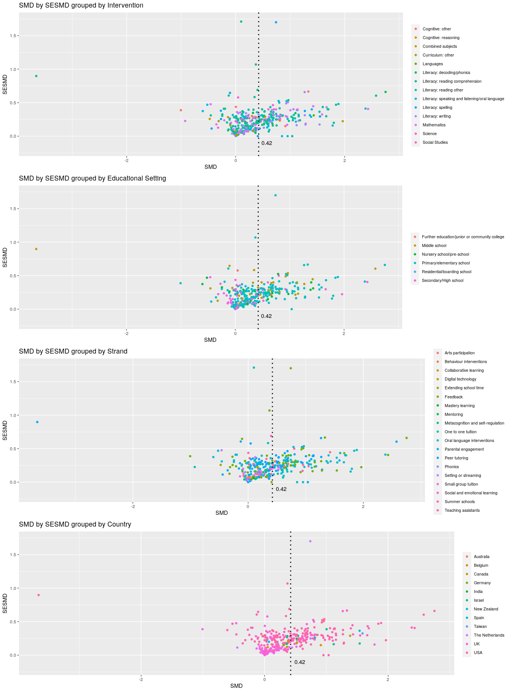<!-- -->

**Subset 'USA' and 'UK' data (Primary outcomes only), then from each of those get "Feedback" strand data only**

```r
countries <- primary_outcome %>% 
  select(Author, Strand, Country, SMD, CIupper, CIlower) %>%
  filter(Country %in% c("USA", "UK")) %>%
  filter(Strand=="Feedback")

rownames(countries) <- NULL
# display data with kable and inspect subsetted columns (highlighted)
countries[1:25,1:6] %>%
  mutate(
    Strand  = cell_spec(Strand, color = "white", bold = T, background = spec_color(.9, end = .9)),
    Country = cell_spec(Country, color = "white", bold = T, background = spec_color(.9, end = .9))) %>%
  kable(escape = F, align = "l") %>%
  kable_styling(c("hover", "condensed", "responsive", "bordered"), full_width = F, font_size = 12)
```

<table class="table table-hover table-condensed table-responsive table-bordered" style="font-size: 12px; width: auto !important; margin-left: auto; margin-right: auto;">
 <thead>
  <tr>
   <th style="text-align:left;"> Author </th>
   <th style="text-align:left;"> Strand </th>
   <th style="text-align:left;"> Country </th>
   <th style="text-align:left;"> SMD </th>
   <th style="text-align:left;"> CIupper </th>
   <th style="text-align:left;"> CIlower </th>
  </tr>
 </thead>
<tbody>
  <tr>
   <td style="text-align:left;"> Adler (1998) </td>
   <td style="text-align:left;"> <span style=" font-weight: bold;    color: white !important;border-radius: 4px; padding-right: 4px; padding-left: 4px; background-color: rgba(37, 131, 142, 1) !important;">Feedback</span> </td>
   <td style="text-align:left;"> <span style=" font-weight: bold;    color: white !important;border-radius: 4px; padding-right: 4px; padding-left: 4px; background-color: rgba(37, 131, 142, 1) !important;">USA</span> </td>
   <td style="text-align:left;"> 0.1650 </td>
   <td style="text-align:left;"> 0.6021 </td>
   <td style="text-align:left;"> -0.2721 </td>
  </tr>
  <tr>
   <td style="text-align:left;"> Anderson (1973) </td>
   <td style="text-align:left;"> <span style=" font-weight: bold;    color: white !important;border-radius: 4px; padding-right: 4px; padding-left: 4px; background-color: rgba(37, 131, 142, 1) !important;">Feedback</span> </td>
   <td style="text-align:left;"> <span style=" font-weight: bold;    color: white !important;border-radius: 4px; padding-right: 4px; padding-left: 4px; background-color: rgba(37, 131, 142, 1) !important;">USA</span> </td>
   <td style="text-align:left;"> 1.1547 </td>
   <td style="text-align:left;"> 1.6074 </td>
   <td style="text-align:left;"> 0.7020 </td>
  </tr>
  <tr>
   <td style="text-align:left;"> Arter (1994) </td>
   <td style="text-align:left;"> <span style=" font-weight: bold;    color: white !important;border-radius: 4px; padding-right: 4px; padding-left: 4px; background-color: rgba(37, 131, 142, 1) !important;">Feedback</span> </td>
   <td style="text-align:left;"> <span style=" font-weight: bold;    color: white !important;border-radius: 4px; padding-right: 4px; padding-left: 4px; background-color: rgba(37, 131, 142, 1) !important;">USA</span> </td>
   <td style="text-align:left;"> 0.3000 </td>
   <td style="text-align:left;"> 0.6528 </td>
   <td style="text-align:left;"> -0.0528 </td>
  </tr>
  <tr>
   <td style="text-align:left;"> Aumiller (1963) </td>
   <td style="text-align:left;"> <span style=" font-weight: bold;    color: white !important;border-radius: 4px; padding-right: 4px; padding-left: 4px; background-color: rgba(37, 131, 142, 1) !important;">Feedback</span> </td>
   <td style="text-align:left;"> <span style=" font-weight: bold;    color: white !important;border-radius: 4px; padding-right: 4px; padding-left: 4px; background-color: rgba(37, 131, 142, 1) !important;">USA</span> </td>
   <td style="text-align:left;"> -0.0058 </td>
   <td style="text-align:left;"> 0.2786 </td>
   <td style="text-align:left;"> -0.2903 </td>
  </tr>
  <tr>
   <td style="text-align:left;"> Baechie (1990) </td>
   <td style="text-align:left;"> <span style=" font-weight: bold;    color: white !important;border-radius: 4px; padding-right: 4px; padding-left: 4px; background-color: rgba(37, 131, 142, 1) !important;">Feedback</span> </td>
   <td style="text-align:left;"> <span style=" font-weight: bold;    color: white !important;border-radius: 4px; padding-right: 4px; padding-left: 4px; background-color: rgba(37, 131, 142, 1) !important;">USA</span> </td>
   <td style="text-align:left;"> 0.6548 </td>
   <td style="text-align:left;"> 1.2143 </td>
   <td style="text-align:left;"> 0.0952 </td>
  </tr>
  <tr>
   <td style="text-align:left;"> Benson (1979) 1_1 </td>
   <td style="text-align:left;"> <span style=" font-weight: bold;    color: white !important;border-radius: 4px; padding-right: 4px; padding-left: 4px; background-color: rgba(37, 131, 142, 1) !important;">Feedback</span> </td>
   <td style="text-align:left;"> <span style=" font-weight: bold;    color: white !important;border-radius: 4px; padding-right: 4px; padding-left: 4px; background-color: rgba(37, 131, 142, 1) !important;">USA</span> </td>
   <td style="text-align:left;"> 0.2200 </td>
   <td style="text-align:left;"> 0.4552 </td>
   <td style="text-align:left;"> -0.0152 </td>
  </tr>
  <tr>
   <td style="text-align:left;"> Benson (1979) 1_2 </td>
   <td style="text-align:left;"> <span style=" font-weight: bold;    color: white !important;border-radius: 4px; padding-right: 4px; padding-left: 4px; background-color: rgba(37, 131, 142, 1) !important;">Feedback</span> </td>
   <td style="text-align:left;"> <span style=" font-weight: bold;    color: white !important;border-radius: 4px; padding-right: 4px; padding-left: 4px; background-color: rgba(37, 131, 142, 1) !important;">USA</span> </td>
   <td style="text-align:left;"> 0.2115 </td>
   <td style="text-align:left;"> 0.4967 </td>
   <td style="text-align:left;"> -0.0737 </td>
  </tr>
  <tr>
   <td style="text-align:left;"> Bilsky (1978) </td>
   <td style="text-align:left;"> <span style=" font-weight: bold;    color: white !important;border-radius: 4px; padding-right: 4px; padding-left: 4px; background-color: rgba(37, 131, 142, 1) !important;">Feedback</span> </td>
   <td style="text-align:left;"> <span style=" font-weight: bold;    color: white !important;border-radius: 4px; padding-right: 4px; padding-left: 4px; background-color: rgba(37, 131, 142, 1) !important;">USA</span> </td>
   <td style="text-align:left;"> 2.4289 </td>
   <td style="text-align:left;"> 3.2239 </td>
   <td style="text-align:left;"> 1.6338 </td>
  </tr>
  <tr>
   <td style="text-align:left;"> Block (1970) </td>
   <td style="text-align:left;"> <span style=" font-weight: bold;    color: white !important;border-radius: 4px; padding-right: 4px; padding-left: 4px; background-color: rgba(37, 131, 142, 1) !important;">Feedback</span> </td>
   <td style="text-align:left;"> <span style=" font-weight: bold;    color: white !important;border-radius: 4px; padding-right: 4px; padding-left: 4px; background-color: rgba(37, 131, 142, 1) !important;">USA</span> </td>
   <td style="text-align:left;"> 0.5191 </td>
   <td style="text-align:left;"> 1.0050 </td>
   <td style="text-align:left;"> 0.0331 </td>
  </tr>
  <tr>
   <td style="text-align:left;"> Boggiano (1985) 1_1 </td>
   <td style="text-align:left;"> <span style=" font-weight: bold;    color: white !important;border-radius: 4px; padding-right: 4px; padding-left: 4px; background-color: rgba(37, 131, 142, 1) !important;">Feedback</span> </td>
   <td style="text-align:left;"> <span style=" font-weight: bold;    color: white !important;border-radius: 4px; padding-right: 4px; padding-left: 4px; background-color: rgba(37, 131, 142, 1) !important;">USA</span> </td>
   <td style="text-align:left;"> 0.8454 </td>
   <td style="text-align:left;"> 1.4385 </td>
   <td style="text-align:left;"> 0.2523 </td>
  </tr>
  <tr>
   <td style="text-align:left;"> Bohannon (1975) </td>
   <td style="text-align:left;"> <span style=" font-weight: bold;    color: white !important;border-radius: 4px; padding-right: 4px; padding-left: 4px; background-color: rgba(37, 131, 142, 1) !important;">Feedback</span> </td>
   <td style="text-align:left;"> <span style=" font-weight: bold;    color: white !important;border-radius: 4px; padding-right: 4px; padding-left: 4px; background-color: rgba(37, 131, 142, 1) !important;">USA</span> </td>
   <td style="text-align:left;"> 2.7500 </td>
   <td style="text-align:left;"> 4.0436 </td>
   <td style="text-align:left;"> 1.4564 </td>
  </tr>
  <tr>
   <td style="text-align:left;"> Brandstetter (1978) 1_2 </td>
   <td style="text-align:left;"> <span style=" font-weight: bold;    color: white !important;border-radius: 4px; padding-right: 4px; padding-left: 4px; background-color: rgba(37, 131, 142, 1) !important;">Feedback</span> </td>
   <td style="text-align:left;"> <span style=" font-weight: bold;    color: white !important;border-radius: 4px; padding-right: 4px; padding-left: 4px; background-color: rgba(37, 131, 142, 1) !important;">USA</span> </td>
   <td style="text-align:left;"> 0.3700 </td>
   <td style="text-align:left;"> 2.4672 </td>
   <td style="text-align:left;"> -1.7272 </td>
  </tr>
  <tr>
   <td style="text-align:left;"> Bridgeman (1974) 1_1 </td>
   <td style="text-align:left;"> <span style=" font-weight: bold;    color: white !important;border-radius: 4px; padding-right: 4px; padding-left: 4px; background-color: rgba(37, 131, 142, 1) !important;">Feedback</span> </td>
   <td style="text-align:left;"> <span style=" font-weight: bold;    color: white !important;border-radius: 4px; padding-right: 4px; padding-left: 4px; background-color: rgba(37, 131, 142, 1) !important;">USA</span> </td>
   <td style="text-align:left;"> 0.2060 </td>
   <td style="text-align:left;"> 0.5207 </td>
   <td style="text-align:left;"> -0.1088 </td>
  </tr>
  <tr>
   <td style="text-align:left;"> Bridgeman (1974) 1_2 </td>
   <td style="text-align:left;"> <span style=" font-weight: bold;    color: white !important;border-radius: 4px; padding-right: 4px; padding-left: 4px; background-color: rgba(37, 131, 142, 1) !important;">Feedback</span> </td>
   <td style="text-align:left;"> <span style=" font-weight: bold;    color: white !important;border-radius: 4px; padding-right: 4px; padding-left: 4px; background-color: rgba(37, 131, 142, 1) !important;">USA</span> </td>
   <td style="text-align:left;"> -0.0984 </td>
   <td style="text-align:left;"> 0.2157 </td>
   <td style="text-align:left;"> -0.4124 </td>
  </tr>
  <tr>
   <td style="text-align:left;"> Brookhart (2008) </td>
   <td style="text-align:left;"> <span style=" font-weight: bold;    color: white !important;border-radius: 4px; padding-right: 4px; padding-left: 4px; background-color: rgba(37, 131, 142, 1) !important;">Feedback</span> </td>
   <td style="text-align:left;"> <span style=" font-weight: bold;    color: white !important;border-radius: 4px; padding-right: 4px; padding-left: 4px; background-color: rgba(37, 131, 142, 1) !important;">USA</span> </td>
   <td style="text-align:left;"> 0.1738 </td>
   <td style="text-align:left;"> 0.5857 </td>
   <td style="text-align:left;"> -0.2381 </td>
  </tr>
  <tr>
   <td style="text-align:left;"> Caccamise (2007) 1_1 </td>
   <td style="text-align:left;"> <span style=" font-weight: bold;    color: white !important;border-radius: 4px; padding-right: 4px; padding-left: 4px; background-color: rgba(37, 131, 142, 1) !important;">Feedback</span> </td>
   <td style="text-align:left;"> <span style=" font-weight: bold;    color: white !important;border-radius: 4px; padding-right: 4px; padding-left: 4px; background-color: rgba(37, 131, 142, 1) !important;">USA</span> </td>
   <td style="text-align:left;"> 0.3800 </td>
   <td style="text-align:left;"> 0.7979 </td>
   <td style="text-align:left;"> -0.0379 </td>
  </tr>
  <tr>
   <td style="text-align:left;"> Caccamise (2007) 1_2 </td>
   <td style="text-align:left;"> <span style=" font-weight: bold;    color: white !important;border-radius: 4px; padding-right: 4px; padding-left: 4px; background-color: rgba(37, 131, 142, 1) !important;">Feedback</span> </td>
   <td style="text-align:left;"> <span style=" font-weight: bold;    color: white !important;border-radius: 4px; padding-right: 4px; padding-left: 4px; background-color: rgba(37, 131, 142, 1) !important;">USA</span> </td>
   <td style="text-align:left;"> 0.4243 </td>
   <td style="text-align:left;"> 0.8422 </td>
   <td style="text-align:left;"> 0.0064 </td>
  </tr>
  <tr>
   <td style="text-align:left;"> Eggen (1978) </td>
   <td style="text-align:left;"> <span style=" font-weight: bold;    color: white !important;border-radius: 4px; padding-right: 4px; padding-left: 4px; background-color: rgba(37, 131, 142, 1) !important;">Feedback</span> </td>
   <td style="text-align:left;"> <span style=" font-weight: bold;    color: white !important;border-radius: 4px; padding-right: 4px; padding-left: 4px; background-color: rgba(37, 131, 142, 1) !important;">USA</span> </td>
   <td style="text-align:left;"> 0.6851 </td>
   <td style="text-align:left;"> 1.2931 </td>
   <td style="text-align:left;"> 0.0771 </td>
  </tr>
  <tr>
   <td style="text-align:left;"> Fuchs (1989) </td>
   <td style="text-align:left;"> <span style=" font-weight: bold;    color: white !important;border-radius: 4px; padding-right: 4px; padding-left: 4px; background-color: rgba(37, 131, 142, 1) !important;">Feedback</span> </td>
   <td style="text-align:left;"> <span style=" font-weight: bold;    color: white !important;border-radius: 4px; padding-right: 4px; padding-left: 4px; background-color: rgba(37, 131, 142, 1) !important;">USA</span> </td>
   <td style="text-align:left;"> -0.1053 </td>
   <td style="text-align:left;"> 1.1613 </td>
   <td style="text-align:left;"> -1.3719 </td>
  </tr>
  <tr>
   <td style="text-align:left;"> Hanna (1976) </td>
   <td style="text-align:left;"> <span style=" font-weight: bold;    color: white !important;border-radius: 4px; padding-right: 4px; padding-left: 4px; background-color: rgba(37, 131, 142, 1) !important;">Feedback</span> </td>
   <td style="text-align:left;"> <span style=" font-weight: bold;    color: white !important;border-radius: 4px; padding-right: 4px; padding-left: 4px; background-color: rgba(37, 131, 142, 1) !important;">USA</span> </td>
   <td style="text-align:left;"> 0.2276 </td>
   <td style="text-align:left;"> 0.3686 </td>
   <td style="text-align:left;"> 0.0866 </td>
  </tr>
  <tr>
   <td style="text-align:left;"> Haring (1975) </td>
   <td style="text-align:left;"> <span style=" font-weight: bold;    color: white !important;border-radius: 4px; padding-right: 4px; padding-left: 4px; background-color: rgba(37, 131, 142, 1) !important;">Feedback</span> </td>
   <td style="text-align:left;"> <span style=" font-weight: bold;    color: white !important;border-radius: 4px; padding-right: 4px; padding-left: 4px; background-color: rgba(37, 131, 142, 1) !important;">USA</span> </td>
   <td style="text-align:left;"> 1.1571 </td>
   <td style="text-align:left;"> 1.7398 </td>
   <td style="text-align:left;"> 0.5745 </td>
  </tr>
  <tr>
   <td style="text-align:left;"> Holman (2011) </td>
   <td style="text-align:left;"> <span style=" font-weight: bold;    color: white !important;border-radius: 4px; padding-right: 4px; padding-left: 4px; background-color: rgba(37, 131, 142, 1) !important;">Feedback</span> </td>
   <td style="text-align:left;"> <span style=" font-weight: bold;    color: white !important;border-radius: 4px; padding-right: 4px; padding-left: 4px; background-color: rgba(37, 131, 142, 1) !important;">USA</span> </td>
   <td style="text-align:left;"> 0.3410 </td>
   <td style="text-align:left;"> 0.6756 </td>
   <td style="text-align:left;"> 0.0064 </td>
  </tr>
  <tr>
   <td style="text-align:left;"> Jacobs (1966) </td>
   <td style="text-align:left;"> <span style=" font-weight: bold;    color: white !important;border-radius: 4px; padding-right: 4px; padding-left: 4px; background-color: rgba(37, 131, 142, 1) !important;">Feedback</span> </td>
   <td style="text-align:left;"> <span style=" font-weight: bold;    color: white !important;border-radius: 4px; padding-right: 4px; padding-left: 4px; background-color: rgba(37, 131, 142, 1) !important;">USA</span> </td>
   <td style="text-align:left;"> -0.2093 </td>
   <td style="text-align:left;"> 0.2554 </td>
   <td style="text-align:left;"> -0.6739 </td>
  </tr>
  <tr>
   <td style="text-align:left;"> Jewell (2003) </td>
   <td style="text-align:left;"> <span style=" font-weight: bold;    color: white !important;border-radius: 4px; padding-right: 4px; padding-left: 4px; background-color: rgba(37, 131, 142, 1) !important;">Feedback</span> </td>
   <td style="text-align:left;"> <span style=" font-weight: bold;    color: white !important;border-radius: 4px; padding-right: 4px; padding-left: 4px; background-color: rgba(37, 131, 142, 1) !important;">USA</span> </td>
   <td style="text-align:left;"> 0.1308 </td>
   <td style="text-align:left;"> 0.4445 </td>
   <td style="text-align:left;"> -0.1829 </td>
  </tr>
  <tr>
   <td style="text-align:left;"> King (1983) </td>
   <td style="text-align:left;"> <span style=" font-weight: bold;    color: white !important;border-radius: 4px; padding-right: 4px; padding-left: 4px; background-color: rgba(37, 131, 142, 1) !important;">Feedback</span> </td>
   <td style="text-align:left;"> <span style=" font-weight: bold;    color: white !important;border-radius: 4px; padding-right: 4px; padding-left: 4px; background-color: rgba(37, 131, 142, 1) !important;">USA</span> </td>
   <td style="text-align:left;"> -0.0539 </td>
   <td style="text-align:left;"> 0.5660 </td>
   <td style="text-align:left;"> -0.6738 </td>
  </tr>
</tbody>
</table>

**Make UK and USA (Primary Outcome) study forest plots and display them**

```r
Primary_UK_plot <- ggplot(data=na.omit(subset(countries, select=c(Country=="UK", Author, SMD, CIlower, CIupper))),
                    aes(y=Author, x=SMD, xmin=CIlower, xmax=CIupper))+
                    geom_point(color='black', shape=15) +
                    geom_errorbarh(height=.7, linetype=1) +
                    scale_x_continuous(limits=c(-4,4), name='Standardized Mean Difference (95% CI)') +
                    ylab('Reference') +
                    geom_vline(xintercept=0, color='black', linetype='dashed') +
                    theme_classic() +
                    ggtitle("UK studies, Feedback Strand (Primary outcome)") +
                    theme(axis.text.x = element_text(colour = "black", size=11),
                          axis.text.y = element_text(colour = "black", size=11)) +
                    theme(axis.title.x = element_text(colour = "black", size=16),
                          axis.title.y = element_text(colour = "black", size=16))

Primary_USA_plot <- ggplot(data=na.omit(subset(countries, select=c(Country=="UK", Author, SMD, CIlower, CIupper))),
                    aes(y=Author, x=SMD, xmin=CIlower, xmax=CIupper))+
                    geom_point(color='black', shape=15) +
                    geom_errorbarh(height=.5, linetype=1) +
                    scale_x_continuous(limits=c(-4,4), name='Standardized Mean Difference (95% CI)') +
                    ylab('Authors') +
                    geom_vline(xintercept=0, color='black', linetype='dashed') +
                    theme_classic() +
                    ggtitle("USA studies, Feedback Strand (Primary Outcome)") +
                    theme(axis.text.x = element_text(colour = "black", size=11),
                          axis.text.y = element_text(colour = "black", size=11)) +
                    theme(axis.title.x = element_text(colour = "black", size=16),
                          axis.title.y = element_text(colour = "black", size=16))

Primary_USA_plot
```

<!-- -->

## Metafor
**Subset "Teaching assistant" strand data from "Primary Outcomes" dataset, order by year, inspect the data with kable**

```r
df <- primary_outcome %>%
      select(SMD, SESMD, Year, CIlower, CIupper, Strand, Author) %>%
      filter(SESMD <= 2) %>%
      filter(SMD >= -3.25) %>%
      filter(SMD <= 3.00) %>%
      filter(Strand=="Teaching assistants")

# order data by year
df_ta <- df[order(df$Year),]

# display data with kable
df_ta[1:25,1:7] %>%
  mutate(
    Strand  = cell_spec(Strand, color = "white", bold = T, background = spec_color(.9, end = .9))) %>%
  kable(escape = F, align = "l") %>%
  kable_styling(c("hover", "condensed", "responsive", "bordered"), full_width = F, font_size = 12)
```

<table class="table table-hover table-condensed table-responsive table-bordered" style="font-size: 12px; width: auto !important; margin-left: auto; margin-right: auto;">
 <thead>
  <tr>
   <th style="text-align:left;"> SMD </th>
   <th style="text-align:left;"> SESMD </th>
   <th style="text-align:left;"> Year </th>
   <th style="text-align:left;"> CIlower </th>
   <th style="text-align:left;"> CIupper </th>
   <th style="text-align:left;"> Strand </th>
   <th style="text-align:left;"> Author </th>
  </tr>
 </thead>
<tbody>
  <tr>
   <td style="text-align:left;"> 0.0180 </td>
   <td style="text-align:left;"> 0.0626 </td>
   <td style="text-align:left;"> 1990 </td>
   <td style="text-align:left;"> -0.1048 </td>
   <td style="text-align:left;"> 0.1408 </td>
   <td style="text-align:left;"> <span style=" font-weight: bold;    color: white !important;border-radius: 4px; padding-right: 4px; padding-left: 4px; background-color: rgba(37, 131, 142, 1) !important;">Teaching assistants</span> </td>
   <td style="text-align:left;"> Word (1990) </td>
  </tr>
  <tr>
   <td style="text-align:left;"> -0.0030 </td>
   <td style="text-align:left;"> 0.0646 </td>
   <td style="text-align:left;"> 1995 </td>
   <td style="text-align:left;"> -0.1296 </td>
   <td style="text-align:left;"> 0.1236 </td>
   <td style="text-align:left;"> <span style=" font-weight: bold;    color: white !important;border-radius: 4px; padding-right: 4px; padding-left: 4px; background-color: rgba(37, 131, 142, 1) !important;">Teaching assistants</span> </td>
   <td style="text-align:left;"> Welch (1995) </td>
  </tr>
  <tr>
   <td style="text-align:left;"> 1.0488 </td>
   <td style="text-align:left;"> 0.2378 </td>
   <td style="text-align:left;"> 2005 </td>
   <td style="text-align:left;"> 0.5828 </td>
   <td style="text-align:left;"> 1.5148 </td>
   <td style="text-align:left;"> <span style=" font-weight: bold;    color: white !important;border-radius: 4px; padding-right: 4px; padding-left: 4px; background-color: rgba(37, 131, 142, 1) !important;">Teaching assistants</span> </td>
   <td style="text-align:left;"> Brown (2005) </td>
  </tr>
  <tr>
   <td style="text-align:left;"> 0.1236 </td>
   <td style="text-align:left;"> 0.2282 </td>
   <td style="text-align:left;"> 2006 </td>
   <td style="text-align:left;"> -0.3236 </td>
   <td style="text-align:left;"> 0.5709 </td>
   <td style="text-align:left;"> <span style=" font-weight: bold;    color: white !important;border-radius: 4px; padding-right: 4px; padding-left: 4px; background-color: rgba(37, 131, 142, 1) !important;">Teaching assistants</span> </td>
   <td style="text-align:left;"> Hatcher (2006) </td>
  </tr>
  <tr>
   <td style="text-align:left;"> 0.9523 </td>
   <td style="text-align:left;"> 0.2585 </td>
   <td style="text-align:left;"> 2006 </td>
   <td style="text-align:left;"> 0.4456 </td>
   <td style="text-align:left;"> 1.4590 </td>
   <td style="text-align:left;"> <span style=" font-weight: bold;    color: white !important;border-radius: 4px; padding-right: 4px; padding-left: 4px; background-color: rgba(37, 131, 142, 1) !important;">Teaching assistants</span> </td>
   <td style="text-align:left;"> Vadasy (2006) </td>
  </tr>
  <tr>
   <td style="text-align:left;"> 0.4676 </td>
   <td style="text-align:left;"> 0.3096 </td>
   <td style="text-align:left;"> 2007 </td>
   <td style="text-align:left;"> -0.1393 </td>
   <td style="text-align:left;"> 1.0744 </td>
   <td style="text-align:left;"> <span style=" font-weight: bold;    color: white !important;border-radius: 4px; padding-right: 4px; padding-left: 4px; background-color: rgba(37, 131, 142, 1) !important;">Teaching assistants</span> </td>
   <td style="text-align:left;"> Vadasy (2007) </td>
  </tr>
  <tr>
   <td style="text-align:left;"> 0.6266 </td>
   <td style="text-align:left;"> 0.2403 </td>
   <td style="text-align:left;"> 2008 </td>
   <td style="text-align:left;"> 0.1556 </td>
   <td style="text-align:left;"> 1.0976 </td>
   <td style="text-align:left;"> <span style=" font-weight: bold;    color: white !important;border-radius: 4px; padding-right: 4px; padding-left: 4px; background-color: rgba(37, 131, 142, 1) !important;">Teaching assistants</span> </td>
   <td style="text-align:left;"> Bunn (2008) </td>
  </tr>
  <tr>
   <td style="text-align:left;"> 0.8000 </td>
   <td style="text-align:left;"> 0.5000 </td>
   <td style="text-align:left;"> 2008 </td>
   <td style="text-align:left;"> -0.1800 </td>
   <td style="text-align:left;"> 1.7800 </td>
   <td style="text-align:left;"> <span style=" font-weight: bold;    color: white !important;border-radius: 4px; padding-right: 4px; padding-left: 4px; background-color: rgba(37, 131, 142, 1) !important;">Teaching assistants</span> </td>
   <td style="text-align:left;"> Goetz (2008) </td>
  </tr>
  <tr>
   <td style="text-align:left;"> 0.4354 </td>
   <td style="text-align:left;"> 0.2531 </td>
   <td style="text-align:left;"> 2008 </td>
   <td style="text-align:left;"> -0.0607 </td>
   <td style="text-align:left;"> 0.9315 </td>
   <td style="text-align:left;"> <span style=" font-weight: bold;    color: white !important;border-radius: 4px; padding-right: 4px; padding-left: 4px; background-color: rgba(37, 131, 142, 1) !important;">Teaching assistants</span> </td>
   <td style="text-align:left;"> Vadasy (2008) TA </td>
  </tr>
  <tr>
   <td style="text-align:left;"> 1.4227 </td>
   <td style="text-align:left;"> 0.4469 </td>
   <td style="text-align:left;"> 2009 </td>
   <td style="text-align:left;"> 0.5467 </td>
   <td style="text-align:left;"> 2.2986 </td>
   <td style="text-align:left;"> <span style=" font-weight: bold;    color: white !important;border-radius: 4px; padding-right: 4px; padding-left: 4px; background-color: rgba(37, 131, 142, 1) !important;">Teaching assistants</span> </td>
   <td style="text-align:left;"> Cole (2009) </td>
  </tr>
  <tr>
   <td style="text-align:left;"> 0.1559 </td>
   <td style="text-align:left;"> 0.1195 </td>
   <td style="text-align:left;"> 2009 </td>
   <td style="text-align:left;"> -0.0782 </td>
   <td style="text-align:left;"> 0.3901 </td>
   <td style="text-align:left;"> <span style=" font-weight: bold;    color: white !important;border-radius: 4px; padding-right: 4px; padding-left: 4px; background-color: rgba(37, 131, 142, 1) !important;">Teaching assistants</span> </td>
   <td style="text-align:left;"> Ratcliff (2009) </td>
  </tr>
  <tr>
   <td style="text-align:left;"> 0.3178 </td>
   <td style="text-align:left;"> 0.3474 </td>
   <td style="text-align:left;"> 2010 </td>
   <td style="text-align:left;"> -0.3631 </td>
   <td style="text-align:left;"> 0.9987 </td>
   <td style="text-align:left;"> <span style=" font-weight: bold;    color: white !important;border-radius: 4px; padding-right: 4px; padding-left: 4px; background-color: rgba(37, 131, 142, 1) !important;">Teaching assistants</span> </td>
   <td style="text-align:left;"> Graves (2010) </td>
  </tr>
  <tr>
   <td style="text-align:left;"> 0.0969 </td>
   <td style="text-align:left;"> 0.2725 </td>
   <td style="text-align:left;"> 2012 </td>
   <td style="text-align:left;"> -0.4372 </td>
   <td style="text-align:left;"> 0.6311 </td>
   <td style="text-align:left;"> <span style=" font-weight: bold;    color: white !important;border-radius: 4px; padding-right: 4px; padding-left: 4px; background-color: rgba(37, 131, 142, 1) !important;">Teaching assistants</span> </td>
   <td style="text-align:left;"> Burgoyne (2012) </td>
  </tr>
  <tr>
   <td style="text-align:left;"> 0.0032 </td>
   <td style="text-align:left;"> 0.4369 </td>
   <td style="text-align:left;"> 2013 </td>
   <td style="text-align:left;"> -0.8532 </td>
   <td style="text-align:left;"> 0.8596 </td>
   <td style="text-align:left;"> <span style=" font-weight: bold;    color: white !important;border-radius: 4px; padding-right: 4px; padding-left: 4px; background-color: rgba(37, 131, 142, 1) !important;">Teaching assistants</span> </td>
   <td style="text-align:left;"> Bennett (2013) </td>
  </tr>
  <tr>
   <td style="text-align:left;"> 0.4000 </td>
   <td style="text-align:left;"> 0.1200 </td>
   <td style="text-align:left;"> 2013 </td>
   <td style="text-align:left;"> 0.1648 </td>
   <td style="text-align:left;"> 0.6352 </td>
   <td style="text-align:left;"> <span style=" font-weight: bold;    color: white !important;border-radius: 4px; padding-right: 4px; padding-left: 4px; background-color: rgba(37, 131, 142, 1) !important;">Teaching assistants</span> </td>
   <td style="text-align:left;"> Holmes (2013) </td>
  </tr>
  <tr>
   <td style="text-align:left;"> 0.6942 </td>
   <td style="text-align:left;"> 0.2728 </td>
   <td style="text-align:left;"> 2013 </td>
   <td style="text-align:left;"> 0.1595 </td>
   <td style="text-align:left;"> 1.2289 </td>
   <td style="text-align:left;"> <span style=" font-weight: bold;    color: white !important;border-radius: 4px; padding-right: 4px; padding-left: 4px; background-color: rgba(37, 131, 142, 1) !important;">Teaching assistants</span> </td>
   <td style="text-align:left;"> Vadasy (2013) </td>
  </tr>
  <tr>
   <td style="text-align:left;"> 0.0886 </td>
   <td style="text-align:left;"> 0.2676 </td>
   <td style="text-align:left;"> 2014 </td>
   <td style="text-align:left;"> -0.4358 </td>
   <td style="text-align:left;"> 0.6131 </td>
   <td style="text-align:left;"> <span style=" font-weight: bold;    color: white !important;border-radius: 4px; padding-right: 4px; padding-left: 4px; background-color: rgba(37, 131, 142, 1) !important;">Teaching assistants</span> </td>
   <td style="text-align:left;"> Duff (2014) </td>
  </tr>
  <tr>
   <td style="text-align:left;"> -0.0800 </td>
   <td style="text-align:left;"> 0.0970 </td>
   <td style="text-align:left;"> 2015 </td>
   <td style="text-align:left;"> -0.2701 </td>
   <td style="text-align:left;"> 0.1101 </td>
   <td style="text-align:left;"> <span style=" font-weight: bold;    color: white !important;border-radius: 4px; padding-right: 4px; padding-left: 4px; background-color: rgba(37, 131, 142, 1) !important;">Teaching assistants</span> </td>
   <td style="text-align:left;"> Sheard (2015) </td>
  </tr>
  <tr>
   <td style="text-align:left;"> 0.2000 </td>
   <td style="text-align:left;"> 0.1100 </td>
   <td style="text-align:left;"> 2015 </td>
   <td style="text-align:left;"> -0.0156 </td>
   <td style="text-align:left;"> 0.4156 </td>
   <td style="text-align:left;"> <span style=" font-weight: bold;    color: white !important;border-radius: 4px; padding-right: 4px; padding-left: 4px; background-color: rgba(37, 131, 142, 1) !important;">Teaching assistants</span> </td>
   <td style="text-align:left;"> Styles (2015) </td>
  </tr>
  <tr>
   <td style="text-align:left;"> 0.1069 </td>
   <td style="text-align:left;"> 0.0540 </td>
   <td style="text-align:left;"> 2015 </td>
   <td style="text-align:left;"> 0.0011 </td>
   <td style="text-align:left;"> 0.2127 </td>
   <td style="text-align:left;"> <span style=" font-weight: bold;    color: white !important;border-radius: 4px; padding-right: 4px; padding-left: 4px; background-color: rgba(37, 131, 142, 1) !important;">Teaching assistants</span> </td>
   <td style="text-align:left;"> Worth (2015) </td>
  </tr>
  <tr>
   <td style="text-align:left;"> 0.0241 </td>
   <td style="text-align:left;"> 0.3594 </td>
   <td style="text-align:left;"> 2016 </td>
   <td style="text-align:left;"> -0.6803 </td>
   <td style="text-align:left;"> 0.7286 </td>
   <td style="text-align:left;"> <span style=" font-weight: bold;    color: white !important;border-radius: 4px; padding-right: 4px; padding-left: 4px; background-color: rgba(37, 131, 142, 1) !important;">Teaching assistants</span> </td>
   <td style="text-align:left;"> Cooper (2016) TA </td>
  </tr>
  <tr>
   <td style="text-align:left;"> 0.0128 </td>
   <td style="text-align:left;"> 0.2652 </td>
   <td style="text-align:left;"> 2016 </td>
   <td style="text-align:left;"> -0.5068 </td>
   <td style="text-align:left;"> 0.5325 </td>
   <td style="text-align:left;"> <span style=" font-weight: bold;    color: white !important;border-radius: 4px; padding-right: 4px; padding-left: 4px; background-color: rgba(37, 131, 142, 1) !important;">Teaching assistants</span> </td>
   <td style="text-align:left;"> Fritts (2016) </td>
  </tr>
  <tr>
   <td style="text-align:left;"> 0.2700 </td>
   <td style="text-align:left;"> 0.1000 </td>
   <td style="text-align:left;"> 2016 </td>
   <td style="text-align:left;"> 0.0740 </td>
   <td style="text-align:left;"> 0.4660 </td>
   <td style="text-align:left;"> <span style=" font-weight: bold;    color: white !important;border-radius: 4px; padding-right: 4px; padding-left: 4px; background-color: rgba(37, 131, 142, 1) !important;">Teaching assistants</span> </td>
   <td style="text-align:left;"> Sibieta (2016) </td>
  </tr>
  <tr>
   <td style="text-align:left;"> 0.0300 </td>
   <td style="text-align:left;"> 0.0800 </td>
   <td style="text-align:left;"> 2016 </td>
   <td style="text-align:left;"> -0.1268 </td>
   <td style="text-align:left;"> 0.1868 </td>
   <td style="text-align:left;"> <span style=" font-weight: bold;    color: white !important;border-radius: 4px; padding-right: 4px; padding-left: 4px; background-color: rgba(37, 131, 142, 1) !important;">Teaching assistants</span> </td>
   <td style="text-align:left;"> Styles (2016) </td>
  </tr>
  <tr>
   <td style="text-align:left;"> 0.0274 </td>
   <td style="text-align:left;"> 0.0170 </td>
   <td style="text-align:left;"> 2016 </td>
   <td style="text-align:left;"> -0.0059 </td>
   <td style="text-align:left;"> 0.0608 </td>
   <td style="text-align:left;"> <span style=" font-weight: bold;    color: white !important;border-radius: 4px; padding-right: 4px; padding-left: 4px; background-color: rgba(37, 131, 142, 1) !important;">Teaching assistants</span> </td>
   <td style="text-align:left;"> Worth (2016) </td>
  </tr>
</tbody>
</table>

**Make forest plot (with metafor) using "Teaching assistants" data, ordered by Year**

```r
random=rma(df_ta$SMD, sei=df_ta$SESMD, data=df_ta)

forest(random, at=c(-1.0,0.0,1.0), showweights = TRUE,
       ilab=cbind(df_ta$Author, df_ta$Year),
       ilab.xpos=c(-7, -15),
       slab=NA,
       ilab.pos=4,
       font=2, digits=2, col="darkgrey",
       cex=1,
       pch=15)

text(-6.2, 30, "Study", cex=.9, font=2)
text(5.4, 30, "SMD", cex=.9, font=2)
text(7.5, 30, "(95% CI)", cex=.9, font=2)
text(3.8, 30, "Weight", cex=.9, font=2)
```

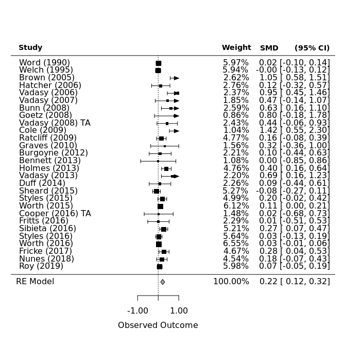<!-- -->

**Display metafor funnel plot for all studies (primary outcome only)**

```r
# subset data (can control for outliers if we want)
df_all <- primary_outcome %>%
      select(SMD, SESMD, Year, CIlower, CIupper, Strand, Year, Author) %>%
      filter(SESMD <= 1) %>%
      filter(SMD >= -2.25) %>%
      filter(SMD <= 2.00)

random_all=rma(df_all$SMD, sei=df_all$SESMD, data=df_all)
funnel(random_all)
```

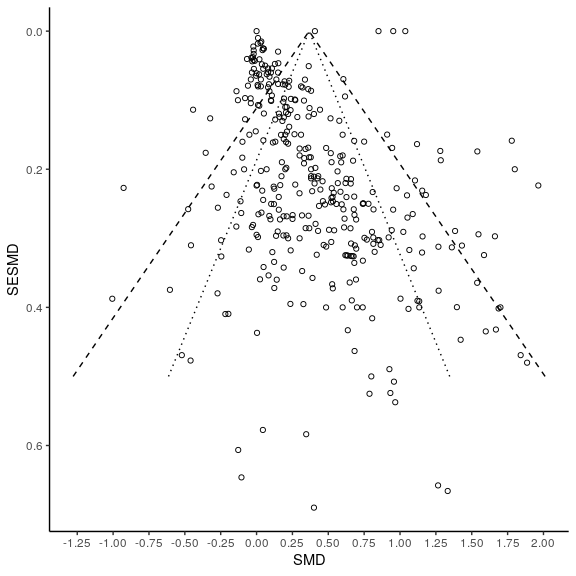<!-- -->

**Make alternative funnel plot with ggplot and display all (primary outcome) data (as above)**

```r
estimate = 0.3663
se = 0.0231

se.seq=seq(0, max(df$SESMD), 0.001)

ll95 = estimate-(1.96*se.seq)
ul95 = estimate+(1.96*se.seq)
 
ll99 = estimate-(3.29*se.seq)
ul99 = estimate+(3.29*se.seq)

meanll95 = estimate-(1.96*se)
meanul95 = estimate+(1.96*se)

dfCI = data.frame(ll95, ul95, ll99, ul99, se.seq, estimate, meanll95, meanul95)

alt_fp = ggplot(aes(x = SESMD, y = SMD), data = df_all) +
  geom_point(shape = 1) +
  xlab('SESMD') + ylab('SMD')+
  geom_line(aes(x = se.seq, y = ll95), linetype = 'dotted', data = dfCI) +
  geom_line(aes(x = se.seq, y = ul95), linetype = 'dotted', data = dfCI) +
  geom_line(aes(x = se.seq, y = ll99), linetype = 'dashed', data = dfCI) +
  geom_line(aes(x = se.seq, y = ul99), linetype = 'dashed', data = dfCI) +
  scale_x_reverse()+
  scale_y_continuous(breaks=seq(-1.25,2,0.25))+
  coord_flip() +
  theme_classic()
alt_fp
```

<!-- -->

## Jittered dotplots
**list reusable layers to use on all plots (constants)**

```r
gglayers <- list(
  geom_jitter(position=position_jitter(.2), size=3, shape=21, stroke=1, na.rm=TRUE),
  ylim(-2,3.5),
  theme(legend.justification = "top"),
  theme(axis.text.x = element_text(colour = "black", size=12),
        axis.text.y = element_text(colour = "black", size=12)),
  theme(axis.title.x = element_text(colour = "black", size=16),
        axis.title.y = element_text(colour = "black", size=16)),
  theme(legend.title = element_text(color = "black", size = 12),
        legend.text = element_text(color = "black", size = 10)),
  theme(plot.title = element_text(colour="black", size="16"))
)
```

**SMD by Decade, grouped by Strand**

```r
# plot of SMD by Decade grouped (color) by Strand
strand <- filter(primary_outcome, !is.na(Strand)) %>%
  ggplot(aes(y=SMD, x=Decade, fill=Strand)) +
  labs(fill = "Strand") +
  ggtitle("SMD by Decade, grouped by Strand") + gglayers

strand
```

<!-- -->

**SMD by Decade, grouped by Intervention**

```r
# plot of SMD by Decade grouped (color) by Intervention
intervention <- filter(primary_outcome, !is.na(Intervention)) %>%
  ggplot(aes(y=SMD, x=Decade, fill=Intervention)) +
  labs(fill = "Intervention") +
  ggtitle("SMD by Decade, grouped by Intervention") + gglayers
intervention
```

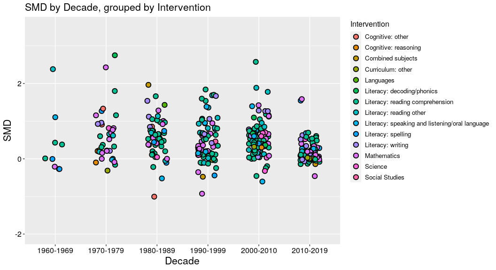<!-- -->

**SMD by Decade, grouped by Country**

```r
# plot of SMD by Decade grouped (color) by Country
country <- filter(primary_outcome, !is.na(Country)) %>%
  ggplot(aes(y=SMD, x=Decade, fill=Country)) +
  labs(fill = "Country") +
  ggtitle("SMD by Decade, grouped by Country") + gglayers
country
```

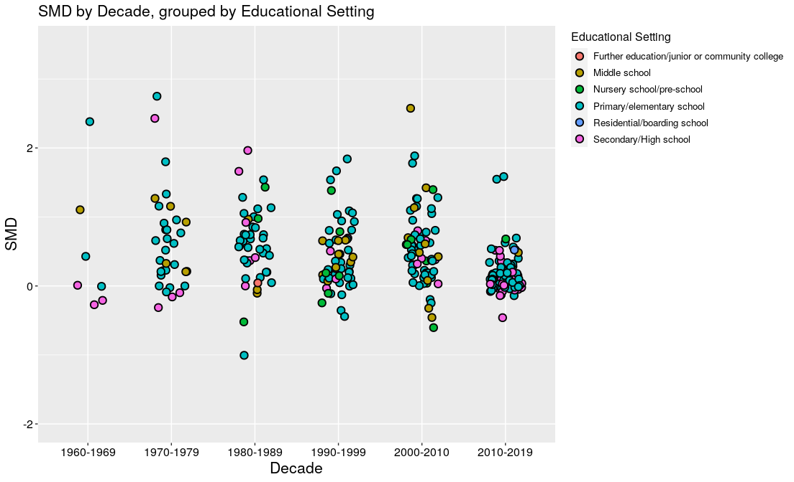<!-- -->

**SMD by Decade, grouped by Educational Setting**

```r
# plot of SMD by Decade grouped (color) by Educational Setting
edu_setting <- filter(primary_outcome, !is.na(EducationalSetting)) %>%
  ggplot(aes(y=SMD, x=Decade, fill=EducationalSetting)) +
  labs(fill = "Educational Setting") +
  ggtitle("SMD by Decade, grouped by Educational Setting") + gglayers
edu_setting
```

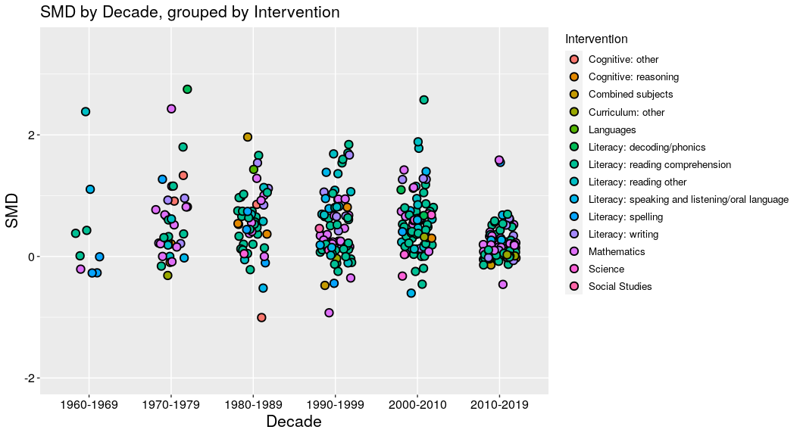<!-- -->

**SMD by Decade, grouped by PublicationType**

```r
# plot of SMD by Decade grouped (color) by Publication Type
pub_type <- filter(primary_outcome, !is.na(PublicationType)) %>%
  ggplot(aes(y=SMD, x=Decade, fill=PublicationType)) +
  labs(fill = "Publication Type") +
  ggtitle("SMD by Decade, grouped by Publication Type") + gglayers
pub_type
```

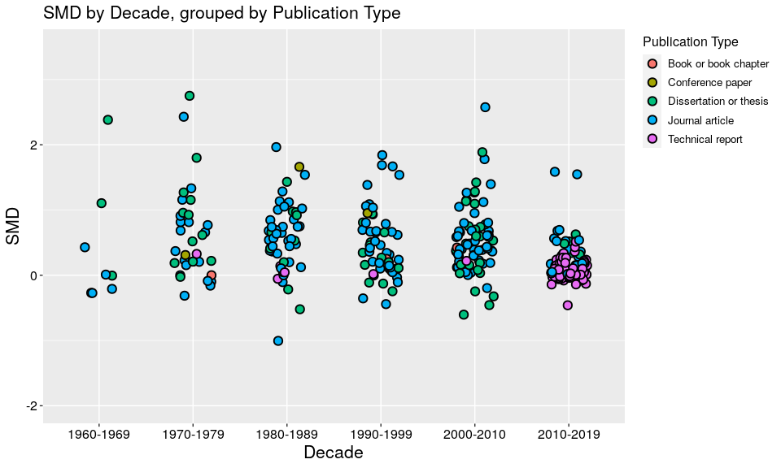<!-- -->

**Plot all Primary Outcome studies as SMD/SESMD scatter plots grouped by intervention, educational setting, strand, and country**

```r
# get means for SMD and SESMD
master_df_mean_SMD    <- mean(primary_outcome$SMD, na.rm=TRUE)
master_dfk_mean_SESMD <- mean(primary_outcome$SESMD, na.rm=TRUE)

# uncomment to view data in dataviewer
#View(master_df) 

# list reusable layers to use on all plots (constants)**
gglayers <- list(
  theme_grey(),
  geom_vline(xintercept=master_df_mean_SMD, linetype="dotted", color="black", size=1),
  annotate(geom="text", x=master_df_mean_SMD+.15, y=-.1, label=round(master_df_mean_SMD, 4), color="black"),
  ylim(-0.2, 1.75),
  xlim(-1.5, 2.5), 
  theme(legend.justification = "top"),
  theme(axis.text.x = element_text(colour = "black", size=12),
        axis.text.y = element_text(colour = "black", size=12)),
  theme(axis.title.x = element_text(colour = "black", size=16),
        axis.title.y = element_text(colour = "black", size=16)),
  theme(legend.title = element_text(color = "black", size = 13),
        legend.text = element_text(color = "black", size = 12)),
  theme(plot.title = element_text(face="bold", colour="black", size="16"))
)
```

**SMD by SESMD grouped by Intervention - all Primary outcome studies**

```r
# Make SMD/SESMD scatter plot, (color) grouped by Intervention
smd_intervention <- ggplot(data=subset(primary_outcome, !is.na(Intervention)), aes(SMD, SESMD, fill=Intervention)) + 
    geom_point(alpha=1, na.rm=TRUE, size=3, shape=21, stroke=1) +
    ggtitle("SMD by SESMD grouped by Intervention") +
    labs(fill = "Intervention") + gglayers
smd_intervention
```

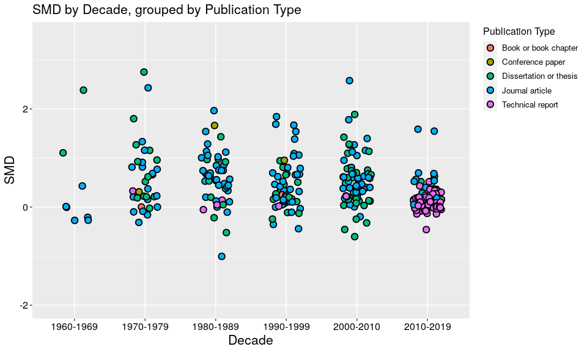<!-- -->

**SMD by SESMD grouped by Educational Setting - all Primary outcome studies**

```r
# Make SMD/SESMD scatter plot, (color) grouped by Educational Setting
smd_edusetting <- ggplot(data=subset(primary_outcome, !is.na(EducationalSetting)), aes(SMD, SESMD, fill=EducationalSetting)) + 
    geom_point(alpha=1, na.rm=TRUE, size=3, shape=21, stroke=1) +
    ggtitle("SMD by SESMD grouped by Educational Setting") +
    labs(fill = "Educational Setting") + gglayers
smd_edusetting
```

<!-- -->

**SMD by SESMD grouped by Strand - all Primary outcome studies**

```r
# Make SMD/SESMD scatter plot, (color) grouped by Strand
smd_strand <- ggplot(data=subset(primary_outcome, !is.na(Strand)), aes(SMD, SESMD, fill=Strand)) + 
    geom_point(alpha=1, na.rm=TRUE, size=3, shape=21, stroke=1) +
    ggtitle("SMD by SESMD grouped by Strand") +
    labs(fill = "Strand") + gglayers
smd_strand
```

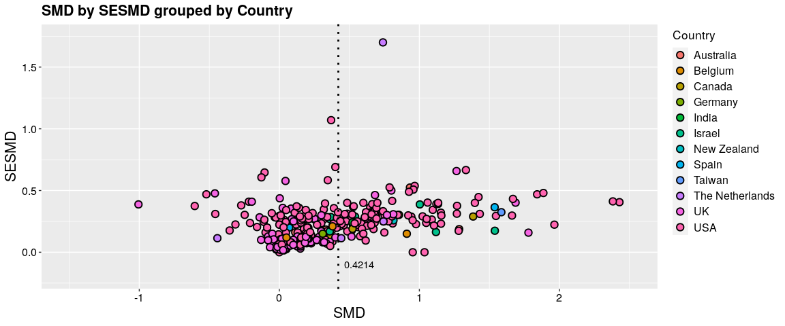<!-- -->

**SMD by SESMD grouped by Country - all Primary outcome studies**

```r
# Make SMD/SESMD scatter plot, (color) grouped by Country
smd_country <- ggplot(data=subset(primary_outcome, !is.na(Country)), aes(SMD, SESMD, fill=Country)) +
    geom_point(alpha=1, na.rm=TRUE, size=3, shape=21, stroke=1) +
    ggtitle("SMD by SESMD grouped by Country") +
    labs(fill = "Country") + gglayers
smd_country
```

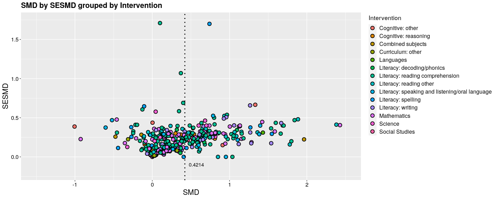<!-- -->

**SMD by SESMD grouped by Publication Type - all Primary outcome studies**

```r
# Make SMD/SESMD scatter plot, (color) grouped by Publication Type
smd_pubtype <- ggplot(data=subset(primary_outcome, !is.na(PublicationType)), aes(SMD, SESMD, fill=PublicationType)) +
    geom_point(alpha=1, na.rm=TRUE, size=3, shape=21, stroke=1) +
    ggtitle("SMD by SESMD grouped by Publication Type") +
    labs(fill = "Publication Type") + gglayers
smd_pubtype
```

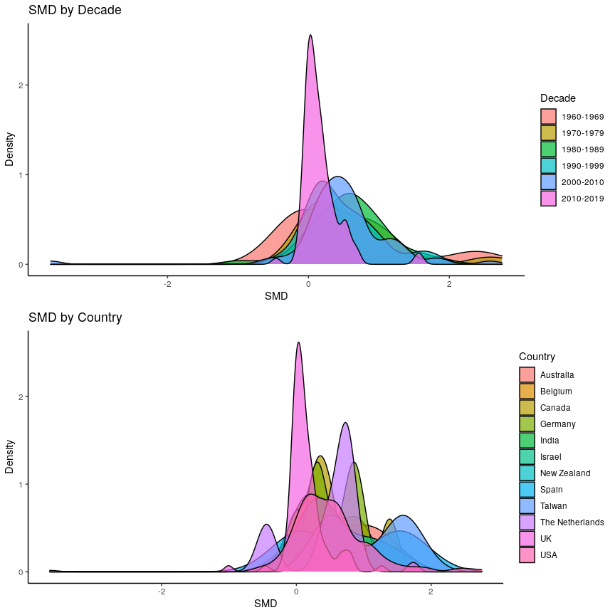<!-- -->

**SMD by Decade and Country (density plots)**

```r
decade <- primary_outcome %>%
          filter(!is.na(Country)) %>%
          ggplot(aes(SMD, fill=Decade)) +
          geom_density(alpha=0.7) +
          scale_y_continuous(name = "Density") +
          ggtitle("SMD by Decade") +
          theme_classic()

country <- primary_outcome %>%
          filter(!is.na(Country)) %>%
          ggplot(aes(SMD, fill=Country)) +
          geom_density(alpha=0.7) +
          scale_y_continuous(name = "Density") +
          ggtitle("SMD by Country") +
          theme_classic()
grid.arrange(decade, country)
```

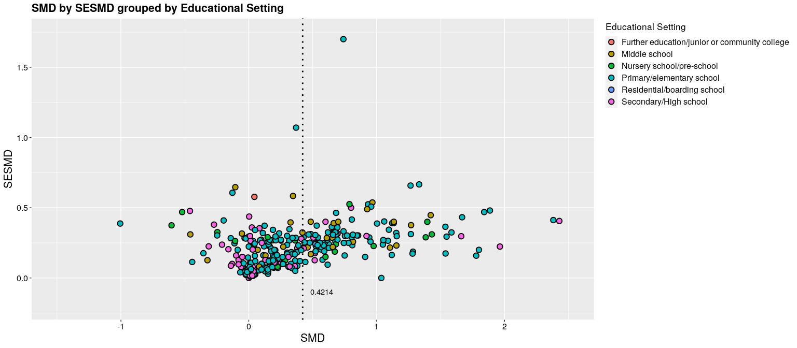<!-- -->

**Categorywise bar char of educational setting by decade**

```r
edu_decade <- primary_outcome %>%
     filter(!is.na(EducationalSetting)) %>%
     ggplot(aes(x=Decade)) +
     geom_bar(aes(fill=EducationalSetting), width = 0.5) + 
     theme(axis.text.x = element_text(angle=0, vjust=0.6)) +
     labs(title="Educational Setting over the past six decades")
edu_decade
```

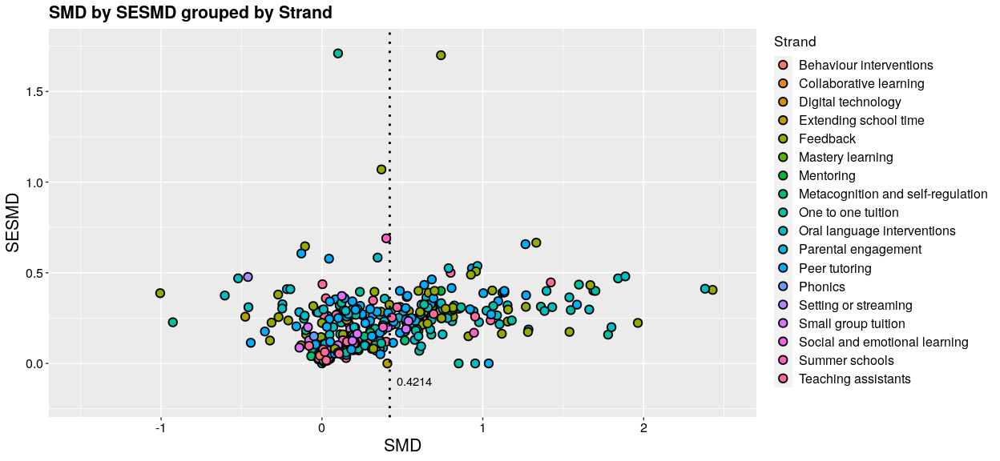<!-- -->


