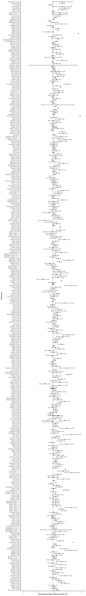
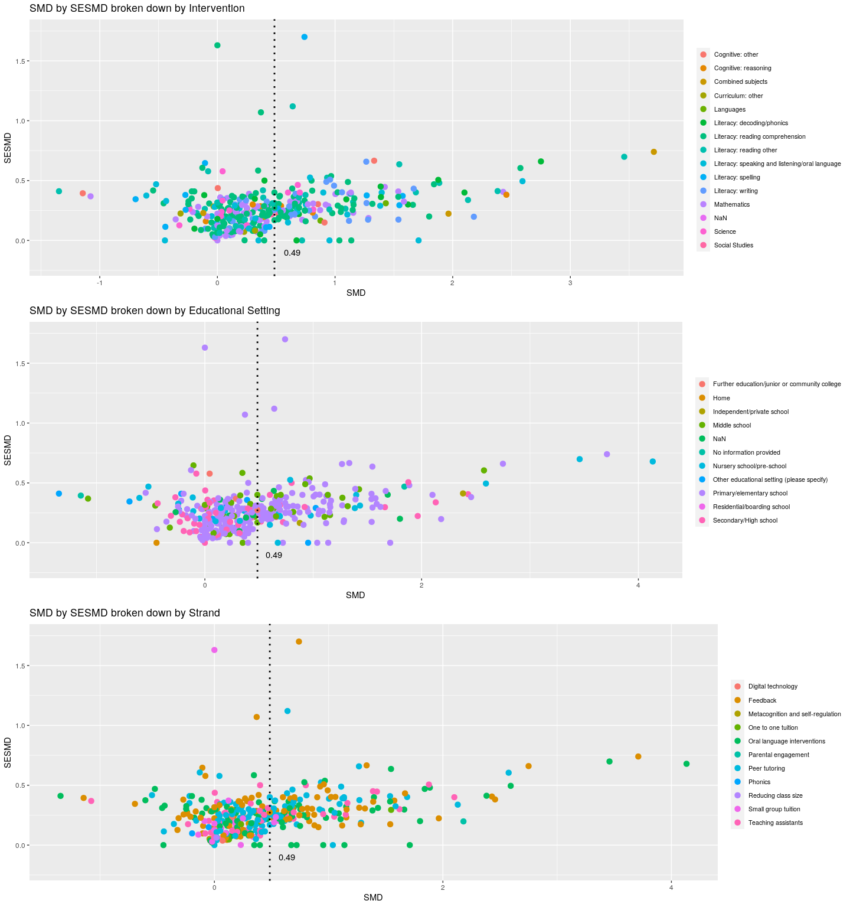

```r
knitr::opts_chunk$set(echo = T,
                      fig.path = "Master_figs/")
library(reticulate)
library(ggplot2)
library(dplyr)
library(reshape2)
library(purrr)
library(gridExtra)
use_python("/usr/local/bin/python3")
```


```python
# import necessary libraries
import json
from collections import Counter
from pprint import pprint
import numpy as np
from matplotlib import pyplot as plt
import pandas as pd
plt.style.use('ggplot')

# import dataset
with open('/home/jon/json/ToolkitExtraction/data/Batch1.json') as f:
    data=json.load(f)

def get_strand_info():
    ''' 
    a function that returns
    a dict containing strand labels
    and corresponding attribute ids
    '''
    strands={}
    for counter, element in enumerate(data["CodeSets"][0]["Attributes"]["AttributesList"]):
        attribute_name=(data["CodeSets"][0]["Attributes"]["AttributesList"][counter]["AttributeName"])
        attribute_id=(data["CodeSets"][0]["Attributes"]["AttributesList"][counter]["AttributeId"])
        strands.update( {attribute_id:attribute_name} )
    return strands

strands = get_strand_info()

def get_edu_info():
    edu_setting={}
    for counter, value in enumerate(data["CodeSets"][2]["Attributes"]["AttributesList"][2]["Attributes"]["AttributesList"][2]["Attributes"]["AttributesList"]):
        setting_code=data["CodeSets"][2]["Attributes"]["AttributesList"][2]["Attributes"]["AttributesList"][2]["Attributes"]["AttributesList"][counter]["AttributeId"]
        setting_name=data["CodeSets"][2]["Attributes"]["AttributesList"][2]["Attributes"]["AttributesList"][2]["Attributes"]["AttributesList"][counter]["AttributeName"]
        edu_setting.update( {setting_code:setting_name} )
    return edu_setting

edu = get_edu_info()

def get_all():
  finds=[]
  find=0
  strandfind=0
  exclude=np.nan
  
  studies=0
  # iterate over each section within each study of 'references'
  for section in range(len(data["References"])):
      studies+=1
      find=0
      strandfind=0
      for study in range(len(data["References"][section]["Codes"])):
          
          # get educational setting data (prmiary/elementary etc.)
          for key,value in edu.items():
              if key == data["References"][section]["Codes"][study]["AttributeId"]:
                  find=value
                  label=key
              elif find==0:
                  find=exclude
                  label=exclude
                  
          # get strand data (feedback, peer tutoring etc.)
          for key,value in strands.items():
              if key == data["References"][section]["Codes"][study]["AttributeId"]:
                  strandfind=value
                  strandlabel=key
              elif strandfind==0:
                  strandfind=exclude
                  strandlabel=exclude
                  
          # get outcome data
          if "Outcomes" in data["References"][section]:
              outcometext=data["References"][section]["Outcomes"][0]["OutcomeText"]
              interventiontext=data["References"][section]["Outcomes"][0]["InterventionText"]
              SMD=(data["References"][section]["Outcomes"][0]["SMD"])
              SESMD=(data["References"][section]["Outcomes"][0]["SESMD"])
              CIupperSMD=(data["References"][section]["Outcomes"][0]["CIUpperSMD"])
              CIlowerSMD=(data["References"][section]["Outcomes"][0]["CILowerSMD"])
          else:
              outcometext=exclude
              interventiontext=exclude
              SMD=exclude
              SESMD=exclude
              CIupperSMD=exclude
              CIlowerSMD=exclude
              
          # get year data
          if "Year" in data["References"][section]:
              year=data["References"][section]["Year"]
          else:
              year=exclude
              
          # get author data
          if "ShortTitle" in data["References"][section]:
              author=data["References"][section]["ShortTitle"]
          else:
              author=exclude
              
      finds.append([author, find, label, strandfind, strandlabel, interventiontext, 
                    outcometext, year, SMD, SESMD, CIupperSMD, CIlowerSMD])
      
  df = pd.DataFrame(finds, columns=['Author', 'EduSetting', 'EduID', 'Strand', 'Strand ID', 
                                    'Intervention', 'Outcome', 'Year', 'SMD', 'SESMD', 'CIupper', 'CIlower'])
                                    
  df.fillna(0)
                                    
  # round effect sizes to two decimal points
  df.loc[:, "SMD"] = df["SMD"].astype(float).round(4)
  df.loc[:, "SESMD"] = df["SESMD"].astype(float, errors='ignore').round(4)
  df.loc[:, "CIupper"] = df["CIupper"].astype(float).round(4)
  df.loc[:, "CIlower"] = df["CIlower"].astype(float).round(4)
                                    
  return df
  
all = get_all()
all.head(10)
```

```
##               Author                 EduSetting  ...  CIupper CIlower
## 0   Aarnoutse (1997)  Primary/elementary school  ...      NaN     NaN
## 1   Aarnoutse (1998)  Primary/elementary school  ...      NaN     NaN
## 2  Abbondanza (2013)      Secondary/High school  ...   0.8637  0.1712
## 3       Adler (1998)  Primary/elementary school  ...   0.6021 -0.2721
## 4     Ahlfors (1979)  Primary/elementary school  ...      NaN     NaN
## 5     Allsopp (1995)              Middle school  ...   0.4027 -0.0835
## 6       Ammon (1971)  Primary/elementary school  ...   0.5780 -0.5780
## 7      Anders (1984)      Secondary/High school  ...   2.2439  1.0792
## 8    Anderson (1973)              Middle school  ...   1.6074  0.7020
## 9     Andrade (2008)  Primary/elementary school  ...   1.2220  0.4380
## 
## [10 rows x 12 columns]
```


```r
master_df <- py$all
View(master_df)
master_df <- as.data.frame(lapply(master_df, unlist))
head(master_df)
```

```
##              Author                EduSetting   EduID
## 1  Aarnoutse (1997) Primary/elementary school 5215411
## 2  Aarnoutse (1998) Primary/elementary school 5215411
## 3 Abbondanza (2013)     Secondary/High school 5215413
## 4      Adler (1998) Primary/elementary school 5215411
## 5    Ahlfors (1979) Primary/elementary school 5215411
## 6    Allsopp (1995)             Middle school 5215412
##                        Strand Strand.ID                    Intervention
## 1 Oral language interventions   5023563                             NaN
## 2 Oral language interventions   5023563                             NaN
## 3               Peer tutoring   5023548 Literacy: reading comprehension
## 4                    Feedback   5023555               Literacy: writing
## 5 Oral language interventions   5023563                             NaN
## 6               Peer tutoring   5023548                     Mathematics
##           Outcome Year    SMD  SESMD CIupper CIlower
## 1             NaN 1997    NaN    NaN     NaN     NaN
## 2             NaN 1998    NaN    NaN     NaN     NaN
## 3 Primary outcome 2013 0.5174 0.1767  0.8637  0.1712
## 4 Primary outcome 1998 0.1650 0.2230  0.6021 -0.2721
## 5             NaN 1979    NaN    NaN     NaN     NaN
## 6 Primary outcome 1995 0.1596 0.1241  0.4027 -0.0835
```
**Make overall forest plot**

```r
# remove missing values from key variables
#master_df<- na.omit(subset(master_df, select = c(Author, SMD, CIlower, CIupper)))

ggplot(data=na.omit(subset(master_df, select=c(Author, SMD, CIlower, CIupper))),
                    aes(y=Author, x=SMD, xmin=CIlower, xmax=CIupper))+
  geom_point(color='black', shape=15) +
  geom_errorbarh(height=.7, linetype=1) +
  scale_x_continuous(limits=c(-4,4), name='Standardized Mean Difference (95% CI)') +
  ylab('Reference') +
  geom_vline(xintercept=0, color='black', linetype='dashed') +
  theme_classic()
```

```
## Warning: Removed 1 rows containing missing values (geom_point).
```

```
## Warning: Removed 6 rows containing missing values (geom_errorbarh).
```

<!-- -->


```r
# prepare data for dotplot
master_df$Intervention <- as.character(master_df$Intervention)
master_df$Intervention[master_df$Intervention==""] <- NA
master_df$Intervention <- as.factor(master_df$Intervention)
master_df_mean_SMD <- mean(master_df$SMD, na.rm=TRUE)
master_dfk_mean_SESMD <- mean(master_df$SESMD, na.rm=TRUE)

# View(feedback_df) # uncomment to view data in dataviewer

smd_intervention <- ggplot(data=subset(master_df, !is.na(Intervention)), aes(SMD, SESMD, color=Intervention)) + 
    geom_point(alpha=1, na.rm=TRUE, size=3) +
    theme_grey() +
    geom_vline(xintercept=master_df_mean_SMD, linetype="dotted", color="black", size=1) +
    theme(legend.title = element_text(color = "black", size = 10),
          legend.text = element_text(color = "black", size = 8)) +
    theme(legend.position="right") +
    guides(fill=guide_legend(nrow=5, byrow=TRUE)) +
    theme(legend.title=element_blank()) +
    annotate(geom="text", x=master_df_mean_SMD+.15, y=-.1, label=round(master_df_mean_SMD, 2), color="black") +
    ylim(-0.2, 1.75) +
    ggtitle("SMD by SESMD broken down by Intervention")

smd_edusetting <- ggplot(data=subset(master_df, !is.na(EduSetting)), aes(SMD, SESMD, color=EduSetting)) + 
    geom_point(alpha=1, na.rm=TRUE, size=3) +
    theme_grey() +
    geom_vline(xintercept=master_df_mean_SMD, linetype="dotted", color="black", size=1) +
    theme(legend.title = element_text(color = "black", size = 10),
          legend.text = element_text(color = "black", size = 8)) +
    theme(legend.position="right") +
    guides(fill=guide_legend(nrow=5, byrow=TRUE)) +
    theme(legend.title=element_blank()) +
    annotate(geom="text", x=master_df_mean_SMD+.15, y=-.1, label=round(master_df_mean_SMD, 2), color="black") +
    ylim(-0.2, 1.75) +
    ggtitle("SMD by SESMD broken down by Educational Setting")

smd_strand <- ggplot(data=subset(master_df, !is.na(Strand)), aes(SMD, SESMD, color=Strand)) + 
    geom_point(alpha=1, na.rm=TRUE, size=3) +
    theme_grey() +
    geom_vline(xintercept=master_df_mean_SMD, linetype="dotted", color="black", size=1) +
    theme(legend.title = element_text(color = "black", size = 10),
          legend.text = element_text(color = "black", size = 8)) +
    theme(legend.position="right") +
    guides(fill=guide_legend(nrow=5, byrow=TRUE)) +
    theme(legend.title=element_blank()) +
    annotate(geom="text", x=master_df_mean_SMD+.15, y=-.1, label=round(master_df_mean_SMD, 2), color="black") +
    ylim(-0.2, 1.75) +
    ggtitle("SMD by SESMD broken down by Strand")

grid.arrange(smd_intervention, smd_edusetting, smd_strand)
```

<!-- -->

