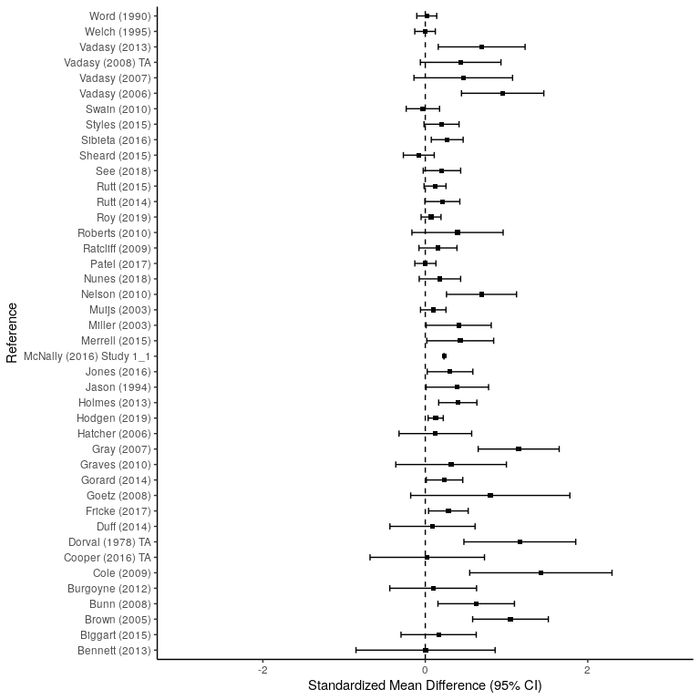

```python
import json
from collections import Counter
from pprint import pprint
from matplotlib import pyplot as plt
import pandas as pd
plt.style.use('ggplot')

# import dataset
with open('/home/jon/json/Batch1.json') as f:
    data=json.load(f)
    
###################################################
### GET STRAND LABELS AND KEYS FROM TOP OUTER LAYER
###################################################

def get_strand_info():
    ''' 
    a function that returns
    a dict containing strand labels
    and corresponding attribute ids
    '''
    strands={}
    for counter, element in enumerate(data["CodeSets"][0]["Attributes"]["AttributesList"]):
        attribute_name=(data["CodeSets"][0]["Attributes"]["AttributesList"][counter]["AttributeName"])
        attribute_id=(data["CodeSets"][0]["Attributes"]["AttributesList"][counter]["AttributeId"])
        strands.update( {attribute_id:attribute_name} )
    return strands
    
######################################
### DISPLAY STRAND SUMMARY INFORMATION 
######################################
    
def get_strand_summary():
    '''
    A function that produces a basic
    summary of strand study counts
    and a graph to display them
    '''
    global counts, strand_title
    strand_overview=[]
    for element in range(len(data["References"])):
        for key, value in strands.items():
            for section in range(len(data["References"][element]["Codes"])):
                if key == data["References"][element]["Codes"][section]["AttributeId"]:
                    a=(data["References"][element]["ItemId"])
                    b=(data["References"][element]["Title"])
                    strand_overview.append([value, key, a, b])

    strand_title=[]
    for element in strand_overview:
        strand_title.append(element[0])

    counts = Counter(strand_title) 
    pprint(counts)

#######################################
### GET THE ID FOR OUR STRAND OF CHOICE 
#######################################

def get_strand_value(strand_label):
    ''' 
    A function that takes in a 
    strand name and returns
    the strand ID
    '''
    for key, value in strands.items():
        if value == strand_label:
            return key, value

######################################################
###  GET EFFECT SIZE INFO FROM STRAND SPECIFIC STUDIES
######################################################

def get_data(strand_key, strand_value, outcome_choice):
    '''
    A function that accepts a strand id and a variable of
    interest and returns a list of that id and the variable
    values.
    '''
    outcome_studies=[] 

    # iterate over each section of 'references'
    for section in range(len(data["References"])):
        # iterate over each study within each section of 'references'
        for study in range(len(data["References"][section]["Codes"])):
            # check each study to see if strand id is present
            if strand_id[0] == data["References"][section]["Codes"][study]["AttributeId"]:
                if "Outcomes" in data["References"][section]:
                    if data["References"][section]["Outcomes"][0]["OutcomeText"] == outcome_choice:
                        outcome_id=((data["References"][section]["Outcomes"][0]["OutcomeId"]))
                        outcome_type=(data["References"][section]["Outcomes"][0]["ShortTitle"])
                        outcome_text=(data["References"][section]["Outcomes"][0]["OutcomeText"])
                        SMD=(data["References"][section]["Outcomes"][0]["SMD"])
                        SESMD=(data["References"][section]["Outcomes"][0]["SESMD"])
                        CIupperSMD=(data["References"][section]["Outcomes"][0]["CIUpperSMD"])
                        CIlowerSMD=(data["References"][section]["Outcomes"][0]["CILowerSMD"])
                        year=(data["References"][section]["Year"])
                        intervention=(data["References"][section]["Outcomes"][0]["InterventionText"])
                        outcome_studies.append([strand_key, strand_value, outcome_id, outcome_text, 
                                                outcome_type, year, intervention, SMD, SESMD, CIupperSMD,
                                                CIlowerSMD])
              
    # display number of studies found within selected strand
    print('Number of studies within strand {}: {}'.format(strand_value, len(outcome_studies)), "\n")
    
    pd.set_option('display.max_rows', 15)
    pd.set_option('display.max_columns', 15)
    
    # convert data list to pandas dataframe for viewing
    df_primary = pd.DataFrame(outcome_studies, columns=['AttributeId', 'Strand', 'OutcomeId', 'OutcomeType', 
                                                        'ShortTitle', 'Year', 'Intervention', 'SMD', 'SESMD',
                                                        'CIupper', 'CIlower'])
    
    # round effect sizes to two decimal points
    df_primary.loc[:, "SMD"] = df_primary["SMD"].astype(float).round(4)
    df_primary.loc[:, "SESMD"] = df_primary["SESMD"].astype(float).round(4)
    df_primary.loc[:, "CIupper"] = df_primary["CIupper"].astype(float).round(4)
    df_primary.loc[:, "CIlower"] = df_primary["CIlower"].astype(float).round(4)
    
    return df_primary

strands = get_strand_info()
get_strand_summary()
```

```
## Counter({'Oral language interventions': 138,
##          'Feedback': 114,
##          'Peer tutoring': 109,
##          'Teaching assistants': 62,
##          'Small group tuition': 30,
##          'One to one tuition': 10,
##          'Phonics': 6,
##          'Digital technology': 4,
##          'Metacognition and self-regulation': 4,
##          'Parental engagement': 1,
##          'Extending school time': 1,
##          'Reducing class size': 1})
```


```python
strand_id = get_strand_value("Feedback") 
feedback = get_data(strand_id[0], strand_id[1], "Primary outcome")
```

```
## Number of studies within strand Feedback: 89
```


```r
feedback_df <- data.frame(py$feedback)

feedback_df$Intervention <- as.character(feedback_df$Intervention)
feedback_df$Intervention[feedback_df$Intervention==""] <- NA
feedback_df$Intervention <- as.factor(feedback_df$Intervention)

feedback_mean_SMD <- mean(feedback_df$SMD, na.rm=TRUE)
feedback_mean_SESMD <- mean(feedback_df$SESMD, na.rm=TRUE)

feedback_mean_SMD
```

```
## [1] 0.5133944
```

```r
feedback_mean_SESMD
```

```
## [1] 0.2915416
```

```r
View(feedback_df)

library(ggplot2)
p <- ggplot(feedback_df, aes(y=ShortTitle, x=SMD, xmin=CIlower, xmax=CIupper))+
  geom_point(color='black') +
  geom_errorbarh(height=.1) +
  scale_x_continuous(limits=c(-2,2), name='Standardized Mean Difference') +
  ylab('Reference') +
  geom_vline(xintercept=0, color='black', linetype='dashed')
```

```r
ggplot(feedback_df, aes(y=ShortTitle, x=SMD, xmin=CIlower, xmax=CIupper))+
  geom_point(color='black') +
  geom_errorbarh(height=.1) +
  scale_x_continuous(limits=c(-2,2), name='Standardized Mean Difference') +
  ylab('Reference') +
  geom_vline(xintercept=0, color='black', linetype='dashed')
```

```
## Warning: Removed 3 rows containing missing values (geom_point).
```

```
## Warning: Removed 9 rows containing missing values (geom_errorbarh).
```

<!-- -->


```r
ggplot(data=subset(feedback_df, !is.na(Intervention)), aes(SMD, SESMD, color=Intervention)) + 
    geom_point(alpha=1, na.rm=TRUE, size=3) +
    theme_grey() +
    geom_vline(xintercept=feedback_mean_SMD, linetype="dotted", color="black", size=1) +
    theme(legend.title = element_text(color = "black", size = 10),
          legend.text = element_text(color = "black", size = 8)) +
    theme(legend.position="right") +
    guides(fill=guide_legend(nrow=5, byrow=TRUE)) +
    theme(legend.title=element_blank()) +
    annotate(geom="text", x=feedback_mean_SMD+.15, y=-.1, label=round(feedback_mean_SMD, 2), color="black") +
    ylim(-0.2, 1.75) +
    ggtitle("SMD by SESMD broken down by Intervention, Feedback strand only")
```

<!-- -->


```python
strand_id = get_strand_value("Oral language interventions") 
oral_lang = get_data(strand_id[0], strand_id[1], "Primary outcome")
```

```
## Number of studies within strand Oral language interventions: 89
```

```python
print(oral_lang.head(10))
```

```
##    AttributeId                       Strand  OutcomeId      OutcomeType  \
## 0      5023563  Oral language interventions      45530  Primary outcome   
## 1      5023563  Oral language interventions      45614  Primary outcome   
## 2      5023563  Oral language interventions      51144  Primary outcome   
## 3      5023563  Oral language interventions      45528  Primary outcome   
## 4      5023563  Oral language interventions      50379  Primary outcome   
## 5      5023563  Oral language interventions      51160  Primary outcome   
## 6      5023563  Oral language interventions      51135  Primary outcome   
## 7      5023563  Oral language interventions      45621  Primary outcome   
## 8      5023563  Oral language interventions      50557  Primary outcome   
## 9      5023563  Oral language interventions      49410  Primary outcome   
## 
##         ShortTitle  Year                     Intervention     SMD   SESMD  \
## 0     Ammon (1971)  1971          Literacy: reading other  0.0000  0.2949   
## 1    Anders (1984)  1984  Literacy: reading comprehension  1.6616  0.2971   
## 2   Aram (2004) OL  2004          Literacy: reading other  0.3624  0.2673   
## 3      Aram (2006)  2006  Literacy: reading comprehension  0.0396  0.2310   
## 4     Banks (1987)  1987          Literacy: reading other -0.1756  0.2289   
## 5   Baumann (2002)  2002  Literacy: reading comprehension -0.0699  0.3087   
## 6      Beck (2007)  2007          Literacy: reading other  1.1537  0.3206   
## 7  Bereiter (1985)  1985  Literacy: reading comprehension  0.5271  0.3665   
## 8     Block (2006)  2006  Literacy: reading comprehension  0.3000  0.0800   
## 9     Bonds (1987)  1987  Literacy: reading comprehension  0.9764  0.2275   
## 
##    CIupper  CIlower  
## 0   0.5780  -0.5780  
## 1   2.2439   1.0792  
## 2   0.8862  -0.1614  
## 3   0.4923  -0.4131  
## 4   0.2729  -0.6242  
## 5   0.5352  -0.6749  
## 6   1.7821   0.5253  
## 7   1.2454  -0.1912  
## 8   0.4568   0.1432  
## 9   1.4223   0.5304
```


```r
oral_lang_df <- data.frame(py$oral_lang)

oral_lang_df$Intervention <- as.character(oral_lang_df$Intervention)
oral_lang_df$Intervention[oral_lang_df$Intervention==""] <- NA
oral_lang_df$Intervention <- as.factor(oral_lang_df$Intervention)

oral_lang_mean_SMD <- mean(oral_lang_df$SMD, na.rm=TRUE)
oral_lang_mean_SESMD <- mean(oral_lang_df$SESMD, na.rm=TRUE)

oral_lang_mean_SMD
```

```
## [1] 0.5674135
```

```r
oral_lang_mean_SESMD
```

```
## [1] 0.2637682
```

```r
View(oral_lang_df)
```


```r
ggplot(data=subset(oral_lang_df, !is.na(Intervention)), aes(SMD, SESMD, color=Intervention)) + 
    geom_point(alpha=1, na.rm=TRUE, size=3) +
    theme_grey() +
    geom_vline(xintercept=oral_lang_mean_SMD, linetype="dotted", color="black", size=1) +
    theme(legend.title = element_text(color = "black", size = 10),
          legend.text = element_text(color = "black", size = 8)) +
    theme(legend.position="right") +
    guides(fill=guide_legend(nrow=5, byrow=TRUE)) +
    theme(legend.title=element_blank()) +
    annotate(geom="text", x=oral_lang_mean_SMD+.15, y=-.1, label=round(oral_lang_mean_SMD, 2), color="black") +
    ylim(-0.2, 1.75) +
    ggtitle("SMD by SESMD broken down by Intervention, Oral Language strand only")
```

<!-- -->


```python
strand_id = get_strand_value("Oral language interventions") 
oral_lang = get_data(strand_id[0], strand_id[1], "Primary outcome")
```

```
## Number of studies within strand Oral language interventions: 89
```

```python
strand_id = get_strand_value("Feedback") 
feedback = get_data(strand_id[0], strand_id[1], "Primary outcome")
```

```
## Number of studies within strand Feedback: 89
```

```python
strand_id = get_strand_value("Peer tutoring") 
peer_tut = get_data(strand_id[0], strand_id[1], "Primary outcome")
```

```
## Number of studies within strand Peer tutoring: 94
```

```python
strand_id = get_strand_value("Teaching assistants") 
teaching_assist = get_data(strand_id[0], strand_id[1], "Primary outcome")
```

```
## Number of studies within strand Teaching assistants: 42
```

```python
strand_id = get_strand_value("Small group tuition") 
small_group = get_data(strand_id[0], strand_id[1], "Primary outcome")
```

```
## Number of studies within strand Small group tuition: 26
```

```python
strand_id = get_strand_value("One to one tuition") 
one_to_one = get_data(strand_id[0], strand_id[1], "Primary outcome")
```

```
## Number of studies within strand One to one tuition: 9
```

```python
master_df = pd.concat([oral_lang, feedback, peer_tut, teaching_assist, small_group, one_to_one])
master_df
```

```
##     AttributeId                       Strand  OutcomeId      OutcomeType  \
## 0       5023563  Oral language interventions      45530  Primary outcome   
## 1       5023563  Oral language interventions      45614  Primary outcome   
## 2       5023563  Oral language interventions      51144  Primary outcome   
## 3       5023563  Oral language interventions      45528  Primary outcome   
## 4       5023563  Oral language interventions      50379  Primary outcome   
## ..          ...                          ...        ...              ...   
## 4       5023562           One to one tuition      47552  Primary outcome   
## 5       5023562           One to one tuition      46178  Primary outcome   
## 6       5023562           One to one tuition      46256  Primary outcome   
## 7       5023562           One to one tuition      47554  Primary outcome   
## 8       5023562           One to one tuition      46242  Primary outcome   
## 
##         ShortTitle  Year                     Intervention     SMD   SESMD  \
## 0     Ammon (1971)  1971          Literacy: reading other  0.0000  0.2949   
## 1    Anders (1984)  1984  Literacy: reading comprehension  1.6616  0.2971   
## 2   Aram (2004) OL  2004          Literacy: reading other  0.3624  0.2673   
## 3      Aram (2006)  2006  Literacy: reading comprehension  0.0396  0.2310   
## 4     Banks (1987)  1987          Literacy: reading other -0.1756  0.2289   
## ..             ...   ...                              ...     ...     ...   
## 4     Patel (2017)  2017  Literacy: reading comprehension  0.0010  0.0663   
## 5       Roy (2019)  2019  Literacy: reading comprehension  0.0709  0.0625   
## 6      Rutt (2014)  2014                      Mathematics  0.2100  0.1097   
## 7      Rutt (2015)  2015  Literacy: reading comprehension  0.1200  0.0689   
## 8       See (2018)  2018                      Mathematics  0.2050  0.1176   
## 
##     CIupper  CIlower  
## 0    0.5780  -0.5780  
## 1    2.2439   1.0792  
## 2    0.8862  -0.1614  
## 3    0.4923  -0.4131  
## 4    0.2729  -0.6242  
## ..      ...      ...  
## 4    0.1310  -0.1290  
## 5    0.1934  -0.0516  
## 6    0.4250  -0.0050  
## 7    0.2550  -0.0150  
## 8    0.4354  -0.0254  
## 
## [349 rows x 11 columns]
```


```r
master_df <- data.frame(py$master_df)
```

```
## Warning in py_to_r.pandas.core.frame.DataFrame(x): index contains duplicated
## values: row names not set
```

```r
master_df$Intervention[master_df$Intervention==""] <- NA
           
filter(master_df, !is.na(Intervention)) %>%
  ggplot(aes(fill=Intervention, y=SMD, x=Strand)) +
  geom_bar(position="dodge", stat="identity", color="black", na.rm=TRUE) +
  ggtitle("SMD by Strand, broken down by Intervention")
```

<!-- -->


```r
filter(master_df, !is.na(Intervention)) %>%
  ggplot(aes(fill=Intervention, y=SMD, x=Strand)) +
  geom_dotplot(binaxis='y', stackdir='center', dotsize=.6, binwidth=.2, na.rm=TRUE) +
  ggtitle("SMD by Strand, broken down by Intervention")
```

<!-- -->


```r
filter(master_df, !is.na(Intervention)) %>%
  ggplot(aes(y=SMD, x=Strand, size=Intervention, color=Intervention)) +
  geom_jitter(shape=16, position=position_jitter(.2), size=2, shape=21)
```

```
## Warning: Duplicated aesthetics after name standardisation: shape
```

<!-- -->


```r
filter(master_df, !is.na(Intervention)) %>%
  ggplot(aes(fill=Intervention, y=SMD, x=Strand)) +
  geom_dotplot(binaxis='y', stackdir='center', dotsize=.6, binwidth=.2, na.rm=TRUE) +
  ggtitle("SMD by Strand, broken down by Intervention")
```

<!-- -->

