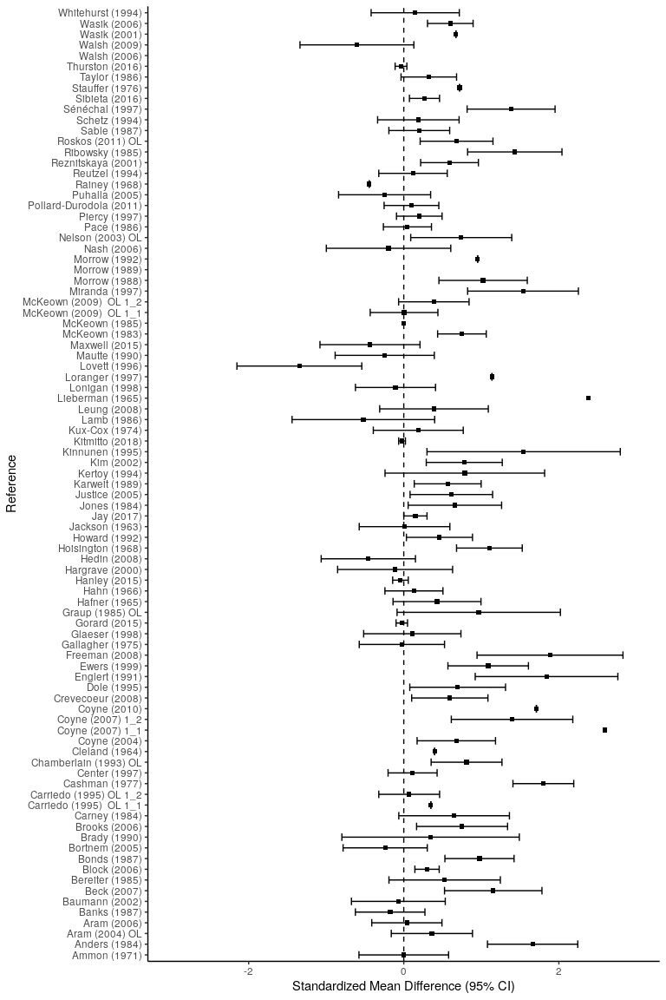
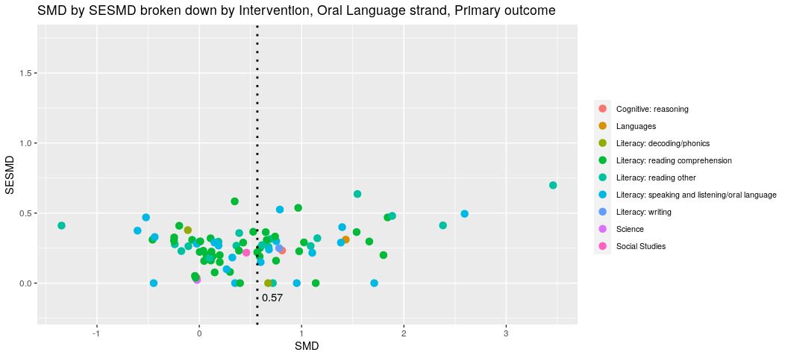
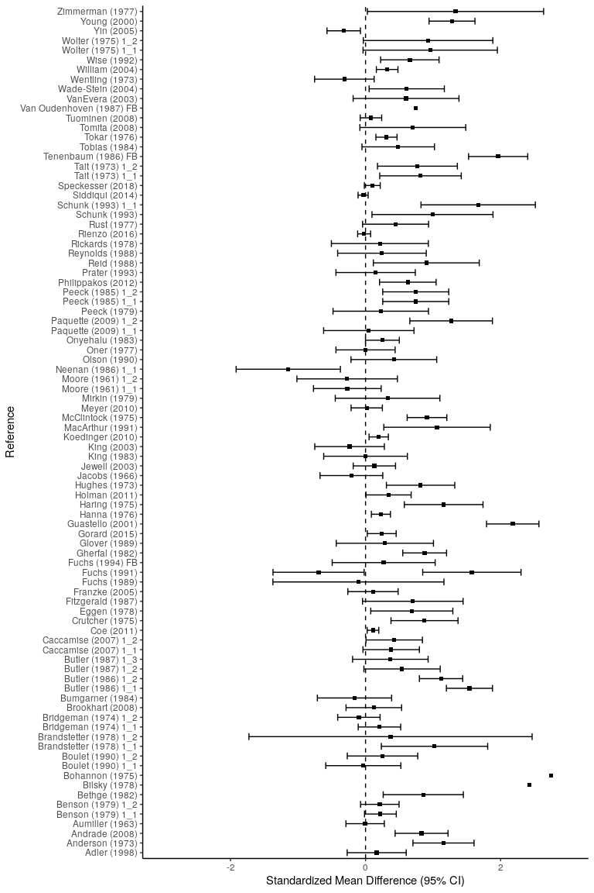
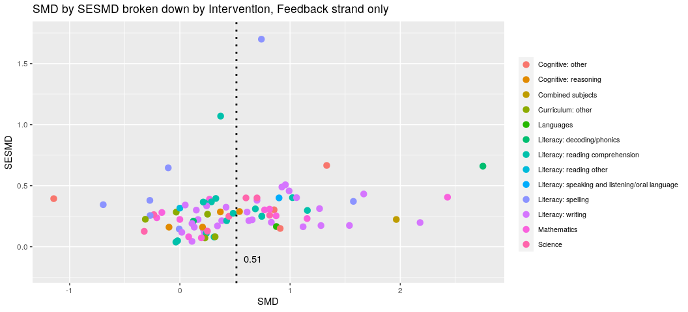
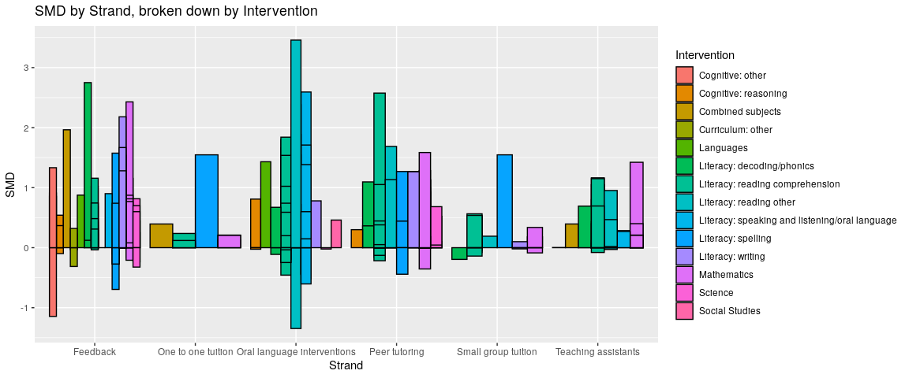
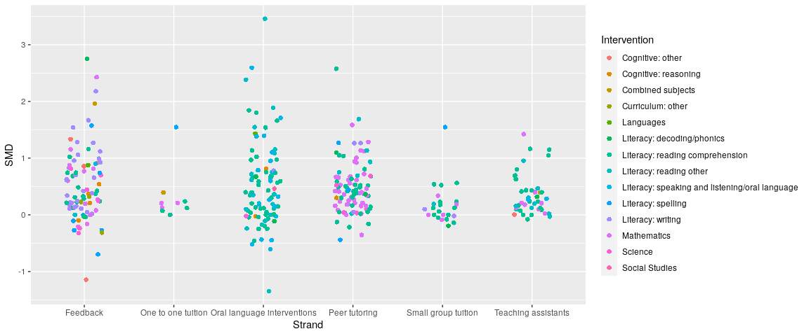

```r
knitr::opts_chunk$set(echo = T,
                      fig.path = "StrandSpecificEffectSizeExtraction_figs/")
library(reticulate)
library(ggplot2)
library(dplyr)
library(reshape2)
use_python("/usr/local/bin/python3")
```

**Get data with Python**

```python
import json
from collections import Counter
from pprint import pprint
from matplotlib import pyplot as plt
import pandas as pd
plt.style.use('ggplot')

# import dataset
with open('/home/jon/json/Batch1.json') as f:
    data=json.load(f)
    
###################################################
### GET STRAND LABELS AND KEYS FROM TOP OUTER LAYER
###################################################

def get_strand_info():
    ''' 
    a function that returns
    a dict containing strand labels
    and corresponding attribute ids
    '''
    strands={}
    for counter, element in enumerate(data["CodeSets"][0]["Attributes"]["AttributesList"]):
        attribute_name=(data["CodeSets"][0]["Attributes"]["AttributesList"][counter]["AttributeName"])
        attribute_id=(data["CodeSets"][0]["Attributes"]["AttributesList"][counter]["AttributeId"])
        strands.update( {attribute_id:attribute_name} )
    return strands
    
######################################
### DISPLAY STRAND SUMMARY INFORMATION 
######################################
    
def get_strand_summary():
    '''
    A function that produces a basic
    summary of strand study counts
    and a graph to display them
    '''
    global counts, strand_title
    strand_overview=[]
    for element in range(len(data["References"])):
        for key, value in strands.items():
            for section in range(len(data["References"][element]["Codes"])):
                if key == data["References"][element]["Codes"][section]["AttributeId"]:
                    a=(data["References"][element]["ItemId"])
                    b=(data["References"][element]["Title"])
                    strand_overview.append([value, key, a, b])

    strand_title=[]
    for element in strand_overview:
        strand_title.append(element[0])

    counts = Counter(strand_title) 
    pprint(counts)

#######################################
### GET THE ID FOR OUR STRAND OF CHOICE 
#######################################

def get_strand_value(strand_label):
    ''' 
    A function that takes in a 
    strand name and returns
    the strand ID
    '''
    for key, value in strands.items():
        if value == strand_label:
            return key, value

######################################################
###  GET EFFECT SIZE INFO FROM STRAND SPECIFIC STUDIES
######################################################

def get_data(strand_key, strand_value, outcome_choice):
    '''
    A function that accepts a strand id and a variable of
    interest and returns a list of that id and the variable
    values.
    '''
    outcome_studies=[] 

    # iterate over each section of 'references'
    for section in range(len(data["References"])):
        # iterate over each study within each section of 'references'
        for study in range(len(data["References"][section]["Codes"])):
            # check each study to see if strand id is present
            if strand_id[0] == data["References"][section]["Codes"][study]["AttributeId"]:
                if "Outcomes" in data["References"][section]:
                    if data["References"][section]["Outcomes"][0]["OutcomeText"] == outcome_choice:
                        outcome_id=((data["References"][section]["Outcomes"][0]["OutcomeId"]))
                        outcome_type=(data["References"][section]["Outcomes"][0]["ShortTitle"])
                        outcome_text=(data["References"][section]["Outcomes"][0]["OutcomeText"])
                        SMD=(data["References"][section]["Outcomes"][0]["SMD"])
                        SESMD=(data["References"][section]["Outcomes"][0]["SESMD"])
                        CIupperSMD=(data["References"][section]["Outcomes"][0]["CIUpperSMD"])
                        CIlowerSMD=(data["References"][section]["Outcomes"][0]["CILowerSMD"])
                        year=(data["References"][section]["Year"])
                        intervention=(data["References"][section]["Outcomes"][0]["InterventionText"])
                        outcome_studies.append([strand_key, strand_value, outcome_id, outcome_text, 
                                                outcome_type, year, intervention, SMD, SESMD, CIupperSMD,
                                                CIlowerSMD])
              
    # display number of studies found within selected strand
    print('Number of studies within strand {}: {}'.format(strand_value, len(outcome_studies)), "\n")
    
    pd.set_option('display.max_rows', 15)
    pd.set_option('display.max_columns', 15)
    
    # convert data list to pandas dataframe for viewing
    df_primary = pd.DataFrame(outcome_studies, columns=['AttributeId', 'Strand', 'OutcomeId', 'OutcomeType', 
                                                        'ShortTitle', 'Year', 'Intervention', 'SMD', 'SESMD',
                                                        'CIupper', 'CIlower'])
    
    # round effect sizes to two decimal points
    df_primary.loc[:, "SMD"] = df_primary["SMD"].astype(float).round(4)
    df_primary.loc[:, "SESMD"] = df_primary["SESMD"].astype(float).round(4)
    df_primary.loc[:, "CIupper"] = df_primary["CIupper"].astype(float).round(4)
    df_primary.loc[:, "CIlower"] = df_primary["CIlower"].astype(float).round(4)
    
    return df_primary

strands = get_strand_info()
get_strand_summary()
```

```
## Counter({'Oral language interventions': 138,
##          'Feedback': 114,
##          'Peer tutoring': 109,
##          'Teaching assistants': 62,
##          'Small group tuition': 30,
##          'One to one tuition': 10,
##          'Phonics': 6,
##          'Digital technology': 4,
##          'Metacognition and self-regulation': 4,
##          'Parental engagement': 1,
##          'Extending school time': 1,
##          'Reducing class size': 1})
```

```python
strand_id = get_strand_value("Oral language interventions") 
oral_lang = get_data(strand_id[0], strand_id[1], "Primary outcome")
```

```
## Number of studies within strand Oral language interventions: 89
```

```python
oral_lang.head(10)
```

```
##    AttributeId                       Strand  OutcomeId      OutcomeType  \
## 0      5023563  Oral language interventions      45530  Primary outcome   
## 1      5023563  Oral language interventions      45614  Primary outcome   
## 2      5023563  Oral language interventions      51144  Primary outcome   
## 3      5023563  Oral language interventions      45528  Primary outcome   
## 4      5023563  Oral language interventions      50379  Primary outcome   
## 5      5023563  Oral language interventions      51160  Primary outcome   
## 6      5023563  Oral language interventions      51135  Primary outcome   
## 7      5023563  Oral language interventions      45621  Primary outcome   
## 8      5023563  Oral language interventions      50557  Primary outcome   
## 9      5023563  Oral language interventions      49410  Primary outcome   
## 
##         ShortTitle  Year                     Intervention     SMD   SESMD  \
## 0     Ammon (1971)  1971          Literacy: reading other  0.0000  0.2949   
## 1    Anders (1984)  1984  Literacy: reading comprehension  1.6616  0.2971   
## 2   Aram (2004) OL  2004          Literacy: reading other  0.3624  0.2673   
## 3      Aram (2006)  2006  Literacy: reading comprehension  0.0396  0.2310   
## 4     Banks (1987)  1987          Literacy: reading other -0.1756  0.2289   
## 5   Baumann (2002)  2002  Literacy: reading comprehension -0.0699  0.3087   
## 6      Beck (2007)  2007          Literacy: reading other  1.1537  0.3206   
## 7  Bereiter (1985)  1985  Literacy: reading comprehension  0.5271  0.3665   
## 8     Block (2006)  2006  Literacy: reading comprehension  0.3000  0.0800   
## 9     Bonds (1987)  1987  Literacy: reading comprehension  0.9764  0.2275   
## 
##    CIupper  CIlower  
## 0   0.5780  -0.5780  
## 1   2.2439   1.0792  
## 2   0.8862  -0.1614  
## 3   0.4923  -0.4131  
## 4   0.2729  -0.6242  
## 5   0.5352  -0.6749  
## 6   1.7821   0.5253  
## 7   1.2454  -0.1912  
## 8   0.4568   0.1432  
## 9   1.4223   0.5304
```
Pass 'oral language' strand pandas dataframe to R (as R dataframe) and make forest plot

```r
oral_lang_df <- data.frame(py$oral_lang) # convert pandas dataframe (python) to R dataframe

ggplot(oral_lang_df, aes(y=ShortTitle, x=SMD, xmin=CIlower, xmax=CIupper))+
  geom_point(color='black', shape=15) +
  geom_errorbarh(height=.7, linetype=1) +
  scale_x_continuous(limits=c(-3,3), name='Standardized Mean Difference (95% CI)') +
  ylab('Reference') +
  geom_vline(xintercept=0, color='black', linetype='dashed') +
  theme_classic()
```

```
## Warning: Removed 2 rows containing missing values (geom_point).
```

```
## Warning: Removed 5 rows containing missing values (geom_errorbarh).
```

<!-- -->

```r
# prepare data for dotplot
oral_lang_df$Intervention <- as.character(oral_lang_df$Intervention)
oral_lang_df$Intervention[oral_lang_df$Intervention==""] <- NA
oral_lang_df$Intervention <- as.factor(oral_lang_df$Intervention)
oral_lang_mean_SMD <- mean(oral_lang_df$SMD, na.rm=TRUE)
oral_lang_mean_SESMD <- mean(oral_lang_df$SESMD, na.rm=TRUE)

# View(oral_lang_df) # uncomment to view data in data viewer

ggplot(data=subset(oral_lang_df, !is.na(Intervention)), aes(SMD, SESMD, color=Intervention)) + 
    geom_point(alpha=1, na.rm=TRUE, size=3) +
    theme_grey() +
    geom_vline(xintercept=oral_lang_mean_SMD, linetype="dotted", color="black", size=1) +
    theme(legend.title = element_text(color = "black", size = 10),
          legend.text = element_text(color = "black", size = 8)) +
    theme(legend.position="right") +
    guides(fill=guide_legend(nrow=5, byrow=TRUE)) +
    theme(legend.title=element_blank()) +
    annotate(geom="text", x=oral_lang_mean_SMD+.15, y=-.1, label=round(oral_lang_mean_SMD, 2), color="black") +
    ylim(-0.2, 1.75) +
    ggtitle("SMD by SESMD broken down by Intervention, Oral Language strand, Primary outcome")
```

<!-- -->

Get 'Feedback' strand data (effect sizes and confidence intervals) for Primary outcome studies

```python
strand_id = get_strand_value("Feedback") 
feedback = get_data(strand_id[0], strand_id[1], "Primary outcome")
```

```
## Number of studies within strand Feedback: 89
```

```python
feedback.head(10)
```

```
##    AttributeId    Strand  OutcomeId      OutcomeType         ShortTitle  Year  \
## 0      5023555  Feedback      46356  Primary outcome       Adler (1998)  1998   
## 1      5023555  Feedback      49729  Primary outcome    Anderson (1973)  1973   
## 2      5023555  Feedback      46229  Primary outcome     Andrade (2008)  2008   
## 3      5023555  Feedback      47394  Primary outcome    Aumiller (1963)  1963   
## 4      5023555  Feedback      46370  Primary outcome  Benson (1979) 1_1  1979   
## 5      5023555  Feedback      49773  Primary outcome  Benson (1979) 1_2  1979   
## 6      5023555  Feedback      48085  Primary outcome      Bethge (1982)  1982   
## 7      5023555  Feedback      48088  Primary outcome      Bilsky (1978)  1978   
## 8      5023555  Feedback      46278  Primary outcome    Bohannon (1975)  1975   
## 9      5023555  Feedback      48104  Primary outcome  Boulet (1990) 1_1  1990   
## 
##                  Intervention     SMD   SESMD  CIupper  CIlower  
## 0           Literacy: writing  0.1650  0.2230   0.6021  -0.2721  
## 1                 Mathematics  1.1547  0.2310   1.6074   0.7020  
## 2           Literacy: writing  0.8300  0.2000   1.2220   0.4380  
## 3          Literacy: spelling -0.0058  0.1451   0.2786  -0.2903  
## 4           Literacy: writing  0.2200  0.1200   0.4552  -0.0152  
## 5           Literacy: writing  0.2115  0.1455   0.4967  -0.0737  
## 6            Cognitive: other  0.8552  0.3027   1.4485   0.2619  
## 7                 Mathematics  2.4289  0.4056   3.2239   1.6338  
## 8  Literacy: decoding/phonics  2.7500  0.6600   4.0436   1.4564  
## 9           Curriculum: other -0.0329  0.2838   0.5233  -0.5891
```
Pass 'feedback' strand pandas dataframe to R (as R dataframe) and make forest plot

```r
feedback_df <- data.frame(py$feedback) # convert pandas dataframe (python) to R dataframe

ggplot(feedback_df, aes(y=ShortTitle, x=SMD, xmin=CIlower, xmax=CIupper))+
  geom_point(color='black', shape=15) +
  geom_errorbarh(height=.7, linetype=1) +
  scale_x_continuous(limits=c(-3,3), name='Standardized Mean Difference (95% CI)') +
  ylab('Reference') +
  geom_vline(xintercept=0, color='black', linetype='dashed') +
  theme_classic()
```

```
## Warning: Removed 3 rows containing missing values (geom_errorbarh).
```

<!-- -->


```r
# prepare data for dotplot
feedback_df$Intervention <- as.character(feedback_df$Intervention)
feedback_df$Intervention[feedback_df$Intervention==""] <- NA
feedback_df$Intervention <- as.factor(feedback_df$Intervention)
feedback_mean_SMD <- mean(feedback_df$SMD, na.rm=TRUE)
feedback_mean_SESMD <- mean(feedback_df$SESMD, na.rm=TRUE)

# View(feedback_df) # uncomment to view data in dataviewer

ggplot(data=subset(feedback_df, !is.na(Intervention)), aes(SMD, SESMD, color=Intervention)) + 
    geom_point(alpha=1, na.rm=TRUE, size=3) +
    theme_grey() +
    geom_vline(xintercept=feedback_mean_SMD, linetype="dotted", color="black", size=1) +
    theme(legend.title = element_text(color = "black", size = 10),
          legend.text = element_text(color = "black", size = 8)) +
    theme(legend.position="right") +
    guides(fill=guide_legend(nrow=5, byrow=TRUE)) +
    theme(legend.title=element_blank()) +
    annotate(geom="text", x=feedback_mean_SMD+.15, y=-.1, label=round(feedback_mean_SMD, 2), color="black") +
    ylim(-0.2, 1.75) +
    ggtitle("SMD by SESMD broken down by Intervention, Feedback strand only")
```

<!-- -->

Get 'Peer tutoring' strand data (effect sizes and confidence intervals) for Primary outcome studies

```python
strand_id = get_strand_value("Peer tutoring") 
peertutor = get_data(strand_id[0], strand_id[1], "Primary outcome")
```

```
## Number of studies within strand Peer tutoring: 94
```

```python
peertutor.head(10)
```

```
##    AttributeId         Strand  OutcomeId      OutcomeType         ShortTitle  \
## 0      5023548  Peer tutoring      43787  Primary outcome  Abbondanza (2013)   
## 1      5023548  Peer tutoring      43793  Primary outcome     Allsopp (1995)   
## 2      5023548  Peer tutoring      43800  Primary outcome   Arblaster (1991)   
## 3      5023548  Peer tutoring      43803  Primary outcome    Atherley (1989)   
## 4      5023548  Peer tutoring      43806  Primary outcome       Baker (2005)   
## 5      5023548  Peer tutoring      43839  Primary outcome     Bar-Eli (1982)   
## 6      5023548  Peer tutoring      43849  Primary outcome    Bramlett (1994)   
## 7      5023548  Peer tutoring      49654  Primary outcome       Bruno (2004)   
## 8      5023548  Peer tutoring      46706  Primary outcome       Brush (1997)   
## 9      5023548  Peer tutoring      46709  Primary outcome     Calhoon (2003)   
## 
##    Year                     Intervention     SMD   SESMD  CIupper  CIlower  
## 0  2013  Literacy: reading comprehension  0.5174  0.1767   0.8637   0.1712  
## 1  1995                      Mathematics  0.1596  0.1241   0.4027  -0.0835  
## 2  1991          Literacy: reading other  1.6870  0.4016   2.4741   0.8999  
## 3  1989  Literacy: reading comprehension  0.6814  0.3356   1.3391   0.0237  
## 4  2005       Literacy: decoding/phonics  1.0958  0.3434   1.7688   0.4228  
## 5  1982                      Mathematics  1.0033  0.3874   1.7627   0.2439  
## 6  1994  Literacy: reading comprehension  0.1019  0.1011   0.3000  -0.0962  
## 7  2004                Literacy: writing  0.3800  0.0864   0.5493   0.2107  
## 8  1997                      Mathematics  0.3167  0.2668   0.8396  -0.2061  
## 9  2003                      Mathematics  0.3997  0.2107   0.8128  -0.0133
```
Pass 'peer tutoring' strand pandas dataframe to R (as R dataframe) and make forest plot

```r
peer_tutoring_df <- data.frame(py$peertutor) # convert pandas dataframe (python) to R dataframe

ggplot(feedback_df, aes(y=ShortTitle, x=SMD, xmin=CIlower, xmax=CIupper))+
  geom_point(color='black', shape=15) +
  geom_errorbarh(height=.7, linetype=1) +
  scale_x_continuous(limits=c(-3,3), name='Standardized Mean Difference (95% CI)') +
  ylab('Reference') +
  geom_vline(xintercept=0, color='black', linetype='dashed') +
  theme_classic()
```

```
## Warning: Removed 3 rows containing missing values (geom_errorbarh).
```

<!-- -->

```r
# prepare data for dotplot
peer_tutoring_df$Intervention <- as.character(peer_tutoring_df$Intervention)
peer_tutoring_df$Intervention[feedback_df$Intervention==""] <- NA
peer_tutoring_df$Intervention <- as.factor(peer_tutoring_df$Intervention)
peer_tutoring_df_SMD <- mean(peer_tutoring_df$SMD, na.rm=TRUE)
peer_tutoring_df_SESMD <- mean(peer_tutoring_df$SESMD, na.rm=TRUE)

# View(feedback_df) # uncomment to view data in dataviewer

ggplot(data=subset(peer_tutoring_df, !is.na(Intervention)), aes(SMD, SESMD, color=Intervention)) + 
    geom_point(alpha=1, na.rm=TRUE, size=3) +
    theme_grey() +
    geom_vline(xintercept=peer_tutoring_df_SMD, linetype="dotted", color="black", size=1) +
    theme(legend.title = element_text(color = "black", size = 10),
          legend.text = element_text(color = "black", size = 8)) +
    theme(legend.position="right") +
    guides(fill=guide_legend(nrow=5, byrow=TRUE)) +
    theme(legend.title=element_blank()) +
    annotate(geom="text", x=peer_tutoring_df_SMD+.15, y=-.1, label=round(peer_tutoring_df_SMD, 2), color="black") +
    ylim(-0.2, 1.75) +
    ggtitle("SMD by SESMD broken down by Intervention, Peer tutoring strand only")
```

<!-- -->


```python
strand_id = get_strand_value("Teaching assistants") 
teachingassist = get_data(strand_id[0], strand_id[1], "Primary outcome")
```

```
## Number of studies within strand Teaching assistants: 42
```

```python
teachingassist.head(10)
```

```
##    AttributeId               Strand  OutcomeId      OutcomeType  \
## 0      5023576  Teaching assistants      47454  Primary outcome   
## 1      5023576  Teaching assistants      47242  Primary outcome   
## 2      5023576  Teaching assistants      45385  Primary outcome   
## 3      5023576  Teaching assistants      45409  Primary outcome   
## 4      5023576  Teaching assistants      45383  Primary outcome   
## 5      5023576  Teaching assistants      45402  Primary outcome   
## 6      5023576  Teaching assistants      47802  Primary outcome   
## 7      5023576  Teaching assistants      53408  Primary outcome   
## 8      5023576  Teaching assistants      48923  Primary outcome   
## 9      5023576  Teaching assistants      47869  Primary outcome   
## 
##          ShortTitle  Year                                    Intervention  \
## 0    Bennett (2013)  2013                                Cognitive: other   
## 1    Biggart (2015)  2015                 Literacy: reading comprehension   
## 2      Brown (2005)  2005                 Literacy: reading comprehension   
## 3       Bunn (2008)  2008                 Literacy: reading comprehension   
## 4   Burgoyne (2012)  2012                         Literacy: reading other   
## 5       Cole (2009)  2009                                     Mathematics   
## 6  Cooper (2016) TA  2016                                     Mathematics   
## 7  Dorval (1978) TA  1978                 Literacy: reading comprehension   
## 8       Duff (2014)  2014                 Literacy: reading comprehension   
## 9     Fricke (2017)  2017  Literacy: speaking and listening/oral language   
## 
##       SMD   SESMD  CIupper  CIlower  
## 0  0.0032  0.4369   0.8596  -0.8532  
## 1  0.1641  0.2362   0.6271  -0.2989  
## 2  1.0488  0.2378   1.5148   0.5828  
## 3  0.6266  0.2403   1.0976   0.1556  
## 4  0.0969  0.2725   0.6311  -0.4372  
## 5  1.4227  0.4469   2.2986   0.5467  
## 6  0.0241  0.3594   0.7286  -0.6803  
## 7  1.1638  0.3512   1.8522   0.4753  
## 8  0.0886  0.2676   0.6131  -0.4358  
## 9  0.2842  0.1244   0.5281   0.0403
```
Pass 'teaching assistants' strand pandas dataframe to R (as R dataframe) and make forest plot

```r
teaching_assistants_df <- data.frame(py$teachingassist)

ggplot(teaching_assistants_df, aes(y=ShortTitle, x=SMD, xmin=CIlower, xmax=CIupper))+
  geom_point(color='black', shape=15) +
  geom_errorbarh(height=.4, linetype=1) +
  scale_x_continuous(limits=c(-3,3), name='Standardized Mean Difference (95% CI)') +
  ylab('Reference') +
  geom_vline(xintercept=0, color='black', linetype='dashed') +
  theme_classic()
```

<!-- -->

```r
# prepare data for dotplot
teaching_assistants_df$Intervention <- as.character(teaching_assistants_df$Intervention)
teaching_assistants_df$Intervention[teaching_assistants_df$Intervention==""] <- NA
teaching_assistants_df$Intervention <- as.factor(teaching_assistants_df$Intervention)
teaching_assistants_df_SMD <- mean(teaching_assistants_df$SMD, na.rm=TRUE)
teaching_assistants_df_SESMD <- mean(teaching_assistants_df$SESMD, na.rm=TRUE)

# View(feedback_df) # uncomment to view data in dataviewer

ggplot(data=subset(teaching_assistants_df, !is.na(Intervention)), aes(SMD, SESMD, color=Intervention)) + 
    geom_point(alpha=1, na.rm=TRUE, size=3) +
    theme_grey() +
    geom_vline(xintercept=teaching_assistants_df_SMD, linetype="dotted", color="black", size=1) +
    theme(legend.title = element_text(color = "black", size = 10),
          legend.text = element_text(color = "black", size = 8)) +
    theme(legend.position="right") +
    guides(fill=guide_legend(nrow=5, byrow=TRUE)) +
    theme(legend.title=element_blank()) +
    annotate(geom="text", x=peer_tutoring_df_SMD+.15, y=-.1, label=round(teaching_assistants_df_SMD, 2), color="black") +
    ylim(-0.2, 1.75) +
    ggtitle("SMD by SESMD broken down by Intervention, Teaching assistants strand only")
```

<!-- -->

Call 'get data' function several times (for different strands) and combine into one 'master' dataframe

```python
strand_id = get_strand_value("Oral language interventions") 
oral_lang = get_data(strand_id[0], strand_id[1], "Primary outcome")
```

```
## Number of studies within strand Oral language interventions: 89
```

```python
strand_id = get_strand_value("Feedback") 
feedback = get_data(strand_id[0], strand_id[1], "Primary outcome")
```

```
## Number of studies within strand Feedback: 89
```

```python
strand_id = get_strand_value("Peer tutoring") 
peer_tut = get_data(strand_id[0], strand_id[1], "Primary outcome")
```

```
## Number of studies within strand Peer tutoring: 94
```

```python
strand_id = get_strand_value("Teaching assistants") 
teaching_assist = get_data(strand_id[0], strand_id[1], "Primary outcome")
```

```
## Number of studies within strand Teaching assistants: 42
```

```python
strand_id = get_strand_value("Small group tuition") 
small_group = get_data(strand_id[0], strand_id[1], "Primary outcome")
```

```
## Number of studies within strand Small group tuition: 26
```

```python
strand_id = get_strand_value("One to one tuition") 
one_to_one = get_data(strand_id[0], strand_id[1], "Primary outcome")
```

```
## Number of studies within strand One to one tuition: 9
```

```python
master_df = pd.concat([oral_lang, feedback, peer_tut, teaching_assist, small_group, one_to_one])
master_df
```

```
##     AttributeId                       Strand  OutcomeId      OutcomeType  \
## 0       5023563  Oral language interventions      45530  Primary outcome   
## 1       5023563  Oral language interventions      45614  Primary outcome   
## 2       5023563  Oral language interventions      51144  Primary outcome   
## 3       5023563  Oral language interventions      45528  Primary outcome   
## 4       5023563  Oral language interventions      50379  Primary outcome   
## ..          ...                          ...        ...              ...   
## 4       5023562           One to one tuition      47552  Primary outcome   
## 5       5023562           One to one tuition      46178  Primary outcome   
## 6       5023562           One to one tuition      46256  Primary outcome   
## 7       5023562           One to one tuition      47554  Primary outcome   
## 8       5023562           One to one tuition      46242  Primary outcome   
## 
##         ShortTitle  Year                     Intervention     SMD   SESMD  \
## 0     Ammon (1971)  1971          Literacy: reading other  0.0000  0.2949   
## 1    Anders (1984)  1984  Literacy: reading comprehension  1.6616  0.2971   
## 2   Aram (2004) OL  2004          Literacy: reading other  0.3624  0.2673   
## 3      Aram (2006)  2006  Literacy: reading comprehension  0.0396  0.2310   
## 4     Banks (1987)  1987          Literacy: reading other -0.1756  0.2289   
## ..             ...   ...                              ...     ...     ...   
## 4     Patel (2017)  2017  Literacy: reading comprehension  0.0010  0.0663   
## 5       Roy (2019)  2019  Literacy: reading comprehension  0.0709  0.0625   
## 6      Rutt (2014)  2014                      Mathematics  0.2100  0.1097   
## 7      Rutt (2015)  2015  Literacy: reading comprehension  0.1200  0.0689   
## 8       See (2018)  2018                      Mathematics  0.2050  0.1176   
## 
##     CIupper  CIlower  
## 0    0.5780  -0.5780  
## 1    2.2439   1.0792  
## 2    0.8862  -0.1614  
## 3    0.4923  -0.4131  
## 4    0.2729  -0.6242  
## ..      ...      ...  
## 4    0.1310  -0.1290  
## 5    0.1934  -0.0516  
## 6    0.4250  -0.0050  
## 7    0.2550  -0.0150  
## 8    0.4354  -0.0254  
## 
## [349 rows x 11 columns]
```
Pass the 'master' dataframe from Python to R

```r
master_df <- data.frame(py$master_df)
```

```
## Warning in py_to_r.pandas.core.frame.DataFrame(x): index contains duplicated
## values: row names not set
```

```r
master_df$Intervention[master_df$Intervention==""] <- NA

View(master_df)
           
filter(master_df, !is.na(Intervention)) %>%
  ggplot(aes(fill=Intervention, y=SMD, x=Strand)) +
  geom_bar(position="dodge", stat="identity", color="black", na.rm=TRUE) +
  ggtitle("SMD by Strand, broken down by Intervention")
```

<!-- -->


```r
filter(master_df, !is.na(Intervention)) %>%
  ggplot(aes(y=SMD, x=Strand, size=Intervention, color=Intervention)) +
  geom_jitter(shape=16, position=position_jitter(.2), size=2, shape=21)
```

```
## Warning: Duplicated aesthetics after name standardisation: shape
```

<!-- -->


```r
filter(master_df, !is.na(Intervention)) %>%
  ggplot(aes(fill=Intervention, y=SMD, x=Strand)) +
  geom_dotplot(binaxis='y', stackdir='center', dotsize=.6, binwidth=.2, na.rm=TRUE) +
  ggtitle("SMD by Strand, broken down by Intervention")
```

<!-- -->

